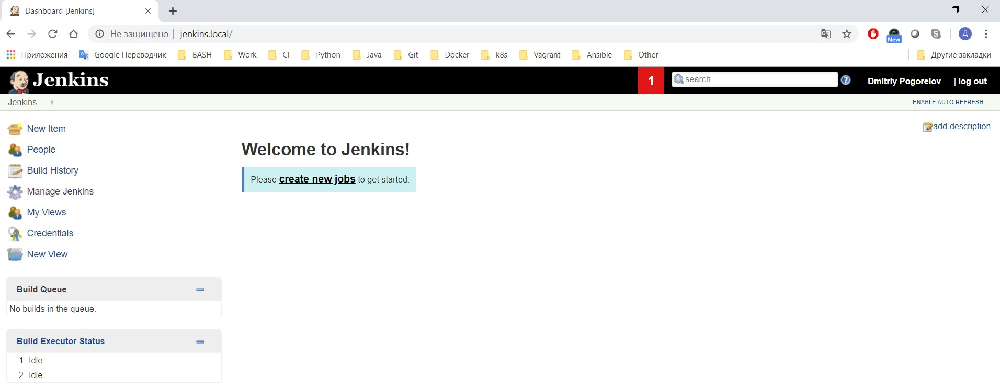

## Homework - Jenkins start

It was used Vagrant to run VM, where using provisioning ***ansible_local*** installed ***Jenkins*** and ***nginx***

Vagrantfile
```yml

Vagrant.configure("2") do |config|
  
  config.ssh.insert_key = false
  config.vm.network "forwarded_port", guest: 80, host: 80
  
  if Vagrant.has_plugin?("vagrant-timezone")
    config.timezone.value = "Europe/Minsk"
  end

  config.vm.define "jenkins" do |jenkins|
    jenkins.vm.box = "ubuntu/bionic64"
    jenkins.vm.box_check_update = false
    jenkins.vm.network "private_network", ip: "192.168.10.15"
    jenkins.vm.hostname = "jenkins.local"
    jenkins.vm.provision "ansible_local" do |ansible|
      ansible.install_mode = "default"
      ansible.become = true
      ansible.playbook = "./ansible/jenkins_playbook.yml"
      ansible.config_file = "./ansible/ansible.cfg"
    end
  end
end
```

Result of full deployment [console output](./vagrant.out)

### Screenshot of Jenkins

