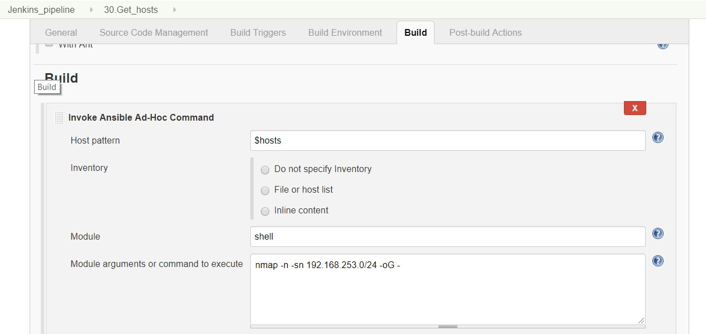
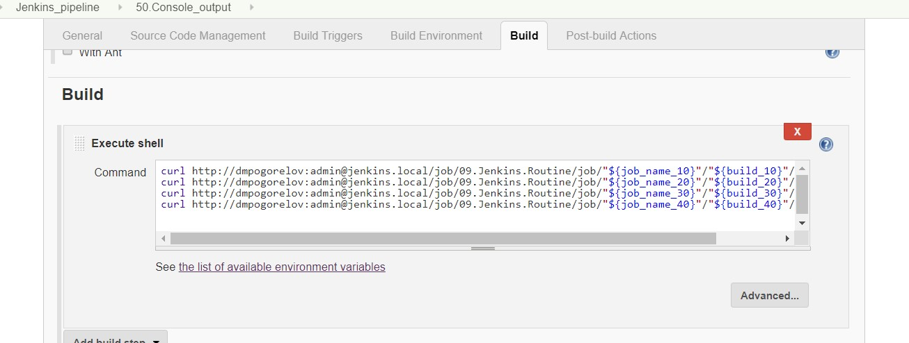
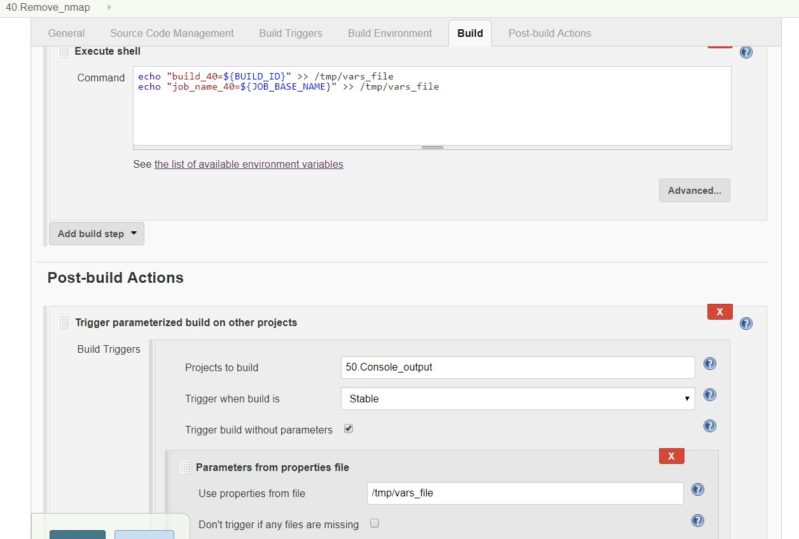
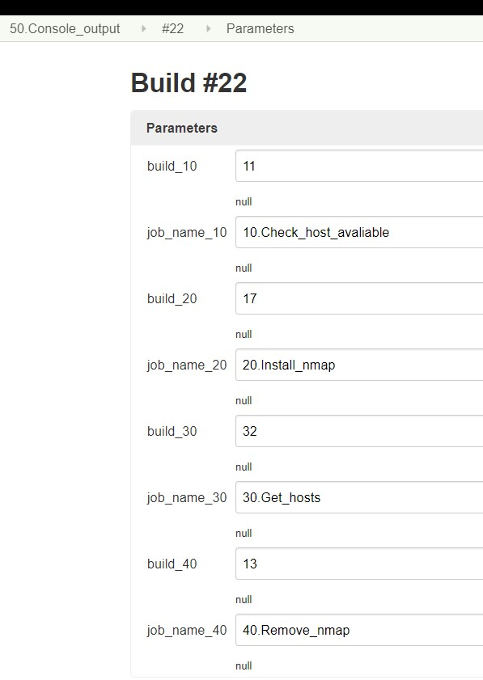
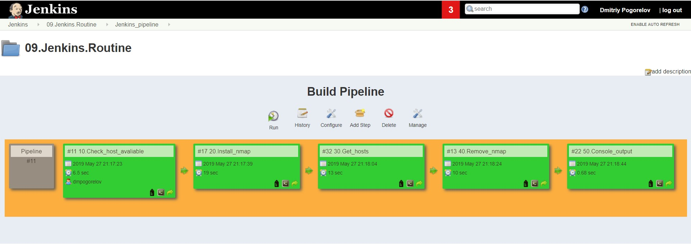

## Homework - Jenkins routine

It was created 5 jobs using build metod:
1. Ansible plugin (Invoke Ansible Ad-hoc command) for jobs:
   - check host avaliable
   - get network info by nmap
   - remove nmap

**example**
   

2. Execute shell for jobs:
   - install nmap
   - get all jobs logs
   - all jobs for pass variables to final job

**example**

3. Parameterized Trigger plugin for create dependencies and work variables. Use variables followong types:
   - string
   - multiple choice
   - from properies file

**example**

### Screenshot of Pipeline

### Results

[console output](./console.out)