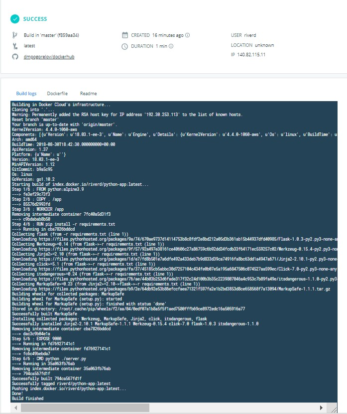
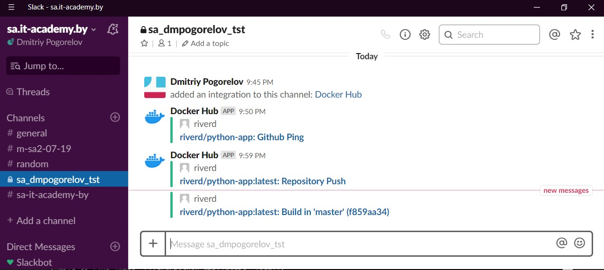

## Homework - Docker. Lading

It was created simple python application

```python
from flask import Flask
from flask import request
from flask import jsonify

app = Flask(__name__)

@app.route("/get_my_ip", methods=["GET"])
def get_my_ip():
    return jsonify({'ip': request.remote_addr}), 200


if __name__ == "__main__":
    app.run(host='0.0.0.0', port=9000)
```
All files stored on GitHub that connected to Dockerhub

>[My Docker repository](https://cloud.docker.com/repository/registry-1.docker.io/riverd/python-app)

After pushing files on GitHub run build docker container

### Dockerhub build output



### Slack notifocations



When container ready it was ran on localhost 

```bash
jenkins@jenkins:/tmp/doc$ docker run -d --name python-app -p 9000:9000 riverd/python-app:latest
Unable to find image 'riverd/python-app:latest' locally
latest: Pulling from riverd/python-app
e7c96db7181b: Already exists
799a5534f213: Already exists
913b50bbe755: Already exists
11154abc6081: Already exists
c805e63f69fe: Already exists
d3b37bee952b: Pull complete
98869952fe33: Pull complete
Digest: sha256:8dcac0946df9117b3d6a0c2223f7b23039ef8224decfa1da7cd9a4b49a641a98
Status: Downloaded newer image for riverd/python-app:latest
27b56321409cb8896f9af92e215042935b6c2f50ca7d2b943824f52d3a14de39
jenkins@jenkins:
jenkins@jenkins:/tmp/doc$ docker ps
CONTAINER ID        IMAGE                      COMMAND                  CREATED             STATUS              PORTS                    NAMES
27b56321409c        riverd/python-app:latest   "/bin/sh -c 'python …"   4 seconds ago       Up 3 seconds        0.0.0.0:9000->9000/tcp   python-app
jenkins@jenkins:
jenkins@jenkins:/tmp/doc$ curl http://jenkins.local:9000/get_my_ip
{"ip":"172.17.0.1"}
```