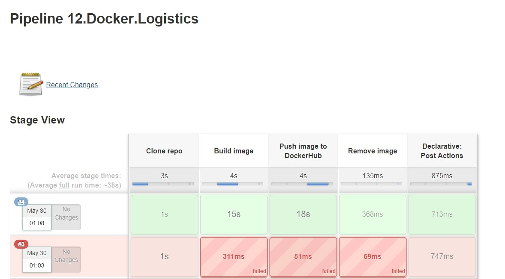
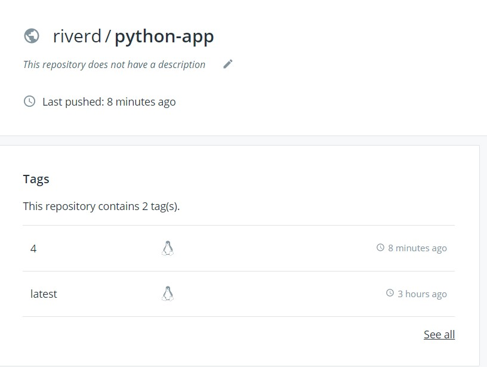
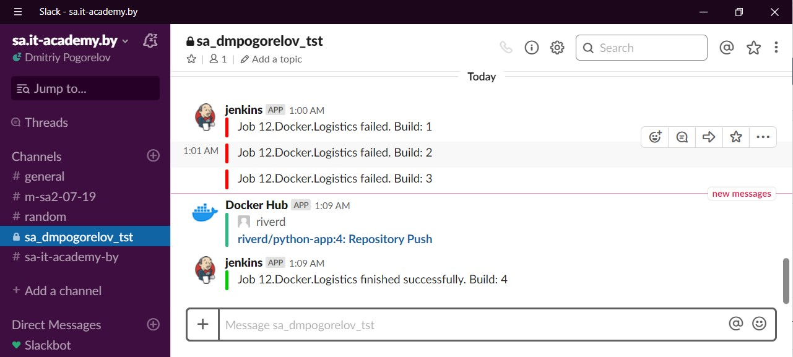
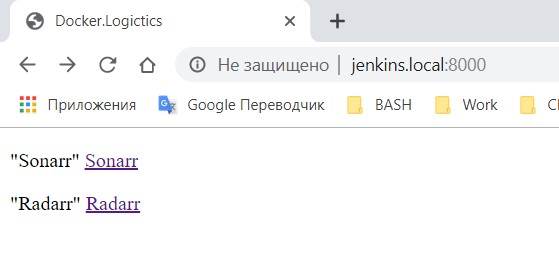
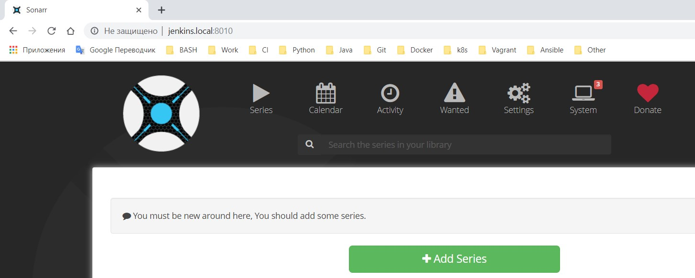
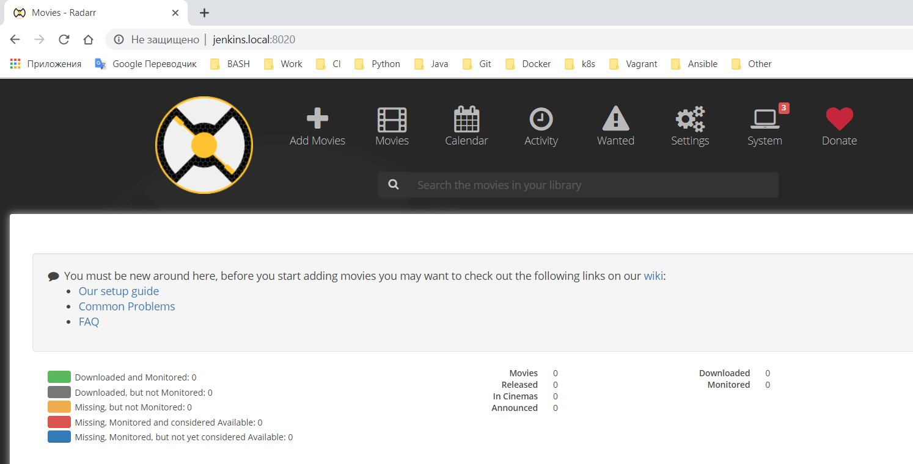

## Homework - Docker. Logistics

For the first task in Jenkins was added credentinals for DockerHub and created pipeline
[Jenkinsfile](./Jenkins.and.Docker/Jenkinsfile)

### Pipeline

### Dockerhub

### Slack notifocations

[console output](./Jenkins.and.Docker/console.out)

For the seconf task used following docker images from public repo:

- linuxserver/radarr
- linuxserver/sonarr
- nginx

[docker-compose.yml](./Docker-compose/docker-compose.yml)

[console output](./Docker-compose/console.out)
