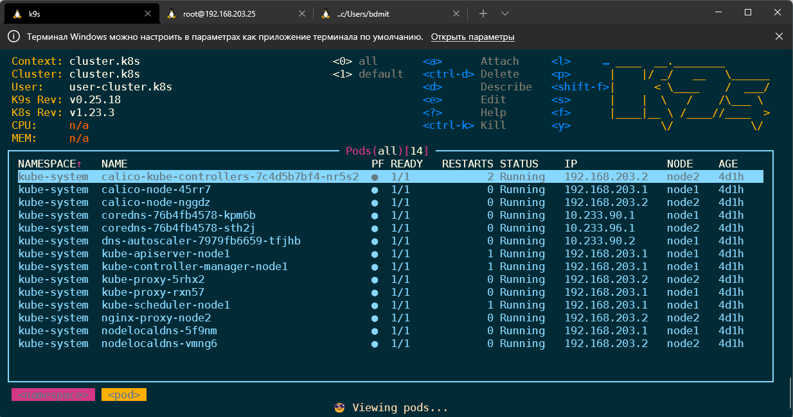

# 11.Kubernetes installation

# ~/.kube/config
```yaml
apiVersion: v1
clusters:
- cluster:
    certificate-authority-data: null
    server: https://127.0.0.1:16443
  name: cluster.k3s
- cluster:
    certificate-authority-data: null
    server: https://127.0.0.1:6443
  name: cluster.k8s
contexts:
- context:
    cluster: cluster.k3s
    user: user-cluster.k3s
  name: cluster.k3s
- context:
    cluster: cluster.k8s
    user: user-cluster.k8s
  name: cluster.k8s
current-context: cluster.k3s
kind: Config
preferences: {}
users:
- name: user-cluster.k3s
  user:
    client-certificate-data: null
    client-key-data: null
- name: user-cluster.k8s
  user:
    client-certificate-data: null
    client-key-data: null
```

## K9s screenshots





