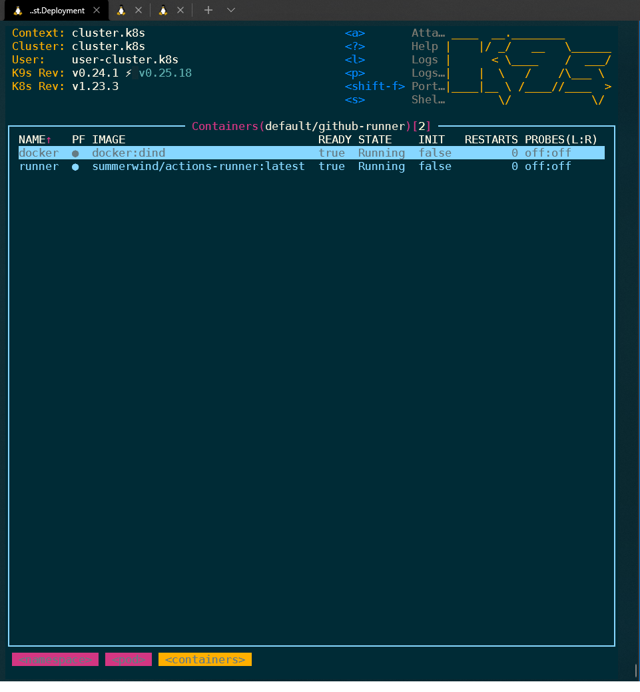
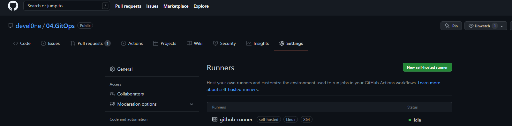

# 12. Kubrenetes. First deployment

## Main task manifest

```yaml
---
apiVersion: v1
kind: Namespace
metadata:
  name: websrv-lesson-12
---
apiVersion: apps/v1
kind: Deployment
metadata:
  name: webserver
  namespace: websrv-lesson-12
  labels:
    app: nginx-websrv
spec:
  replicas: 3
  selector:
    matchLabels:
      app: nginx-websrv
  template:
    metadata:
      labels:
        app: nginx-websrv
    spec:
      containers:
      - name: nginx-instance
        image: nginx
        ports:
        - containerPort: 80
        resources:
          requests:
            cpu: 10m
            memory: 20Mi
          limits:
            cpu: 50m
            memory: 50Mi
        volumeMounts:
        - name: index-html-mount
          mountPath: /usr/share/nginx/html/index.html
          subPath: index.html
      volumes:
      - name: index-html-mount
        configMap:
          name: index-html-custom-data
---
apiVersion: v1
kind: Service
metadata:
  name: nginx-web-service
  namespace: websrv-lesson-12
 labels:
    run: nginx-web-service
spec:
  ports:
  - port: 80
    protocol: TCP
  selector:
    app: nginx-websrv
---
apiVersion: networking.k8s.io/v1
kind: Ingress
metadata:
  namespace: websrv-lesson-12
  name: ingress-sa
  annotations:
    kubernetes.io/ingress.class: nginx
    nginx.ingress.kubernetes.io/server-alias: "app.k8s-1.sa"
spec:
  rules:
    - host: app.k8s-1.sa
      http:
        paths:
          - path: /
            pathType: Prefix
            backend:
              service:
                name: nginx-web-service
                port:
                  number: 80
---
apiVersion: v1
kind: ConfigMap
metadata:
  namespace: websrv-lesson-12
  name: index-html-custom-data
data:
  index.html: |
    <html>
          <header><title>Custom index.html</title></header>
          <body>Custom test page!!!</body>
    </html>
```

### Testing main task

```bash
root@node1:~# curl -I http://app.k8s-1.sa:30001
HTTP/1.1 200 OK
Date: Mon, 21 Feb 2022 17:10:05 GMT
Content-Type: text/html
Content-Length: 110
Connection: keep-alive
Last-Modified: Mon, 21 Feb 2022 12:24:06 GMT
ETag: "62138466-6e"
Accept-Ranges: bytes

root@node1:~# curl http://app.k8s-1.sa:30001
<html>
      <header><title>Custom index.html</title></header>
      <body>Custom test page!!!</body>
</html>

```

# Additional task

### Deployment PAT action-runner

```bash
kubectl apply -f https://github.com/cert-manager/cert-manager/releases/download/v1.7.1/cert-manager.yaml

kubectl apply -f https://github.com/actions-runner-controller/actions-runner-controller/releases/download/v0.20.2/actions-runner-controller.yaml

kubectl create secret generic controller-manager \
    -n actions-runner-system \
    --from-literal=github_token=${TOKEN}

kubectl apply -f github-runner.yaml

kubectl get runners
```

### Manifest

```yaml
apiVersion: actions.summerwind.dev/v1alpha1
kind: Runner
metadata:
  name: github-runner
spec:
  repository: devel0ne/04.GitOps
  env: []
```




