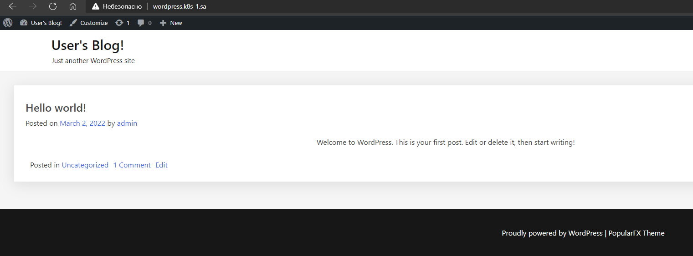
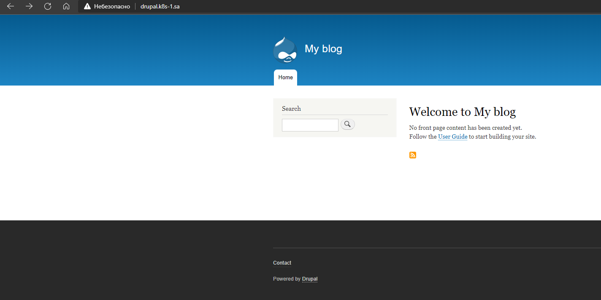

	# 13.Kubernetes.Helm

## deploy_nfs_provisioner.sh

```bash
helm repo add nfs-subdir-external-provisioner https://kubernetes-sigs.github.io/nfs-subdir-external-provisioner/

helm install nfs-subdir-external-provisioner nfs-subdir-external-provisioner/nfs-subdir-external-provisioner \
             --set nfs.server=192.168.37.105 \
             --set nfs.path=/mnt/IT-Academy/nfs-data/sa2-19-22/Dmitry_Boyko/storage/ \
             --set storageClass.accessModes=ReadWriteMany
```

## WordPress deploy

### Deploy script

```bash
kubectl create namespace wordpress

helm install wordpress --namespace wordpress \
  --set wordpressUsername=admin \
  --set wordpressPassword=pa$$word \
  --set mariadb.auth.rootPassword=db_pa$$word \
  --set memcached.enabled=true \
  --set global.storageClass="nfs-client" \
    bitnami/wordpress
```

### Ingress manifest

```yaml
apiVersion: networking.k8s.io/v1
kind: Ingress
metadata:
  name: webapp-external
  namespace: wordpress
  annotations:
    kubernetes.io/ingress.class: nginx
    nginx.ingress.kubernetes.io/server-alias: "wordpress.k8s-2.sa"
spec:
  rules:
    - host: wordpress.k8s-1.sa
      http:
        paths:
          - path: /
            pathType: Prefix
            backend:
              service:
                name: wordpress
                port:
                  number: 80
```

### WordPress screenshot



## Drupal deploy

### Deploy script
```bash
kubectl create namespace drupal

helm install drupal --namespace drupal \
  --set drupalUsername=admin \
  --set drupalPassword=pa$$word \
  --set allowEmptyPassword=false \
  --set mariadb.auth.rootPassword=db_pa$$word \
  --set allowEmptyPassword=false \
  --set global.storageClass="nfs-client" \
    bitnami/drupal
```

### Ingress manifest
```yaml
apiVersion: networking.k8s.io/v1
kind: Ingress
metadata:
  name: webapp-external
  namespace: drupal
  annotations:
    kubernetes.io/ingress.class: nginx
    nginx.ingress.kubernetes.io/server-alias: "drupal.k8s-2.sa"
spec:
  rules:
    - host: drupal.k8s-1.sa
      http:
        paths:
          - path: /
            pathType: Prefix
            backend:
              service:
                name: drupal
                port:
                  number: 80
```

### Drupal screenshot




 
