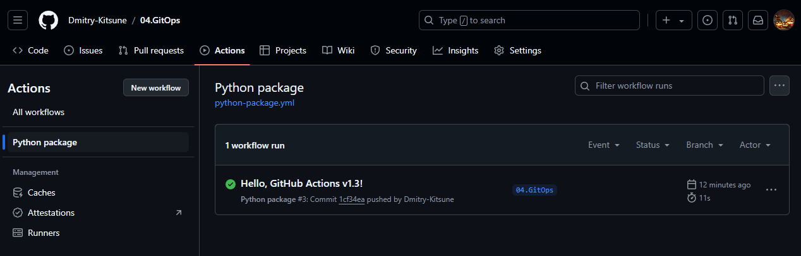
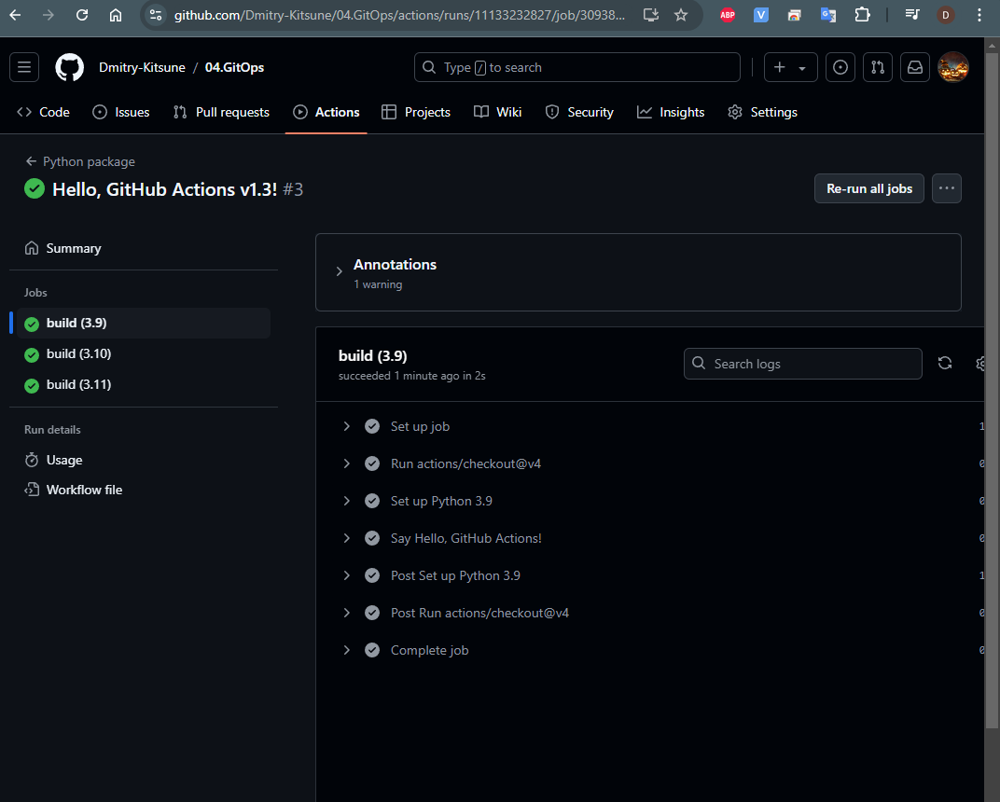
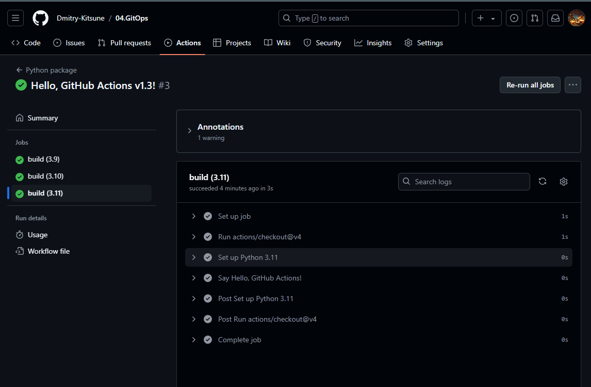
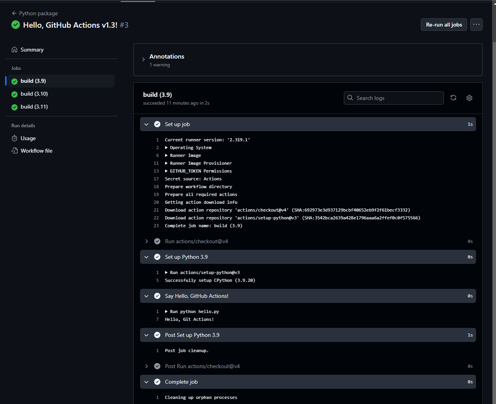
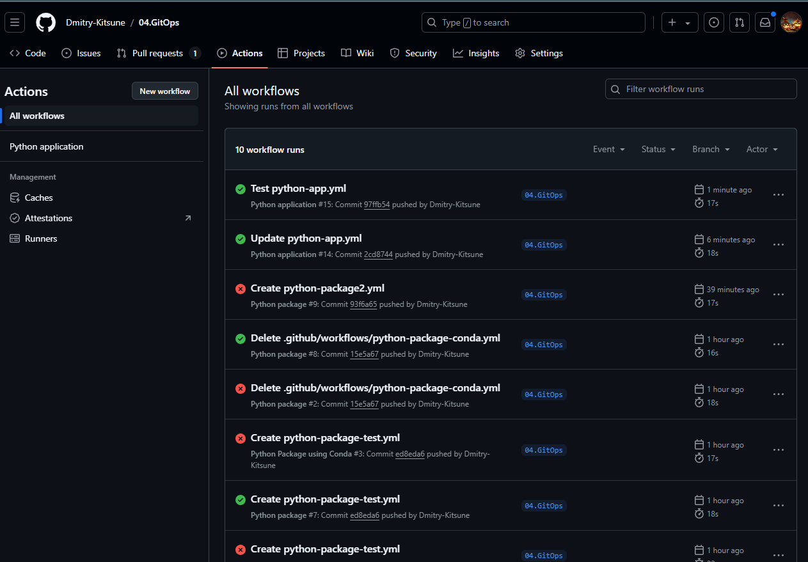
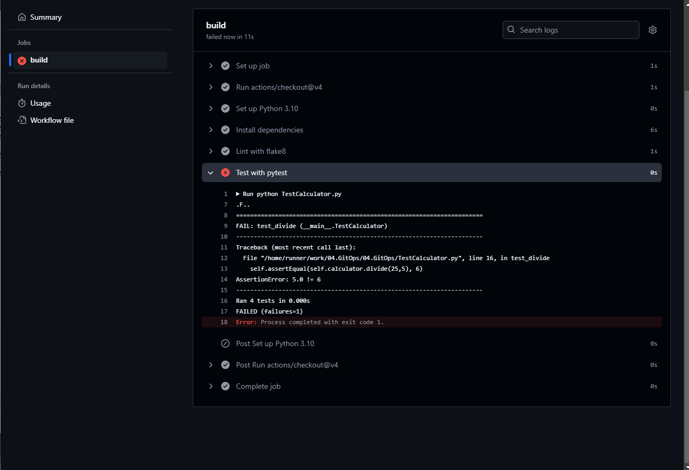

##  04. GitOps

## Homework Assignment 1: Setting up a Basic GitHub Action

1. Create a new public repository on GitHub.
```bush
cd md-sa2-29-24/
mkdir 04.GitOps
cd 04.GitOps/
git init
touch README.md
$ git status
git add 04.GitOps/
git commit -m "04.GitOps-Start"
git checkout -b 04.GitOps
git remote add GitOps https://github.com/Dmitry-Kitsune/04.GitOps.git
git push -u GitOps 04.GitOps

```

2. Inside the repository, create a simple Python or JavaScript script (e.g., "hello.py" or "hello.js") that prints "Hello, GitHub Actions!" to the console.
```bush
nano hello.py
  msg = "Hello, Git Actions!"
  print(msg)
```

3. Create a new GitHub Action workflow (.github/workflows/hello.yml) that triggers on every push to the main branch.
```bush
nano hello.yaml

name: Run Hello message after push in 04.GitOps (default branch)

on:
  push:
    branches:
    - 04.GitOps (default branch)

jobs:
  print:
    runs-on: ubuntu-latest

    steps:
        - uses: actions/checkout@v4
        - name: Install python
          uses: actions/setup-python@v3
          with:
            python-version: "3.10"

        - name: Say Hello, GitHub Actions!
          run: python hello.py
````
4. Configure the workflow to run the script you created in step 2.

```bush
name: Run Hello message after push in 04.GitOps

on:
  push:
    branches: [ "04.GitOps" ]
  pull_request:
    branches: [ "04.GitOps" ]

jobs:
  build:

    runs-on: ubuntu-latest
    strategy:
      fail-fast: false
      matrix:
        python-version: ["3.9", "3.10", "3.11"]

    steps:
    - uses: actions/checkout@v4
    - name: Set up Python ${{ matrix.python-version }}
      uses: actions/setup-python@v3
      with:
        python-version: ${{ matrix.python-version }}
    - name: Say Hello, GitHub Actions!
      run: python hello.py
```

5. Push your changes to the repository and observe the GitHub Action run.
```bush
git status
git add -all
git commit -m "Hello, GitHub Actions v1.3!"
git push -u GitOps 04.GitOps
```
  
  
  
  
  

## Homework Assignment 2: Building and Testing with GitHub Actions

1. Choose a programming language of your choice.

Programming language - Python

2. Set up a new or use an existing repository.

https://github.com/Dmitry-Kitsune/04.GitOps

3. Create a simple program that performs a basic operation (e.g., calculation, string manipulation).

```bush
#A simple calculator
class Calculator:
  #empty constructor
  def __init__(self):
    pass
  #add method - given two numbers, return the addition
  def add(self, x1, x2):
    return x1 + x2
  #multiply method - given two numbers, return the 
  #multiplication of the two
  def multiply(self, x1, x2):
    return x1 * x2
  #subtract method - given two numbers, return the value
  #of first value minus the second
  def subtract(self, x1, x2):
    return x1 - x2
  #divide method - given two numbers, return the value
  #of first value divided by the second
  def divide(self, x1, x2):
    if x2 != 0:
      return x1/x2
```

4. Write unit tests for your program using a testing framework appropriate for the language.
```bush
import unittest
from Calculator import Calculator

class TestCalculator(unittest.TestCase):
  #setUp method is overridden from the parent class TestCase
  def setUp(self):
    self.calculator = Calculator()
  #Each test method starts with the keyword test_
  def test_add(self):
    self.assertEqual(self.calculator.add(3,5), 8)
  def test_subtract(self):
    self.assertEqual(self.calculator.subtract(7,2), 5)
  def test_multiply(self):
    self.assertEqual(self.calculator.multiply(4,8), 32)
  def test_divide(self):
    self.assertEqual(self.calculator.divide(25,5), 6)
# Executing the tests in the above test case class
if __name__ == "__main__":
  unittest.main()
```
5. Create a GitHub Action workflow that runs the unit tests whenever changes are pushed to the repository.
```bush
python-app.yml

# This workflow will install Python dependencies, run tests and lint with a single version of Python
# For more information see: https://docs.github.com/en/actions/automating-builds-and-tests/building-and-testing-python

name: Python application

on:
  push:
    branches: [ "04.GitOps" ]
  pull_request:
    branches: [ "04.GitOps" ]

permissions:
  contents: read

jobs:
  build:

    runs-on: ubuntu-latest

    steps:
    - uses: actions/checkout@v4
    - name: Set up Python 3.10
      uses: actions/setup-python@v3
      with:
        python-version: "3.10"
    - name: Install dependencies
      run: |
        python -m pip install --upgrade pip
        pip install flake8 pytest
        if [ -f requirements.txt ]; then pip install -r requirements.txt; fi
    - name: Lint with flake8
      run: |
        # stop the build if there are Python syntax errors or undefined names
        flake8 . --count --select=E9,F63,F7,F82 --show-source --statistics
        # exit-zero treats all errors as warnings. The GitHub editor is 127 chars wide
        flake8 . --count --exit-zero --max-complexity=10 --max-line-length=127 --statistics
    - name: Test with pytest
      run: |
        python TestCalculator.py

```
6. Ensure the workflow reports whether the tests passed or failed.

   
   

Your github action files (or links to the report README.md) add to the folder 04.GitOps and create report README.md