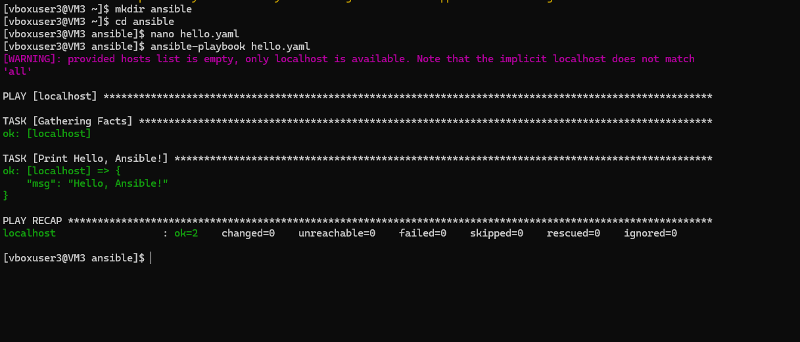
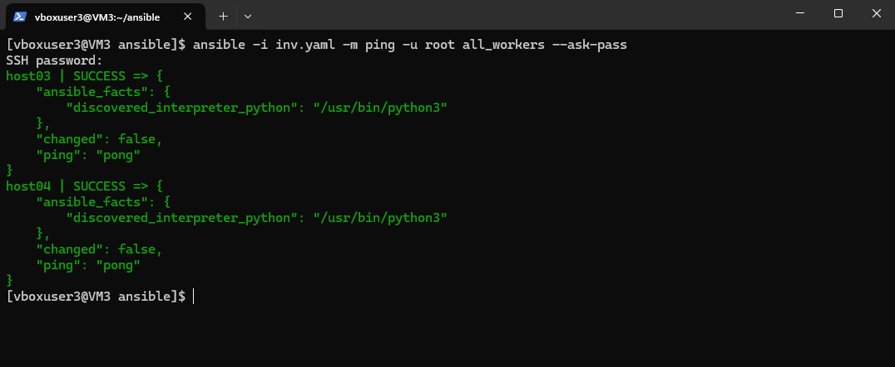
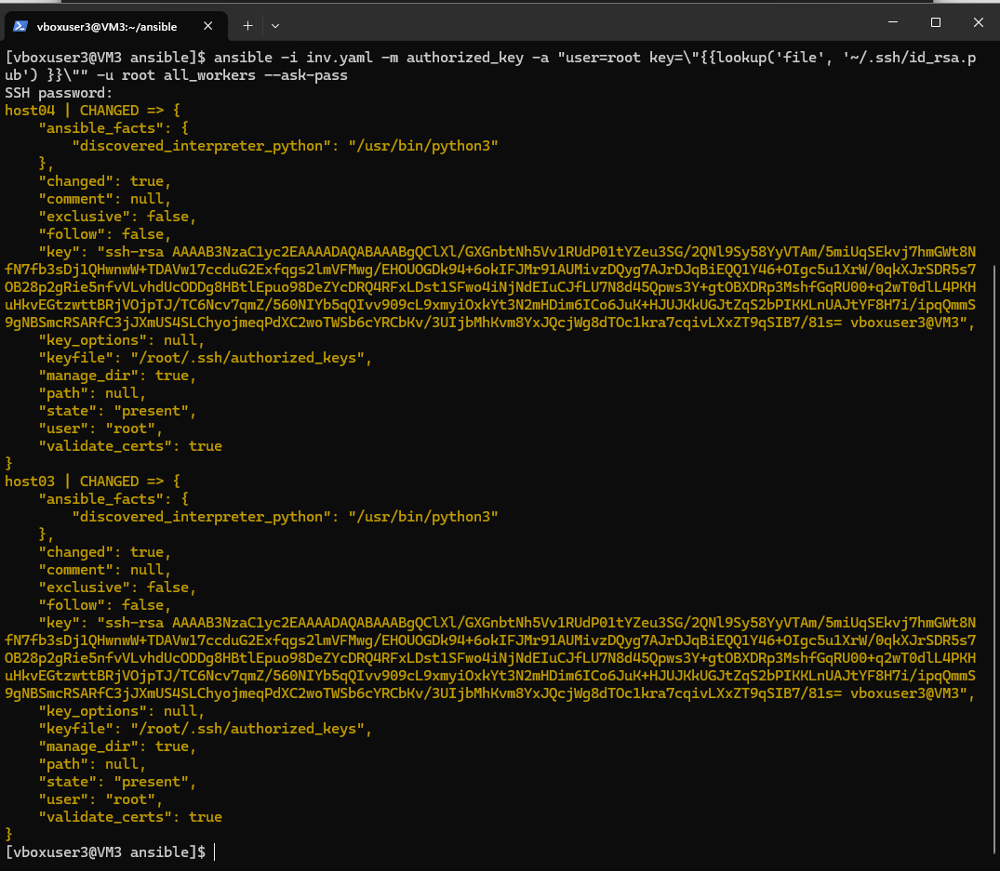
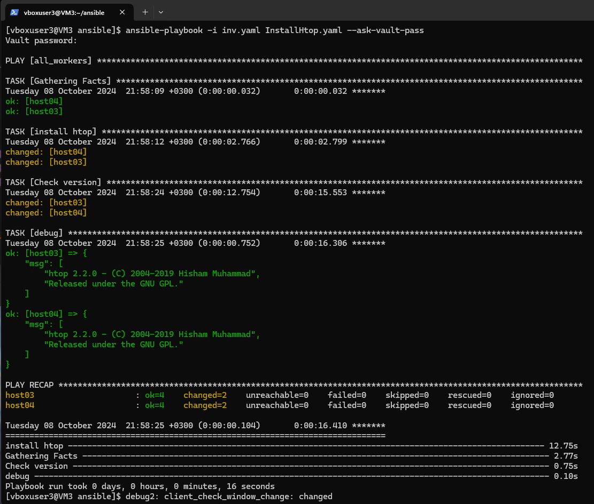
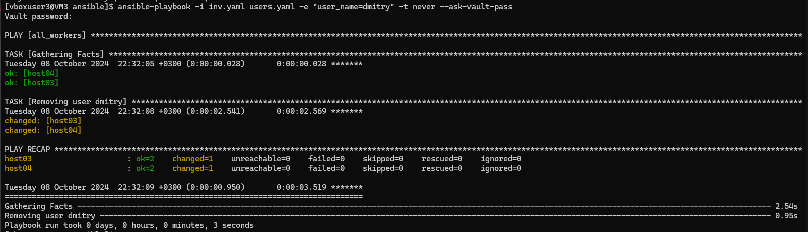

## 05. Ansible start

## Homework Assignment 1: Setting Up Ansible

1. Install Ansible on your local machine or a virtual environment.
```bush
sudo dnf update -y
	Install   5 Packages
	Upgrade  97 Packages
	Remove    4 Packages

 sudo dnf install -y epel-release

sudo dnf install ansible -y

ansible --version
ansible [core 2.14.14]
  config file = /etc/ansible/ansible.cfg
  configured module search path = ['/home/vboxuser3/.ansible/plugins/modules', '/usr/share/ansible/plugins/modules']
  ansible python module location = /usr/lib/python3.9/site-packages/ansible
  ansible collection location = /home/vboxuser3/.ansible/collections:/usr/share/ansible/collections
  executable location = /usr/bin/ansible
  python version = 3.9.18 (main, Aug 23 2024, 00:00:00) [GCC 11.4.1 20231218 (Red Hat 11.4.1-3)] (/usr/bin/python3)
  jinja version = 3.1.2
  libyaml = True

```

2. Create a directory for your Ansible playbooks and configuration files.

```bush
 mkdir ansible
 cd ansible

```

3. Write an Ansible playbook that prints "Hello, Ansible!" to the console.

```bush

[vboxuser3@VM3 ansible]$ nano hello.yaml

- hosts: localhost
  vars:
    msg: "Hello, Ansible!"
 
  tasks:
    - name: Print Hello, Ansible!
      debug:
        msg: "{{ msg }}"
      tags:
        - no_facts
        - always
```


4. Run the playbook using the ansible-playbook command and ensure it executes successfully.

```bush
ansible-playbook hello.yaml

```
5. Document the installation process and the steps you took to run the playbook.

```bush
[WARNING]: provided hosts list is empty, only localhost is available. Note that the implicit localhost does not match
'all'

PLAY [localhost] *******************************************************************************************************

TASK [Gathering Facts] *************************************************************************************************
ok: [localhost]

TASK [Print Hello, Ansible!] *******************************************************************************************
ok: [localhost] => {
    "msg": "Hello, Ansible!"
}

PLAY RECAP *************************************************************************************************************
localhost                  : ok=2    changed=0    unreachable=0    failed=0    skipped=0    rescued=0    ignored=0

```


## Homework Assignment 2: Managing Remote Hosts
 	
192.168.202.3-4

1. Set up a virtual machine (or use an existing one in IT-ACADEMY DC) to act as your remote target.

```bush
all_workers:
  children:
    work_sa:
      hosts:
        host03:
          ansible_host: 192.168.202.3
        host04:
          ansible_host: 192.168.202.4
jump_sa:
  vars:
    env: "it-academy"
  hosts:
    bastion:
      ansible_host: 178.124.206.53
      ansible_user: jump_sa


[vboxuser3@VM3 ansible]$ ansible-inventory -i inv.yaml --graph
@all:
  |--@ungrouped:
  |--@all_workers:
  |  |--@work_sa:
  |  |  |--host03
  |  |  |--host04
  |--@jump_sa:
  |  |--bastion
```


2. Ensure SSH access to the remote machine from your local machine.

```bussh
[vboxuser3@VM3 ansible]$ ssh -p 32510 jump_sa@178.124.206.53
Welcome to Ubuntu 20.04.6 LTS (GNU/Linux 5.15.39-1-pve x86_64)

 * Documentation:  https://help.ubuntu.com
 * Management:     https://landscape.canonical.com
 * Support:        https://ubuntu.com/pro
New release '22.04.5 LTS' available.
Run 'do-release-upgrade' to upgrade to it.

Last login: Thu Oct  3 16:29:15 2024 from 37.214.62.167
jump_sa@jump:~$
```

# connect to host 192.168.202.3
```bush
[vboxuser3@VM3 ansible]$ ssh root@192.168.202.3
The authenticity of host '192.168.202.3 (<no hostip for proxy command>)' can't be established.
ED25519 key fingerprint is SHA256:7xyzqLjdOEJwrMP8aGbcPFMvlWIty3B+n8645IOD744.
This key is not known by any other names
Are you sure you want to continue connecting (yes/no/[fingerprint])? yes
Warning: Permanently added '192.168.202.3' (ED25519) to the list of known hosts.
root@192.168.202.3's password:
Welcome to Ubuntu 20.04 LTS (GNU/Linux 5.15.39-1-pve x86_64)

 * Documentation:  https://help.ubuntu.com
 * Management:     https://landscape.canonical.com
 * Support:        https://ubuntu.com/advantage


The programs included with the Ubuntu system are free software;
the exact distribution terms for each program are described in the
individual files in /usr/share/doc/*/copyright.

Ubuntu comes with ABSOLUTELY NO WARRANTY, to the extent permitted by
applicable law.

root@sa-3:~#
```
# connect to host 192.168.202.3

```bush
[vboxuser3@VM3 ansible]$ ssh root@192.168.202.4
The authenticity of host '192.168.202.4 (<no hostip for proxy command>)' can't be established.
ED25519 key fingerprint is SHA256:x3qqMJFeEk87tQqAnSTDtb3FloUPywcdzu/XT2IhaXc.
This key is not known by any other names
Are you sure you want to continue connecting (yes/no/[fingerprint])? yes
Warning: Permanently added '192.168.202.4' (ED25519) to the list of known hosts.
root@192.168.202.4's password:
Welcome to Ubuntu 20.04 LTS (GNU/Linux 5.15.39-1-pve x86_64)

 * Documentation:  https://help.ubuntu.com
 * Management:     https://landscape.canonical.com
 * Support:        https://ubuntu.com/advantage


The programs included with the Ubuntu system are free software;
the exact distribution terms for each program are described in the
individual files in /usr/share/doc/*/copyright.

Ubuntu comes with ABSOLUTELY NO WARRANTY, to the extent permitted by
applicable law.

root@sa-4:~#
```
# ping hosts
```bush
ansible -i inv.yaml -m ping -u root all_workers --ask-pass
```


```bush
ansible -i inv.yaml -m authorized_key -a "user=root key=\"{{lookup('file', '~/.ssh/id_rsa.pub') }}\"" -u root all_workers --ask-pass
```


3. Write an Ansible playbook to install a basic package (e.g., vim or htop) on the remote host.
```bush
- hosts: "{{ group | default('all_workers')}}"
  tasks:
    - name: install htop
      ansible.builtin.apt:
        name: htop
        state: latest
        update_cache: yes
 
    - name: Check version
      shell: |
        htop --version
      register: out

    - debug:
        msg: "{{ out.stdout_lines }}"

ansible-playbook -i inv.yaml InstallHtop.yaml --ask-vault-pass
```
4. Use inventory files to manage the connection details for the remote host.
```bush
[vboxuser3@VM3 ansible]$ cat inv.yaml
all_workers:
  children:
    work_sa:
      hosts:
        host03:
          ansible_host: 192.168.202.3
        host04:
          ansible_host: 192.168.202.4
jump_sa:
  vars:
    env: "it-academy"
  hosts:
    bastion:
      ansible_host: 178.124.206.53
      ansible_user: jump_sa
```

```bush

Vault password:
{
    "ansible_host": "192.168.202.3",
    "ansible_ssh_common_args": "-o ProxyCommand=\"ssh -W %h:%p -q jump_sa@178.124.206.53  -p 32510\"",
    "ansible_user": "root"
}
[vboxuser3@VM3 ansible]$ ansible-inventory -i inv.yaml --host host04  --ask-vault-pass
Vault password:
{
    "ansible_host": "192.168.202.4",
    "ansible_ssh_common_args": "-o ProxyCommand=\"ssh -W %h:%p -q jump_sa@178.124.206.53  -p 32510\"",
    "ansible_user": "root"
}
```

5. Execute the playbook and verify that the package is installed on the remote host.

```bush	
[vboxuser3@VM3 ansible]$ ansible-inventory -i inv.yaml --host host03  --ask-vault-pass
```


## Homework Assignment 3: Managing Users and Groups

1. Create a playbook to manage users and groups on a remote host.

```bash
nano users.yaml
```
2. Define tasks to create a new user, assign the user to a specific group, and set a password.

3. Parameterize the playbook to allow dynamic user and group names.

```bush
- hosts: "{{ group | default('all_workers')}}"
  tasks:

   - name: "Creating group: {{ user_group }}"
     ansible.builtin.group:
       name: "{{ user_group }}"
       state: present

   - name: "Creating user: {{ user_name }}"
     ansible.builtin.user:
       name: "{{ user_name }}"
       group: "{{ user_group }}"
       password: "{{ user_pass | password_hash('sha256') }}"
       state: present
       comment: Managed by Ansible

   - name: Check user
     shell: |
       grep "{{ user_name }}" /etc/passwd
       groups "{{ user_name }}"
       grep "{{ user_name }}" /etc/shadow
       date
     register: out

   - debug:
       msg: "{{ out.stdout_lines }}"

   - name: Removing user {{ user_name }}
     ansible.builtin.user:
       name: "{{ user_name }}"
       state: absent
       remove: yes
     tags: never
```

4. Execute the playbook and verify that the user and group configurations are applied.
	*add user
```bush
ansible-playbook -i inv.yaml users.yaml -e "user_name=dmitry user_group=group01 user_pass=12345" --ask-vault-pass
```


	*delete user
```bush
ansible-playbook -i inv.yaml users.yaml -e "user_name=dmitry" -t never --ask-vault-pass
```


Your ansible project add to folder 05.Ansible.start, create README.md with short report inside and prepare PR