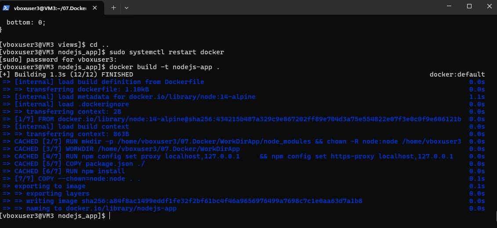
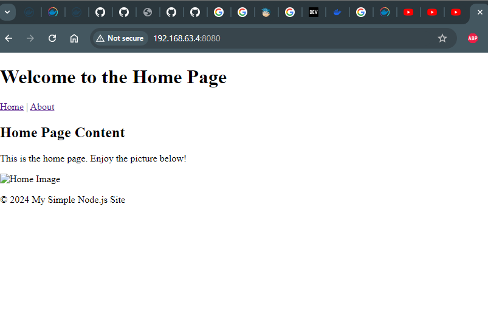
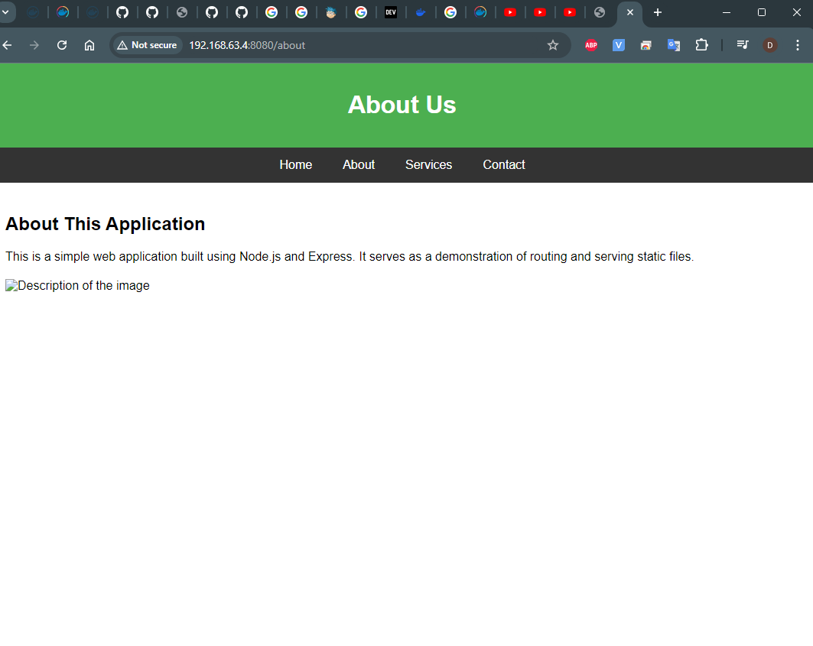

# 07. Docker

# Homework Assignment 1: Docker Installation and Basic Commands

1.Install Docker on your local machine or a virtual environment.
```bush
[vboxuser3@VM3 ~]$ sudo yum update
sudo dnf --refresh update
sudo dnf upgrade
sudo dnf install yum-utils
sudo yum-config-manager --add-repo https://download.docker.com/linux/centos/docker-ce.repo
sudo dnf install docker-ce docker-ce-cli containerd.io docker-compose-plugin

```
2.Verify the Docker installation by running the docker --version command.
```bush
[vboxuser3@VM3 ~]$ docker --version
Docker version 27.3.1, build ce12230
```
3.Pull the official "hello-world" Docker image and run a container based on it.
```bush
sudo systemctl start docker
sudo docker run hello-world
```

```bush
[vboxuser3@VM3 ~]$ sudo docker run hello-world
Unable to find image 'hello-world:latest' locally
latest: Pulling from library/hello-world
c1ec31eb5944: Pull complete
Digest: sha256:d211f485f2dd1dee407a80973c8f129f00d54604d2c90732e8e320e5038a0348
Status: Downloaded newer image for hello-world:latest

Hello from Docker!
This message shows that your installation appears to be working correctly.

To generate this message, Docker took the following steps:
 1. The Docker client contacted the Docker daemon.
 2. The Docker daemon pulled the "hello-world" image from the Docker Hub.
    (amd64)
 3. The Docker daemon created a new container from that image which runs the
    executable that produces the output you are currently reading.
 4. The Docker daemon streamed that output to the Docker client, which sent it
    to your terminal.

To try something more ambitious, you can run an Ubuntu container with:
 $ docker run -it ubuntu bash

Share images, automate workflows, and more with a free Docker ID:
 https://hub.docker.com/

For more examples and ideas, visit:
 https://docs.docker.com/get-started/


```


4.List the running containers using the docker ps command.
```bush
newgrp docker
sudo usermod -aG docker $USER

# docker ps -a
CONTAINER ID   IMAGE         COMMAND    CREATED         STATUS                     PORTS     NAMES
5d829c50b294   hello-world   "/hello"   8 minutes ago   Exited (0) 8 minutes ago
 lucid_nightingale

# docker ps
CONTAINER ID   IMAGE     COMMAND   CREATED   STATUS    PORTS     NAMES
```
5.Document the installation process and the commands used for verification.

# Homework Assignment 2: Building a Docker Image with Dockerfile

1.Create a new directory for your Dockerfile and application code.
```bush
mkdir 07.Docker
cd 07.Docker/
mkdir nodejs_app
```
 *Structure

/nodejs_app
│
├── application.js
├── package.json
├── Dockerfile
├── /views
│   ├── index.html
│   ├── about.html
│   └── style.css

2.Write a Dockerfile to build an image for a simple web application (e.g., Flask or Node.js).

application.js

```bush 
cat application.js
// Load express module
const express = require('express');
const path = require('path');
// Create an express application instance
const app = express();

// Define the port the server will listen to
// const port = 8080;
const port = 8080;
// Route for the root URL
app.get('/', (req, res) => {
  res.sendFile(path.join(__dirname, 'views', 'index.html'));
});

// Route for the about page
app.get('/about', (req, res) => {
  res.sendFile(path.join(__dirname, 'views', 'about.html'));
});

// Start the server and listen on the specified port
app.listen(port, () => {
  console.log(`Node.js app is running on http://localhost:${port}`);
});```
package.json

```buah
cat package.json
{
  "name": "nodejs-app",
  "version": "1.0.0",
  "description": "A simple Node.js web app",
  "main": "application.js",
  "scripts": {
    "start": "node application.js"
  },
  "author": "Burlyaev",
  "license": "MIT",
  "dependencies": {
    "express": "^4.16.4"
  }
}
```
Dockerfile

```bush
cat Dockerfile
# Use a lightweight Node.js base image
FROM node:14-alpine

# Set the working directory
RUN mkdir -p /home/vboxuser3/07.Docker/WorkDirApp/node_modules && chown -R node:node /home/vboxuser3/07.Docker/WorkDirApp

WORKDIR /home/vboxuser3/07.Docker/WorkDirApp

# Define the proxy URL as an environment variable
# Set environment variables for the proxy
# ENV HTTP_PROXY=http://192.168.63.3:8080
# ENV HTTPS_PROXY=http://192.168.63.3:8080
 ENV NO_PROXY=localhost,127.0.0.1
# ENV HTTP_PROXY=localhost,127.0.0.1
# ENV HTTPS_PROXY=localhost,127.0.0.1

# Set the proxy configuration for npm
#RUN npm config set proxy ${HTTP_PROXY} \
#    && npm config set https-proxy ${HTTPS_PROXY}
RUN npm config set proxy ${NO_PROXY} \
    && npm config set https-proxy ${NO_PROXY}
# Copy package.json and install dependencies
COPY package.json ./

# Install npm dependencies
RUN npm install

# Copy the rest of your application code
COPY --chown=node:node . .

# Expose the application port
# EXPOSE 8888
EXPOSE 8080

# Command to run the application
CMD ["node", "application.js"]
```
/views

index.html
```bush
<!DOCTYPE html>
<html lang="en">
<head>
  <meta charset="UTF-8">
  <meta name="viewport" content="width=device-width, initial-scale=1.0">
  <title>Home</title>
  <link rel="stylesheet" href="/styles.css">
</head>
<body>
  <header>
    <h1>Welcome to the Home Page</h1>
    <nav>
      <a href="/">Home</a> |
      <a href="/about">About</a>
    </nav>
  </header>

  <main>
    <h2>Home Page Content</h2>
    <p>This is the home page. Enjoy the picture below!</p>
    
  </main>

  <footer>
    <p>&copy; 2024 My Simple Node.js Site</p>
  </footer>
</body>
</html>
```

about.html
```bush
<!DOCTYPE html>
<html lang="en">
<head>
    <meta charset="UTF-8">
    <meta name="viewport" content="width=device-width, initial-scale=1.0">
    <title>About Us</title>
    <style>
        body {
            font-family: Arial, sans-serif;
            margin: 0;
            padding: 0;
        }

        header {
            background-color: #4CAF50;
            color: white;
            padding: 15px;
            text-align: center;
        }

        nav {
            display: flex;
            justify-content: center;
            background-color: #333;
        }

        nav a {
            color: white;
            padding: 14px 20px;
            text-decoration: none;
            text-align: center;
        }

        nav a:hover {
            background-color: #ddd;
            color: black;
        }

        main {
            padding: 20px;
        }

        img {
            max-width: 100%;
            height: auto;
            display: block;
            margin: 20px auto;
        }
    </style>
</head>
<body>

<header>
    <h1>About Us</h1>
</header>

<nav>
    <a href="/">Home</a>
    <a href="/about">About</a>
    <a href="/services">Services</a>
    <a href="/contact">Contact</a>
</nav>

<main>
    <h2>About This Application</h2>
    <p>This is a simple web application built using Node.js and Express. It serves as a demonstration of routing and serving static files.</p>
    
</main>

</body>
</html>
```
style.css

```bush
body {
  font-family: Arial, sans-serif;
  margin: 0;
  padding: 0;
}

header {
  background-color: #333;
  color: #fff;
  padding: 15px;
  text-align: center;
}

header h1 {
  margin: 0;
}

nav a {
  color: #fff;
  margin: 0 10px;
  text-decoration: none;
}

nav a:hover {
  text-decoration: underline;
}

main {
  padding: 20px;
}

footer {
  background-color: #333;
  color: #fff;
  text-align: center;
  padding: 10px;
  position: fixed;
  width: 100%;
  bottom: 0;
}
```

3.Copy your application code into the image and set the necessary environment.

4.Build the Docker image using the docker build command.



5.Run a container based on the image and access the web application.
```bush
[vboxuser3@VM3 nodejs_app]$ docker run -p 8080:8080 nodejs-app
Node.js app is running on http://localhost:8080

[vboxuser3@VM3 nodejs_app]$ docker container ps -a
CONTAINER ID   IMAGE          COMMAND                  CREATED          STATUS                        PORTS                                       NAMES
14ff52ad4fb9   nodejs-app     "docker-entrypoint.s…"   19 seconds ago   Up 18 seconds                 0.0.0.0:8080->8080/tcp, :::8080->8080/tcp   application.js
```


6.Document the steps taken to create the Dockerfile, build the image, and access the app.





Your Dockerfile(s) and history of testing command put into folder 07.Docker add prepare PR (Pull Request)