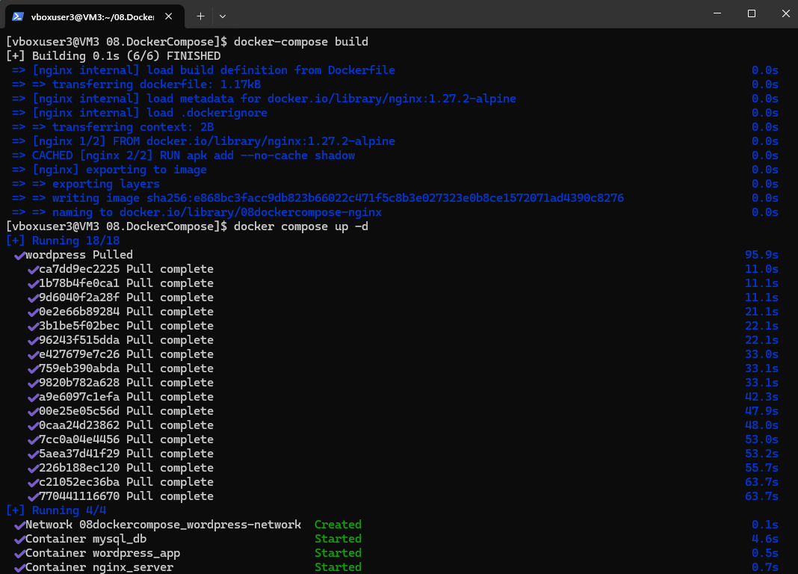
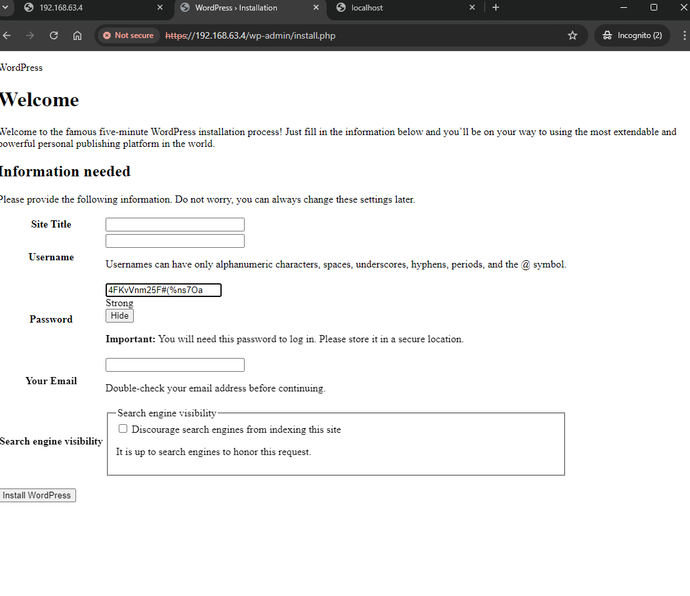
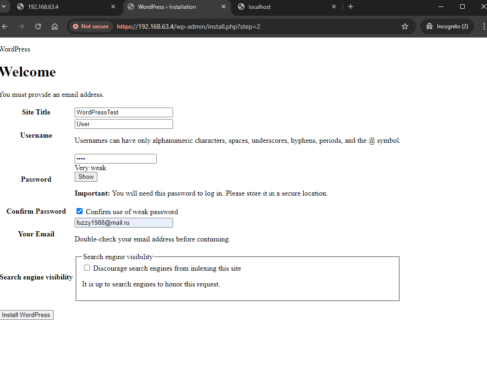
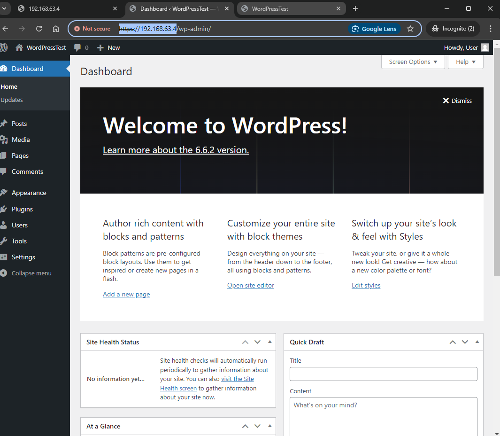
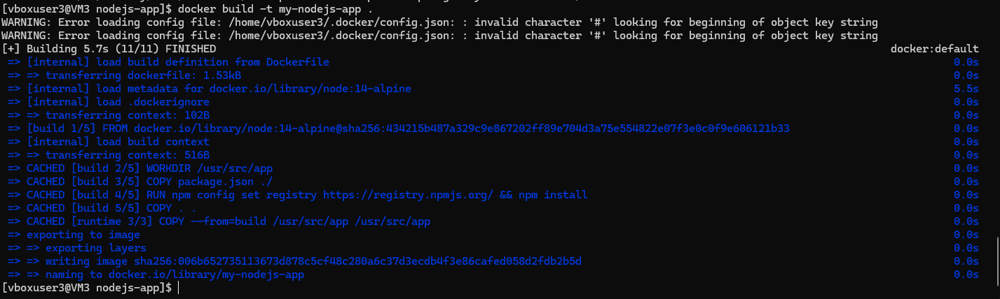
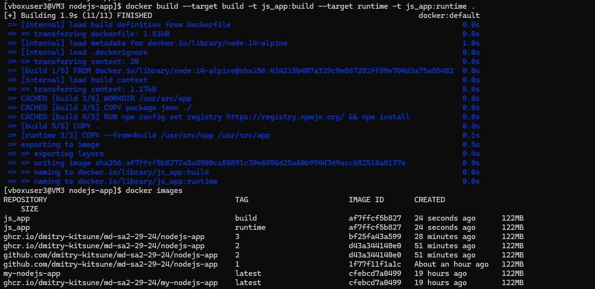
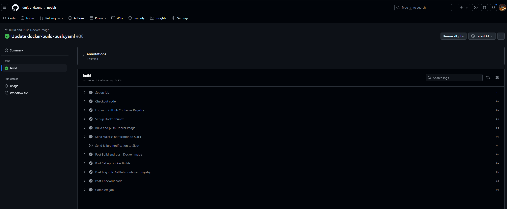
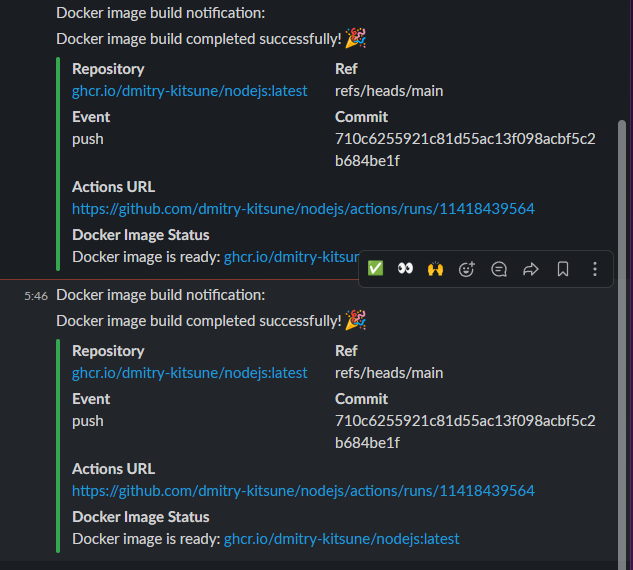

# 08. Docker. Docker compose

# Homework Assignment 1: Docker Compose for Application Stacks

1. Select a combination of services (e.g., web app, database) to create a multi-container application.
```bush 
Creating a WordPress application using Docker Compose with Nginx, MySQL, and PHP-FPM 
```
* Folder Structure
```bush
home/vboxuser3/08.DockerCompose/
├── certs                         # SSL certificates
│   ├── self-signed.crt
│   ├── self-signed.key
│   └── dhparam.pem
├── docker-compose.yml             # Docker Compose file
├── .env                           # Environment variables for MySQL
├── nginx                          # Nginx-specific configuration
│   ├── nginx.conf                 # Main Nginx config file
│   └── snippets                   # SSL snippets
│       ├── self-signed.conf
│       └── ssl-params.conf
└── wordpress                      # WordPress files (mounted to container)
```

```bush
 mkdir -p 08.DockerCompose/nginx 08.DockerCompose/wordpress certs snippets
```

2. Create a Docker Compose YAML file to define the services, networks, and volumes.

*docker-compose.yml
```bush
nano docker-compose.yml

# file 
# version: '1.5'

services:
  # MySQL Database Service
  db:
    image: mysql:8.0.39
    container_name: mysql_db
    restart: unless-stopped
    env_file: .env
    volumes:
      - db_data:/var/lib/mysql
    environment:
#      no_proxy: "localhost,127.0.0.1,::1"
      MYSQL_DATABASE: ${MYSQL_DB_NAME}
      MYSQL_ROOT_PASSWORD: ${MYSQL_ROOT_PASSWORD}
      MYSQL_USER: ${MYSQL_USER}
      MYSQL_PASSWORD: ${MYSQL_PASSWORD}
    networks:
      - wordpress-network

# PHP-FPM Service
#   php:
#    image: php:7.4-fpm
#    container_name: php_fpm
#    volumes:
#      - ./wordpress:/var/www/html
#    networks:
#      - wordpress-network

  # WordPress Service
  wordpress:
    depends_on:
      - db
#      - php
#    image: wordpress:6.6.2-php8.3-fpm-alpine
    image: wordpress:php7.4-fpm-alpine
#    image: wordpress:latest
    container_name: wordpress_app
    restart: always
    env_file: .env
    volumes:
#      - ./apache/apache2.conf:/etc/apache2/apache2.conf   # Mount custom apache2.conf
#      - ./apache/000-default.conf:/etc/apache2/sites-available/000-default.conf  # Mount custom virtual host config
#   - html:/var/www/html
      - ./wordpress:/var/www/html
    environment:
#      no_proxy: "localhost,127.0.0.1,::1"
      WORDPRESS_DB_HOST: db:3306  # ! this matches your service name
      WORDPRESS_DB_USER: ${WORDPRESS_DB_USER}
      WORDPRESS_DB_PASSWORD: ${WORDPRESS_DB_PASSWORD}
      WORDPRESS_DB_NAME: ${WORDPRESS_DB_NAME}
    networks:
      - wordpress-network

  # Nginx Web Server Service
  nginx:
    depends_on:
      - wordpress  # Ensure Nginx starts after WordPress
    build:
      context: /home/vboxuser3/08.DockerCompose/nginx/  # Path to the directory containing your Dockerfile
      dockerfile: Dockerfile  # Name of your Dockerfile
    container_name: nginx_server
    restart: unless-stopped
    volumes:
      - /home/vboxuser3/08.DockerCompose/nginx/nginx.conf:/etc/nginx/nginx.conf  # Correct Nginx config path
      - ./wordpress:/var/www/html  # Bind mount to WordPress directory
      - ./certs:/etc/nginx/certs  # Ensure certs directory exists
      - ./snippets:/etc/nginx/snippets
#      - /home/vboxuser3/08.DockerCompose/certs:/etc/nginx/certs  # Certificates directory
#      - /home/vboxuser3/08.DockerCompose/snippets:/etc/nginx/snippets  # Nginx snippets directory
    networks:
      - wordpress-network
#    extra_hosts:
#      - "localhost:127.0.0.1"  # Ensure Nginx knows localhost is 127.0.0.1
    ports:
      - "8081:80"  # Nginx will listen on port 8081 for HTTP traffic
      - "443:443"   # Nginx will listen on port 443 for HTTPS traffic
  # Nginx Web Server Service
#    image: nginx:1.27.2-alpine
#      - html:/var/www/html
#    extra_hosts:
#      - "localhost:127.0.0.1"  # Ensure Nginx knows localhost is 127.0.0.1

volumes:
  html:
  db_data:
    driver: local

networks:
  wordpress-network:
    driver: bridge
```

3. Configure environment variables and dependencies between services.

Environment Variables:
```bussh
.env

MYSQL_DB_NAME=wordpress
MYSQL_ROOT_PASSWORD=root_password
MYSQL_USER=wordpress_user
MYSQL_PASSWORD=wordpress_password

WORDPRESS_DB_USER=wordpress_user
WORDPRESS_DB_PASSWORD=wordpress_password
WORDPRESS_DB_NAME=wordpress
```
Nginx Configuration:

```bush
# Global configuration
# user www-data;
worker_processes auto;
pid /run/nginx.pid;
include /etc/nginx/modules-enabled/*.conf;

events {
    worker_connections 1024;  # Maximum number of simultaneous connections
}

http {
    # Start of HTTP block
    server {
        listen 80;                # Listen on port 80 for HTTP
        listen [::]:80;           # Listen on port 80 for IPv6
        server_name localhost;    # The server is accessible on localhost

        # Optionally, uncomment the line below to redirect all HTTP requests to HTTPS
        return 301 https://$host$request_uri;

        root /var/www/html;      # Document root for serving files
        index index.php index.html;  # Default files to serve (index.php and index.html)
    }

    # HTTPS Server Configuration with SSL
    server {
        listen 443 ssl;           # Listen on port 443 for HTTPS
        listen [::]:443 ssl;      # Listen on port 443 for HTTPS (IPv6)
        server_name localhost;    # The server is accessible on localhost

        # Include SSL certificate and key from snippets
        include /etc/nginx/snippets/self-signed.conf;  # Self-signed certificate location
        include /etc/nginx/snippets/ssl-params.conf;   # SSL security parameters

        root /var/www/html;      # Document root for serving files
        index index.php;         # Default index file is index.php

        # Handle requests to the root URL
        location / {
            try_files $uri $uri/ /index.php?$args;  # Try to serve the file, fallback to index.php
        }

        # PHP-FPM configuration for handling PHP requests
        location ~ \.php$ {
            try_files $uri =404;  # If the file doesn't exist, return a 404 error
#            fastcgi_buffers 8 16k;
#            fastcgi_buffer_size 32k;
#            fastcgi_connect_timeout 60;
#            fastcgi_read_timeout 300;
#            fastcgi_split_path_info ^(.+\.php)(/.+)$;
            # FastCGI settings for passing requests to PHP-FPM
            fastcgi_pass wordpress:9000;  # Pass requests to the WordPress PHP-FPM container
            fastcgi_index index.php;       # Default file to handle PHP requests
            include fastcgi_params;        # Include standard FastCGI parameters
            fastcgi_param SCRIPT_FILENAME $document_root$fastcgi_script_name; # Script filename
        }

        # Deny access to .htaccess files for security reasons
        location ~ /\.ht {
            deny all;
        }
    }
}
```

Create Nginx Configuration Files

```bush 
nano /home/vboxuser3/08.DockerCompose/nginx/nginx.conf

# nginx.conf

server {
    listen [::]:8081;
    listen 8081;
    server_name localhost;
    return 301 https://$host$request_uri;
}

server {
    listen [::]:8443 ssl;
    listen 8443 ssl;
    server_name localhost;

    include /etc/nginx/snippets/self-signed.conf;
    include /etc/nginx/snippets/ssl-params.conf;

    root /var/www/html;
    index index.php;

    location / {
        try_files $uri $uri/ /index.php?$args;
    }

    location ~ \.php$ {
        try_files $uri =404;
        fastcgi_buffers 8 16k;
        fastcgi_buffer_size 32k;
        fastcgi_connect_timeout 60;
        fastcgi_read_timeout 300;
        fastcgi_split_path_info ^(.+\.php)(/.+)$;
        fastcgi_pass php:9000;
        fastcgi_index index.php;
        include fastcgi_params;
        fastcgi_param SCRIPT_FILENAME $document_root$fastcgi_script_name;
        fastcgi_param PATH_INFO $fastcgi_path_info;
    }
}
```

SSL Snippets
```bush
nano /home/vboxuser3/08.DockerCompose/snippets/self-signed.conf

# file

ssl_certificate /etc/nginx/certs/self-signed.crt;
ssl_certificate_key /etc/nginx/certs/self-signed.key;

```

Create ssl-params.conf

```bush
nano /home/vboxuser3/08.DockerCompose/snippets/ssl-params.conf

#file

ssl_protocols TLSv1.2;
ssl_prefer_server_ciphers on;
ssl_ciphers HIGH:!aNULL:!MD5;
```

Set Up SSL Certificates
````bush
cd /home/vboxuser3/08.DockerCompose/certs

# Create self-signed certificate
openssl req -x509 -nodes -days 365 -newkey rsa:2048 -keyout self-signed.key -out self-signed.crt

Country Name (2 letter code) [XX]:BY
State or Province Name (full name) []:
Locality Name (eg, city) [Default City]:
Organization Name (eg, company) [Default Company Ltd]:
Organizational Unit Name (eg, section) []:
Common Name (eg, your name or your server's hostname) []:
Email Address []:


# Create a Diffie-Hellman group
openssl dhparam -out dhparam.pem 2048

Generating DH parameters, 2048 bit long safe prime
... ++*++*++*++*++*++*++*++*++*++*++*++*++*++*++*++*++*++*++*++*++*++*++*++*++*++*++*++*++*++*++*++*++*++*++*++*++*++*++*++*++*++*++*++*++*++*++*++*++*++*++*++*++*++*++*++*++*++*++*++*++*++*++*++*
```

Create the .env File

```bush
nano /home/vboxuser3/08.DockerCompose/.env

# file

MYSQL_ROOT_PASSWORD=root_password
MYSQL_DATABASE=wordpress
MYSQL_USER=wordpress_user
MYSQL_PASSWORD=wordpress_password
```

```bush
# Use the official Nginx image
FROM nginx:1.27.2-alpine

# Install necessary packages for user management
RUN apk add --no-cache shadow

# Set proxy environment variables
ENV no_proxy="localhost,127.0.0.1,::1"

#Expose the ports Nginx will listen on
EXPOSE 80 8081 443

```
4. Run the application stack using the docker-compose up or docker compose up command.

```bush 
cd /home/vboxuser3/08.DockerCompose

sudo systemctl start docker
[vboxuser3@VM3 08.DockerCompose]$ sudo systemctl enable docker
Created symlink /etc/systemd/system/multi-user.target.wants/docker.service → /usr/lib/systemd/system/docker.service.

# Install required packages: First, make sure the required dependencies are installed on system

sudo dnf install -y curl jq

Last metadata expiration check: 1:30:49 ago on Sun 13 Oct 2024 06:27:27 PM +03.
Package curl-7.76.1-29.el9_4.1.x86_64 is already installed.
Package jq-1.6-16.el9.x86_64 is already installed.
Dependencies resolved.
Nothing to do.

# Download the Docker Compose binary

sudo curl -L "https://github.com/docker/compose/releases/download/v2.20.2/docker-compose-$(uname -s)-$(uname -m)" -o /usr/local/bin/docker-compose
  % Total    % Received % Xferd  Average Speed   Time    Time     Time  Current
                                 Dload  Upload   Total   Spent    Left  Speed
  0     0    0     0    0     0      0      0 --:--:-- --:--:-- --:--:--     0
100 57.6M  100 57.6M    0     0   9.8M      0  0:00:05  0:00:05 --:--:-- 11.2M

# Apply executable permissions
sudo chmod +x /usr/local/bin/docker-compose

# Verify Docker Compose Installation

# docker-compose --version
[vboxuser3@VM3 08.DockerCompose]$ docker-compose --version
Docker Compose version v2.20.2


# Start container
docker-compose up -d
```



5. Access the application through a web browser or API client.






6. Document the Docker Compose file structure and the steps to deploy the application stack.

# Homework Assignment 2: Docker build automation (github action)

1. Choose a programming language (e.g., Java, Go, Python) and a sample application.

``` Take previous application from previous homework 07.Docker
 cp application.js /home/vboxuser3/08.DockerCompose/
```

2. Write a multi-stage Dockerfile to build the application with different stages for build and runtime.

```bush
#Dockerfile
# Stage 1: Build the Node.js application
FROM node:14-alpine AS build

# Set the working directory inside the container
WORKDIR /usr/src/app

# Define the proxy URL as an environment variable (only if needed)
# ENV PROXY_URL=http://your-proxy:8080
#ENV NO_PROXY=localhost,127.0.0.1
#ENV NO_PROXY=http://localhost:8080
#ENV HTTP_PROXY=http://localhost
#ENV HTTPS_PROXY=http://localhost

# Set the proxy configuration for npm (only if needed)
# RUN npm config set proxy ${PROXY_URL} \
#     && npm config set https-proxy ${PROXY_URL}
#RUN npm config set proxy ${NO_PROXY} \
#    && npm config set https-proxy ${NO_PROXY}
#RUN npm config set proxy ${HTTP_PROXY} \
#    && npm config set https-proxy ${HTTPS_PROXY}

# Copy package.json and package-lock.json to the working directory
COPY package.json ./
#COPY package.json package-lock.json ./

# Install dependencies
#RUN npm install
RUN npm config set registry https://registry.npmjs.org/ && npm install
# Copy the application source code (from your host folder structure)
COPY . .

# (Optional) Run the build step if needed (remove this if there's no build step)
# RUN npm run build

# Stage 2: Runtime
FROM node:14-alpine AS runtime

# Set the working directory
WORKDIR /usr/src/app

# Copy the built application from the previous stage
COPY --from=build /usr/src/app /usr/src/app

# Expose the port your app runs on
EXPOSE 8080

# Set environment variables
ENV NODE_ENV=production

# Start the application
CMD ["node", "application.js"]
```
```bush
# docker-build-push.yaml
name: Build and Push Docker Image

on:
  push:
    branches:
      - main
  workflow_dispatch: # Allow manual trigger with inputs
    inputs:
      imageToBuild:
        description: 'The image directory to build'
        required: true
        default: 'my-nodejs-app'
      tagImage:
        description: 'Tag for the image'
        required: true
        default: 'latest'

jobs:
  build:
    runs-on: ubuntu-latest

    steps:
      # Step 1: Checkout code from the GitHub repository
      - name: Checkout code
        uses: actions/checkout@v3

      # Step 2: Log in to GitHub Container Registry (GHCR)
      - name: Log in to GitHub Container Registry
        uses: docker/login-action@v2
        with:
          registry: ghcr.io
          username: ${{ github.repository_owner }}
          password: ${{ secrets.GITHUB_TOKEN }}

      # Step 3: Set up Docker Buildx (required for multi-platform builds)
      - name: Set up Docker Buildx
        uses: docker/setup-buildx-action@v2

      # Step 4: Build and push Docker image to GHCR
      - name: Build and push Docker image
        uses: docker/build-push-action@v3
        with:
          context: .
          file: ./Dockerfile
          push: true
          tags: ghcr.io/${{ github.repository_owner }}/${{ github.event.inputs.imageToBuild || 'nodejs' }}:${{ github.event.inputs.tagImage || 'latest' }}

      # Step 5: Send success notification to Slack if the build succeeds
      - name: Send success notification to Slack
        if: success()
        uses: slackapi/slack-github-action@v1.27.0
        with:
          payload: |
            {
              "text": "Docker image build notification:",
              "attachments": [
                {
                  "fallback": "Docker image built successfully: ghcr.io/${{ github.repository_owner }}/${{ github.event.inputs.imageToBuild || 'nodejs' }}:${{ github.event.inputs.tagImage || 'latest' }}",
                  "pretext": "Docker image build completed successfully! 🎉",
                  "color": "#36a64f",
                  "fields": [
                    {
                      "title": "Repository",
                      "value": "ghcr.io/${{ github.repository_owner }}/${{ github.event.inputs.imageToBuild || 'nodejs' }}:${{ github.event.inputs.tagImage || 'latest' }}",
                      "short": true
                    },
                    {
                      "title": "Ref",
                      "value": "${{ github.ref }}",
                      "short": true
                    },
                    {
                      "title": "Event",
                      "value": "${{ github.event_name }}",
                      "short": true
                    },
                    {
                      "title": "Commit",
                      "value": "${{ github.sha }}",
                      "short": true
                    },
                    {
                      "title": "Actions URL",
                      "value": "${{ github.server_url }}/${{ github.repository }}/actions/runs/${{ github.run_id }}",
                      "short": false
                    },
                    {
                      "title": "Docker Image Status",
                      "value": "Docker image is ready: ghcr.io/${{ github.repository_owner }}/${{ github.event.inputs.imageToBuild || 'nodejs' }}:${{ github.event.inputs.tagImage || 'latest' }}",
                      "short": false
                    }
                  ]
                }
              ]
            }
        env:
          SLACK_WEBHOOK_URL: ${{ secrets.SLACK_WEBHOOK_URL }}
          SLACK_WEBHOOK_TYPE: INCOMING_WEBHOOK

      # Step 6: Send failure notification to Slack if the build fails
      - name: Send failure notification to Slack
        if: failure()
        uses: slackapi/slack-github-action@v1.27.0
        with:
          payload: |
            {
              "text": "Docker image build notification:",
              "attachments": [
                {
                  "fallback": "Docker image build failed for: ghcr.io/${{ github.repository_owner }}/${{ github.event.inputs.imageToBuild || 'nodejs' }}:${{ github.event.inputs.tagImage || 'latest' }}",
                  "pretext": "Docker image build encountered an error! ❌",
                  "color": "#FF0000",
                  "fields": [
                    {
                      "title": "Repository",
                      "value": "ghcr.io/${{ github.repository_owner }}/${{ github.event.inputs.imageToBuild || 'nodejs' }}:${{ github.event.inputs.tagImage || 'latest' }}",
                      "short": true
                    },
                    {
                      "title": "Ref",
                      "value": "${{ github.ref }}",
                      "short": true
                    },
                    {
                      "title": "Event",
                      "value": "${{ github.event_name }}",
                      "short": true
                    },
                    {
                      "title": "Commit",
                      "value": "${{ github.sha }}",
                      "short": true
                    },
                    {
                      "title": "Actions URL",
                      "value": "${{ github.server_url }}/${{ github.repository }}/actions/runs/${{ github.run_id }}",
                      "short": false
                    },
                    {
                      "title": "Docker Image Status",
                      "value": "Docker image build failed :x:",
                      "short": false
                    }
                  ]
                }
              ]
            }
        env:
          SLACK_WEBHOOK_URL: ${{ secrets.SLACK_WEBHOOK_URL }}
          SLACK_WEBHOOK_TYPE: INCOMING_WEBHOOK
```

3. Compile or package the application in the build stage.

```bush
[vboxuser3@VM3 nodejs-app]$ tree -a
.
├── application.js
├── Dockerfile
├── .env
├── .github
│   └── workflows
│       └── docker-build-push.yaml
├── package.json
└── views
    ├── about.html
    ├── index.html
    └── style.css
```

4. Copy the compiled application into the runtime stage and configure it to run.
```bush
[vboxuser3@VM3 nodejs-app]$ docker build --target build -t js_app:build --target runtime -t js_app:runtime .
[+] Building 1.9s (11/11) FINISHED                                                             docker:default
 => [internal] load build definition from Dockerfile                                                     0.0s
 => => transferring dockerfile: 1.53kB                                                                   0.0s
 => [internal] load metadata for docker.io/library/node:14-alpine                                        1.0s
 => [internal] load .dockerignore                                                                        0.0s
 => => transferring context: 2B                                                                          0.0s
 => [build 1/5] FROM docker.io/library/node:14-alpine@sha256:434215b487a329c9e867202ff89e704d3a75e55482  0.0s
 => [internal] load build context                                                                        0.0s
 => => transferring context: 1.17kB                                                                      0.0s
 => CACHED [build 2/5] WORKDIR /usr/src/app                                                              0.0s
 => CACHED [build 3/5] COPY package.json ./                                                              0.0s
 => CACHED [build 4/5] RUN npm config set registry https://registry.npmjs.org/ && npm install            0.0s
 => [build 5/5] COPY . .                                                                                 0.0s
 => [runtime 3/3] COPY --from=build /usr/src/app /usr/src/app                                            0.1s
 => exporting to image                                                                                   0.5s
 => => exporting layers                                                                                  0.4s
 => => writing image sha256:af7ffcf5b8272a5a8980ca85891c39e6986d25a60b99447d9acc682510a0137e             0.0s
 => => naming to docker.io/library/js_app:build                                                          0.0s
 => => naming to docker.io/library/js_app:runtime                                                        0.0s
[vboxuser3@VM3 nodejs-app]$ docker images
REPOSITORY                                           TAG                       IMAGE ID       CREATED
    SIZE
js_app                                               build                     af7ffcf5b827   24 seconds ago      122MB
js_app                                               runtime                   af7ffcf5b827   24 seconds ago      122MB
ghcr.io/dmitry-kitsune/md-sa2-29-24/nodejs-app       3                         bf25fa43a599   28 minutes ago      122MB
ghcr.io/dmitry-kitsune/md-sa2-29-24/nodejs-app       2                         d43a344140e0   51 minutes ago      122MB
```
5. Build the multi-stage Docker image and run a container based on it.



 docker images
REPOSITORY              TAG                       IMAGE ID       CREATED         SIZE
my-nodejs-app           latest                    006b65273511   5 minutes ago   122MB
08dockercompose-nginx   latest                    e868bc3facc9   2 days ago      49.5MB
nodejs-app              latest                    a84f8ac1499e   3 days ago      124MB
nginx                   latest                    7f553e8bbc89   2 weeks ago     192MB
nginx                   1.27.2-alpine             cb8f91112b6b   2 weeks ago     47MB
wordpress               latest                    d42d4f76653a   4 weeks ago     699MB
wordpress               6.6.2-php8.3-fpm-alpine   3452dba21c47   4 weeks ago     267MB





6. Push/publish image to docker hub and/or github container register.
```bush
  docker build -t ghcr.io/dmitry-kitsune/nodejs:latest .
  docker login ghcr.io -u Dmitry-Kitsune -p ghp_HcVxxxxxxxxxxxxxxxx
  docker push ghcr.io/dmitry-kitsune/nodejs:latest
```
7. Slack notification when build failed/success with image name/tag.




8. Document the Dockerfile structure, the build process, and the advantages of multi-stage builds.

Docker compose file and github action file add to folder 08.Docker.Docker-compose add prepare PR (Pull Request)