# 10. Kubernetes installation (WS) 

root@sa-3  
 	
192.168.208.3-4

pre installation:
```bush

sudo dnf install wget

# Build Python 3.10 from Source

#Install build dependencies:
sudo dnf groupinstall "Development Tools"
sudo dnf install bzip2-devel libffi-devel zlib-devel

# Download Python 3.10 source:
wget https://www.python.org/ftp/python/3.10.0/Python-3.10.0.tgz

# Extract the source code:

tar -xzf Python-3.10.0.tgz
cd Python-3.10.0

# Configure and build:
./configure --enable-optimizations
make

# Install Python:
sudo make altinstall

#Check the version:
python3.10 --version

#Ansible

pip install ansible
pip install --upgrade ansible
pip install ansible==8.7.0

ansible --version

# Create a virtual environment using Python 3.10
python3.10 -m venv ansible-env

# Activate the virtual environment
source ansible-env/bin/activate

# Install Required Packages
pip install -U pip  # Update pip if needed
pip install -U -r requirements.txt
pip3 install ruamel_yaml
ansible --version


source ansible-env/bin/activate

declare -a IPS=(192.168.208.3 192.168.208.4)
cp -rfp inventory/sample/ inventory/burlyaev
CONFIG_FILE=inventory/burlyaev/hosts.yaml python3 contrib/inventory_builder/inventory.py ${IPS[@]}
nano inventory/burlyaev/hosts.yaml  ## need to remove host2 form kube_control_plane group
ansible-playbook -i inventory/burlyaev/hosts.yaml -u root cluster.yml --ask-pass

```


# Homework Assignment 1. K8s Installation

Localhost:

- Install kubectl for local run

```bush
  curl -LO "https://dl.k8s.io/release/$(curl -L -s https://dl.k8s.io/release/stable.txt)/bin/linux/amd64/kubectl"
  curl -LO "https://dl.k8s.io/release/$(curl -L -s https://dl.k8s.io/release/stable.txt)/bin/linux/amd64/kubectl.sha256"
  echo "$(cat kubectl.sha256)  kubectl" | sha256sum --check
  install -o root -g root -m 0755 kubectl /usr/local/bin/kubectl
  kubectl cluster-info --context kind-burlyaev
```

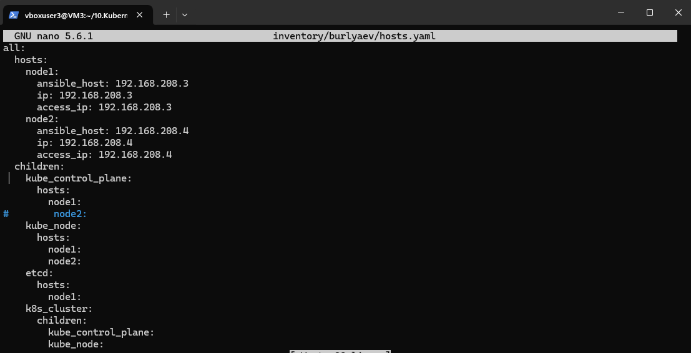

- Install k3s (on hosts 192.168.203.2)
```bush
   apt update
   apt install curl
   curl -fL https://get.k3s.io | sh -s - --write-kubeconfig-mode 644 --disable traefik --disable servicelb
   service k3s status
   kubectl get pods -A
```

- Install k9s to maintain cluster
```bush
wget https://github.com/derailed/k9s/releases/download/v0.32.5/k9s_Linux_amd64.tar.gz
tar -C /usr/local/bin -xzf k9s_Linux_amd64.tar.gz
ls -l /usr/local/bin/k9s
k9s
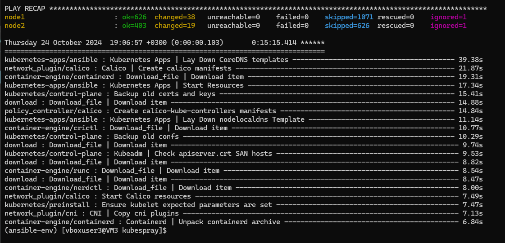

# Tunnel notes
ssh -L 6443:127.0.0.1:6443 root@192.168.208.3 -f -N
ssh -L 6444:127.0.0.1:6443 root@192.168.203.2 -f -N
```

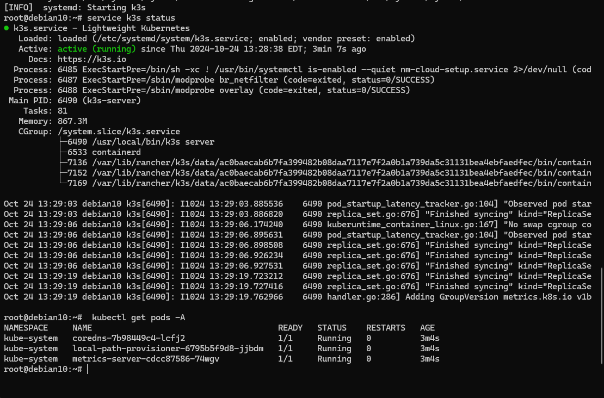

```bush
cat .kube/config-k8s
#....
    server: https://127.0.0.1:6443
  name: k8s
contexts:
#....

cat .kube/config-k3s
#....
    server: https://127.0.0.1:6444
  name: k3s
contexts:
#....
```


- Make print-screen of k9s with pods in all namespaces


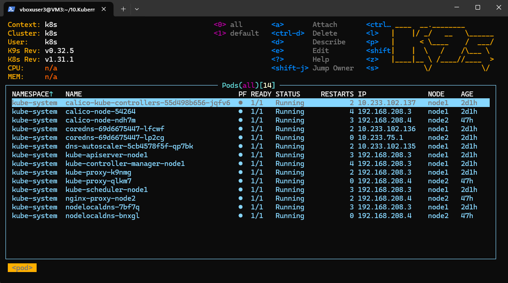
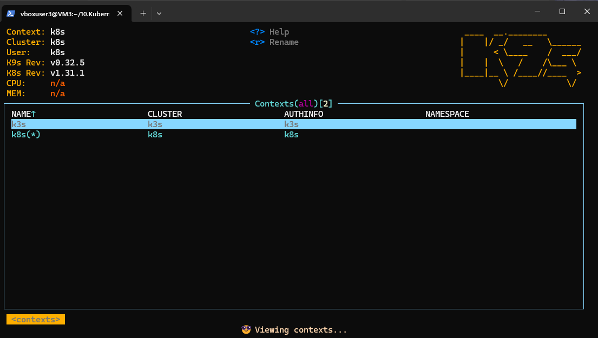

Kubernetes host

- Finish workshop deployment if it is not done yet

- Deploy shell pod in default namespace which you can you use for internal checks inside the cluster
```bush
# shell-pod.yaml
apiVersion: v1
kind: Pod
metadata:
  name: shell
  namespace: default
spec:
  containers:
  - name: shell
    image: busybox
    command: ['sh', '-c', 'sleep 3600']
    tty: true
    stdin: true
  restartPolicy: Never
```
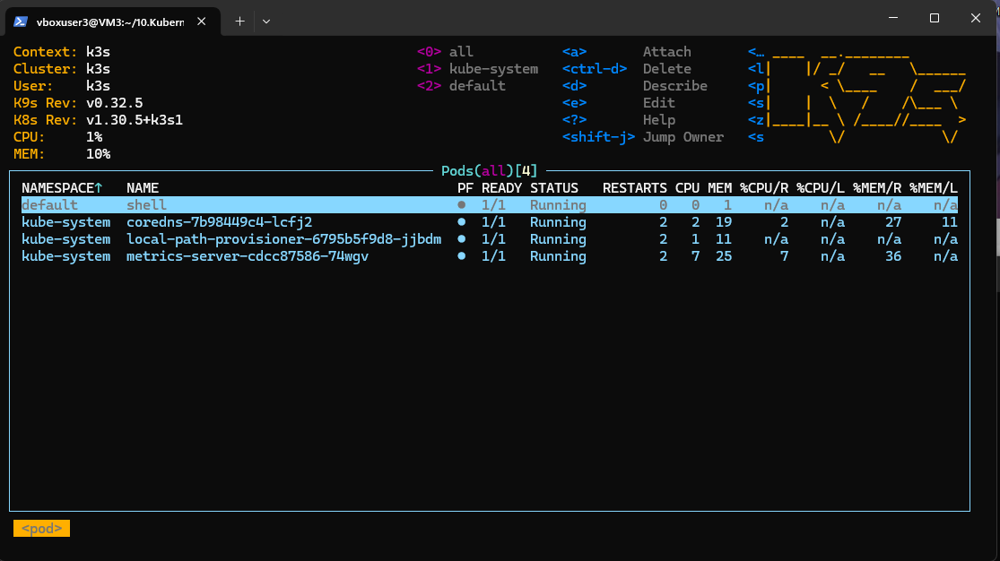
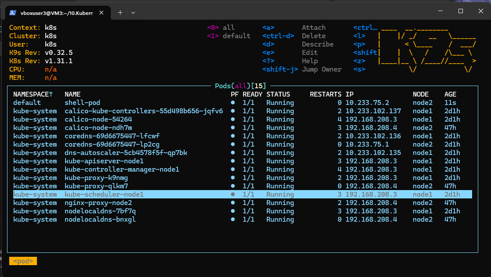

Monitoring of cluster:


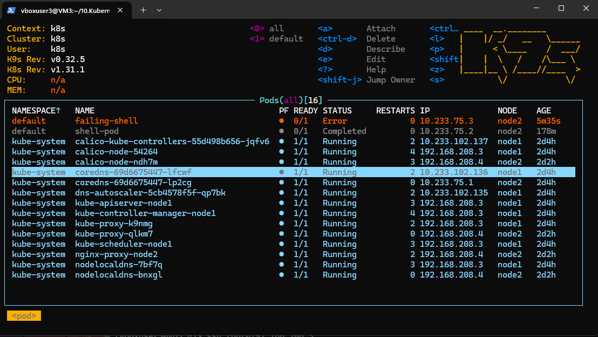

- Create GitHub action to check status of pods and create slack notification if you have crashed/failed pods
```bush
# check_pod_status.yml

name: Check Pod Status and Notify Slack

on:
  #schedule:
  #  - cron: '*/30 * * * *'  # Runs every 30 minutes
  workflow_dispatch:  # Allows manual triggering of the workflow
  
jobs:
  check-pods:
    runs-on: ubuntu-latest
    steps:
      - uses: actions/checkout@v3
      
      # Prepare environment variables for K3S
      - name: Prepare Environment Variables for K3S
        run: |
          # Clear the file before adding new variables 
          rm -f ~/temp_env_file_k3s.txt
          touch ./temp_env_file_k3s.txt

      # Check for failed pods in K3S cluster
      - name: Check for failed pods in K3S cluster
        id: check_pods_k3s
        uses: appleboy/ssh-action@v1.1.0
        with:
          proxy_host: ${{ secrets.JUMPHOST_IP }}
          proxy_port: ${{ secrets.JUMPHOST_PORT }}
          proxy_username: ${{ secrets.JUMPHOST_USER }}
          proxy_password: ${{ secrets.JUMPHOST_PASS }}
          host: ${{ secrets.K3S_SERVER_IP }}
          username: ${{ secrets.KS_SERVER_USER }}
          password: ${{ secrets.KS_SERVER_PASS }}
          script: |
            rm -f ~/temp_env_file_k3s.txt
            # Ensure jq is installed
            if ! command -v jq &> /dev/null; then
              sudo apt-get update && sudo apt-get install -y jq
            fi

            # source temp_env_file.txt
            mkdir -p ~/env_files
            touch ~/env_files/temp_env_file_k3s.txt
            
            # Set up kubeconfig for K3S
            mkdir -p ~/.kube
            echo "${{ secrets.KUBECONFIG_K3S }}" > ~/.kube/config
            export KUBECONFIG=~/.kube/config

            # Initialize state variables
            STATUS="Error"
            FAILED_PODS=""
            
            # Get the pod statuses and print them
            STATUS_ARRAY_K3S=$(kubectl get pods -A)
            ERROR_ARRAY_K3S=$(kubectl get pods -A | grep -iE "$STATUS")

            # Check for errors
            if [[ -z "$ERROR_ARRAY_K3S" ]]; then
              echo "No failed pods found in K3S"
              echo "STATE_ENV_K3S=FALSE" > ~/env_files/temp_env_file_k3s.txt
              echo "FAILED_PODS_K3S=No failed pods in K3S" >> ~/env_files/temp_env_file_k3s.txt
            else
              echo "Failed pods found in K3S!"
              # FAILED_PODS=$(echo "$STATUS_ARRAY_K3S" | grep -i "Error" | tr '\n' ';' | sed 's/;$/;/' )
              echo "STATE_ENV_K3S=TRUE" > ~/env_files/temp_env_file_k3s.txt
              echo "FAILED_PODS_K3S=$FAILED_PODS" >> ~/env_files/temp_env_file_k3s.txt
            fi

            # Print the contents for debugging
            echo "Show tempfile"
            # tree ~/
            # cat ~/temp_env_file_k3s.txt
            ls ~/env_files/temp_env_file_k3s.txt  # Check if the file exists
            cat ~/env_files/temp_env_file_k3s.txt  # Output the contents for debugging

      - name: List files in home directory on remote server
        uses: appleboy/ssh-action@v1.1.0
        with:
          proxy_host: ${{ secrets.JUMPHOST_IP }}
          proxy_port: ${{ secrets.JUMPHOST_PORT }}
          proxy_username: ${{ secrets.JUMPHOST_USER }}
          proxy_password: ${{ secrets.JUMPHOST_PASS }}
          host: ${{ secrets.K3S_SERVER_IP }}
          username: ${{ secrets.KS_SERVER_USER }}
          password: ${{ secrets.KS_SERVER_PASS }}
          script: |
            echo "Listing files in home directory:"
            ls -l ~/env_files/temp_env_file_k3s.txt
            ls -a ~/env_files/temp_env_file_k3s.txt
            
      # Step to copy the environment file to the GitHub Actions runner
      - name: Copy temp_env_file_k3s.txt to local runner
        uses: nicklasfrahm/scp-action@main
        with:
          direction: download
          host: ${{ secrets.K3S_SERVER_IP }}           # K3S server IP
          username: ${{ secrets.KS_SERVER_USER }}        # Username for K3S server
          insecure_password: ${{ secrets.KS_SERVER_PASS }}                    # SSH key for authentication
          insecure_ignore_fingerprint: true               # Ignore SSH fingerprint verification
          proxy_host: ${{ secrets.JUMPHOST_IP }}         # Jump host IP
          proxy_username: ${{ secrets.JUMPHOST_USER }}   # Username for the jump host
          insecure_proxy_password: ${{ secrets.JUMPHOST_PASS }}             # SSH key for the jump host
          proxy_port: ${{ secrets.JUMPHOST_PORT }}       # Port for the jump host
          insecure_proxy_ignore_fingerprint: true         # Ignore fingerprint verification for the proxy
          source: "/root/env_files/temp_env_file_k3s.txt" # Source path on the K3S server
          target: "./temp_env_file_k3s.txt"              # Local target path on the GitHub runner

      # Step to load environment variables from the temporary file
      # Upload Variable File as Artifact for K3S
      - name: Upload Variable File as Artifact for K3S
        uses: actions/upload-artifact@v4
        with:
          name: k3s_variable_file
          path: ./temp_env_file_k3s.txt
     
      - name: Check directory
        run: |
          echo ls -a ~/
          
      # Prepare environment variables for K8S
      - name: Prepare Environment Variables for K3S
        run: |
          # Clear the file before adding new variables (one file for both)
          rm -f ~/temp_env_file_k8s.txt

      # Check for failed pods in K8S cluster
      - name: Check for failed pods in K8S cluster
        id: check_pods_k8s
        uses: appleboy/ssh-action@v1.1.0
        with:
          proxy_host: ${{ secrets.JUMPHOST_IP }}
          proxy_port: ${{ secrets.JUMPHOST_PORT }}
          proxy_username: ${{ secrets.JUMPHOST_USER }}
          proxy_password: ${{ secrets.JUMPHOST_PASS }}
          host: ${{ secrets.K8S_SERVER_IP }}
          username: ${{ secrets.KS_SERVER_USER }}
          password: ${{ secrets.KS_SERVER_PASS }}
          script: |
            # source temp_env_file.txt  # Load the environment variable from the temp file
            
            # Ensure jq is installed
            if ! command -v jq &> /dev/null; then
              sudo apt-get update && sudo apt-get install -y jq
            fi

            # Set up kubeconfig for K8S
            mkdir -p ~/.kube
            echo "${{ secrets.KUBECONFIG_K8S }}" > ~/.kube/config
            export KUBECONFIG=~/.kube/config

            # source temp_env_file.txt
            mkdir -p ~/env_files
            touch ~/env_files/temp_env_file_k8s.txt
            
            # Initialize state variables
            STATUS="Error"
            FAILED_PODS=""
            
            # Get the pod statuses and print them for k8s
            STATUS_ARRAY_K8S=$(kubectl get pods -A)
            ERROR_ARRAY_K8S=$(kubectl get pods -A | grep -iE "$STATUS")
            echo "$STATUS_ARRAY_K8S"
            echo "DEBUG for ERROR_ARRAY_K8S"
            echo "$ERROR_ARRAY_K8S"
            
            # Check for errors
            if [[ -z "$ERROR_ARRAY_K8S" ]]; then
              echo "No failed pods found in K8S"
              echo "STATE_ENV_K8S=FALSE" > ~/env_files/temp_env_file_k8s.txt
              echo "FAILED_PODS_K8S=No failed pods in K8S" >> ~/env_files/temp_env_file_k8s.txt
            else
              echo "Failed pods found in K8S!"
              # FAILED_PODS=$(echo "$STATUS_ARRAY_K8S" | grep -i "Error" | tr '\n' ';' | sed 's/;$/;/' )
              echo "STATE_ENV_K8S=TRUE" > ~/env_files/temp_env_file_k8s.txt
              echo "FAILED_PODS_K8S=$ERROR_ARRAY_K8S" >> ~/env_files/temp_env_file_k8s.txt
            fi
            
            # Print the contents for debugging
            echo "Show tempfile"
            cat ~/env_files/temp_env_file_k8s.txt

      # Step to copy the environment file to the GitHub Actions runner
      - name: Copy temp_env_file_k8s.txt to local runner
        uses: nicklasfrahm/scp-action@main
        with:
          direction: download
          host: ${{ secrets.K8S_SERVER_IP }}           # K3S server IP
          username: ${{ secrets.KS_SERVER_USER }}        # Username for K3S server
          insecure_password: ${{ secrets.KS_SERVER_PASS }}                    # SSH key for authentication
          insecure_ignore_fingerprint: true               # Ignore SSH fingerprint verification
          proxy_host: ${{ secrets.JUMPHOST_IP }}         # Jump host IP
          proxy_username: ${{ secrets.JUMPHOST_USER }}   # Username for the jump host
          insecure_proxy_password: ${{ secrets.JUMPHOST_PASS }}             # SSH key for the jump host
          proxy_port: ${{ secrets.JUMPHOST_PORT }}       # Port for the jump host
          insecure_proxy_ignore_fingerprint: true         # Ignore fingerprint verification for the proxy
          source: "/root/env_files/temp_env_file_k8s.txt" # Source path on the K3S server
          target: "./temp_env_file_k8s.txt"              # Local target path on the GitHub runner

      # Step to load environment variables from the temporary file
      # Upload Variable File as Artifact for K8S
      - name: Upload Variable File as Artifact for K8S
        uses: actions/upload-artifact@v4
        with:
          name: k8s_variable_file
          path: ./temp_env_file_k8s.txt     
      - name: Check directory
        run: |
          echo ls -a ~/
       ################################################################## end of first job  ##################################################


  send-slack-notification:
    runs-on: ubuntu-latest
    needs: check-pods  # Ensure this job runs after 'check-pods'
    
    steps:

      # Download Variable File Artifact for K3S
      - name: Download Variable File Artifact for K3S
        uses: actions/download-artifact@v4
        with:
          name: k3s_variable_file
          path: .

      # Download Variable File Artifact for K3S
      - name: Download Variable File Artifact for K8S
        uses: actions/download-artifact@v4
        with:
          name: k8s_variable_file
          path: .

      # Load Environment Variables from Downloaded File
      - name: Load Environment Variables K3S from Downloaded File
        run: |
          echo ls -a ~/
          find -name "temp_env_file_k3s*"
          cat ./temp_env_file_k3s.txt
          TEMP_ENV_FILE=$(cat ./temp_env_file_k3s.txt)   # should match the download path
          echo "$TEMP_ENV_FILE"
          export VARIABLE_ENV=$(cat ./temp_env_file_k3s.txt)
          echo "Save to GITHUB_ENV"
          echo "$VARIABLE_ENV" >> $GITHUB_ENV

      # Step to demonstrate that the variables are loaded
      - name: Show Loaded Variables
        run: |
          echo "STATE_ENV_K3S: ${{ env.STATE_ENV_K3S }}"
          echo "FAILED_PODS_K3S: ${{ env.FAILED_PODS_K3S }}"

      # Load Environment Variables from Downloaded File
      - name: Load Environment Variables K8S from Downloaded File
        run: |
          echo ls -a ./
          find -name "temp_env_file_k8s*"
          cat ./temp_env_file_k8s.txt
          TEMP_ENV_FILE=$(cat ./temp_env_file_k8s.txt)   # should match the download path
          echo "$TEMP_ENV_FILE"
          export VARIABLE_ENV=$(cat ./temp_env_file_k8s.txt)
          echo "Save to GITHUB_ENV"
          echo "$VARIABLE_ENV" >> $GITHUB_ENV

      # Step to demonstrate that the variables are loaded
      - name: Show Loaded Variables
        run: |
          echo "STATE_ENV_K8S: ${{ env.STATE_ENV_K8S }}"
          echo "FAILED_PODS_K8S: ${{ env.FAILED_PODS_K8S }}"
          
 # For K3S claster

      - name: Send Slack Notification for K3S Error Pods
        if: env.STATE_ENV_K3S == 'TRUE'
        uses: slackapi/slack-github-action@v1.27.0
        with:
          payload: |
            {
              "attachments": [
                {
                  "fallback": "Attention: The following pods in K3S are in Error state.",
                  "pretext": "Attention: The following pods in K3S are in Error state.",
                  "color": "#D00000",
                  "fields": [
                    {
                      "title": "K3S Error Pods",
                      "value": "${{ env.FAILED_PODS_K3S }}",
                      "short": false
                    }
                  ]
                }
              ]
            }
        env:
          SLACK_WEBHOOK_URL: ${{ secrets.SLACK_WEBHOOK_URL }}
          SLACK_WEBHOOK_TYPE: INCOMING_WEBHOOK
          SLACK_USERNAME: KuberCluster

      # Send Slack Notification for K3S Successful Status
      - name: Send Slack Notification for K3S Successful Status
        if: env.STATE_ENV_K3S == 'FALSE'
        uses: slackapi/slack-github-action@v1.27.0
        with:
          payload: |
            {
              "attachments": [
                {
                  "fallback": "Good News: All pods are running smoothly in K3S.",
                  "pretext": "Good News: All pods are running smoothly in K3S.",
                  "color": "#36A64F",
                  "fields": [
                    {
                      "title": "K3S Status",
                      "value": "All pods are running smoothly in K3S.",
                      "short": false
                    }
                  ]
                }
              ]
            }
        env:
          SLACK_WEBHOOK_URL: ${{ secrets.SLACK_WEBHOOK_URL }}
          SLACK_WEBHOOK_TYPE: INCOMING_WEBHOOK
          SLACK_USERNAME: KuberCluster 

# For k8s classter

      # Send Slack Notification for K8S Error Pods
      - name: Send Slack Notification for K8S Error Pods
        if: env.STATE_ENV_K8S == 'TRUE'
        uses: slackapi/slack-github-action@v1.27.0
        with:
          payload: |
            {
              "attachments": [
                {
                  "fallback": "Attention: The following pods in K8S are in Error state.",
                  "pretext": "Attention: The following pods in K8S are in Error state.",
                  "color": "#D00000",
                  "fields": [
                    {
                      "title": "K8S Error Pods",
                      "value": "${{ env.FAILED_PODS_K8S }}",
                      "short": false
                    }
                  ]
                }
              ]
            }
        env:
          SLACK_WEBHOOK_URL: ${{ secrets.SLACK_WEBHOOK_URL }}
          SLACK_WEBHOOK_TYPE: INCOMING_WEBHOOK
          SLACK_USERNAME: KuberCluster

      # Send Slack Notification for K8S Successful Status
      - name: Send Slack Notification for K8S Successful Status
        if: env.STATE_ENV_K8S == 'FALSE'
        uses: slackapi/slack-github-action@v1.27.0
        with:
          payload: |
            {
              "attachments": [
                {
                  "fallback": "Good News: All pods are running smoothly in K8S.",
                  "pretext": "Good News: All pods are running smoothly in K8S.",
                  "color": "#36A64F",
                  "fields": [
                    {
                      "title": "K8S Status",
                      "value": "All pods are running smoothly in K8S.",
                      "short": false
                    }
                  ]
                }
              ]
            }
        env:
          SLACK_WEBHOOK_URL: ${{ secrets.SLACK_WEBHOOK_URL }}
          SLACK_WEBHOOK_TYPE: INCOMING_WEBHOOK
          SLACK_USERNAME: KuberCluster

```

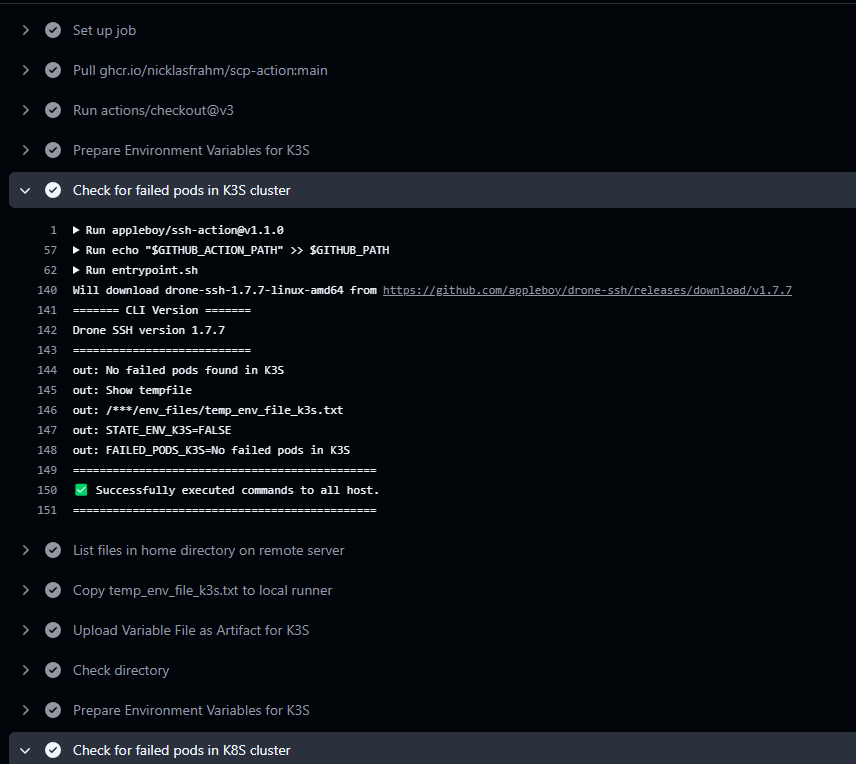
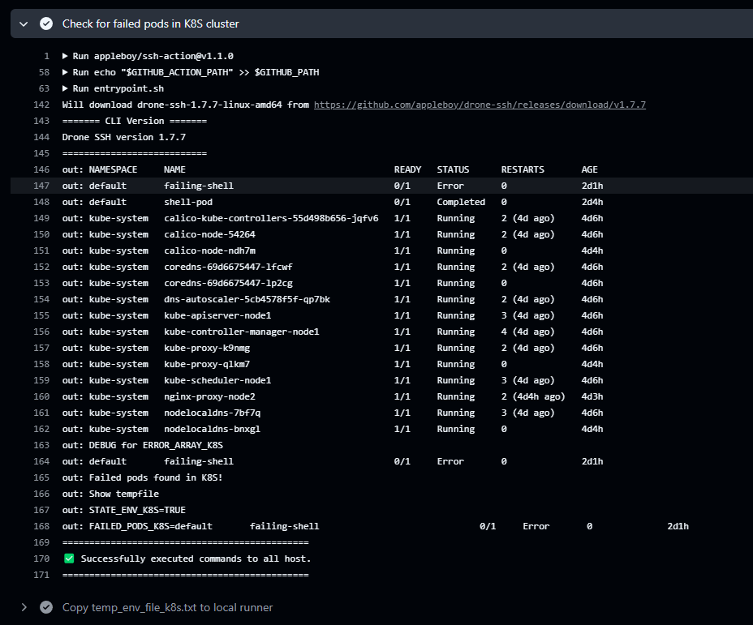
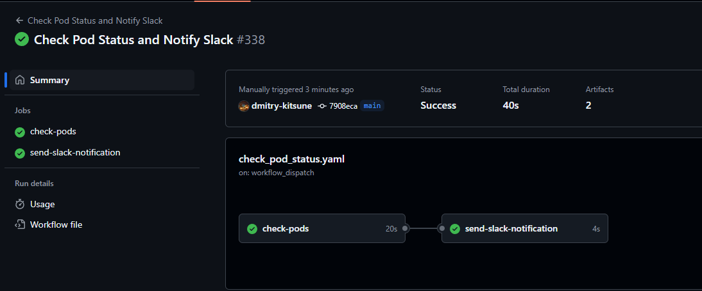

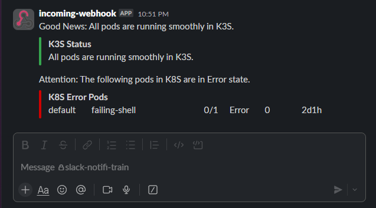

Your print-screen, github action file add to PR