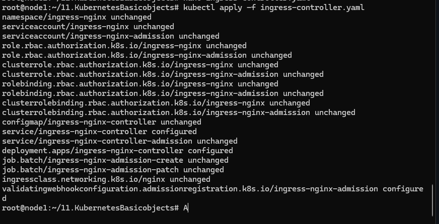
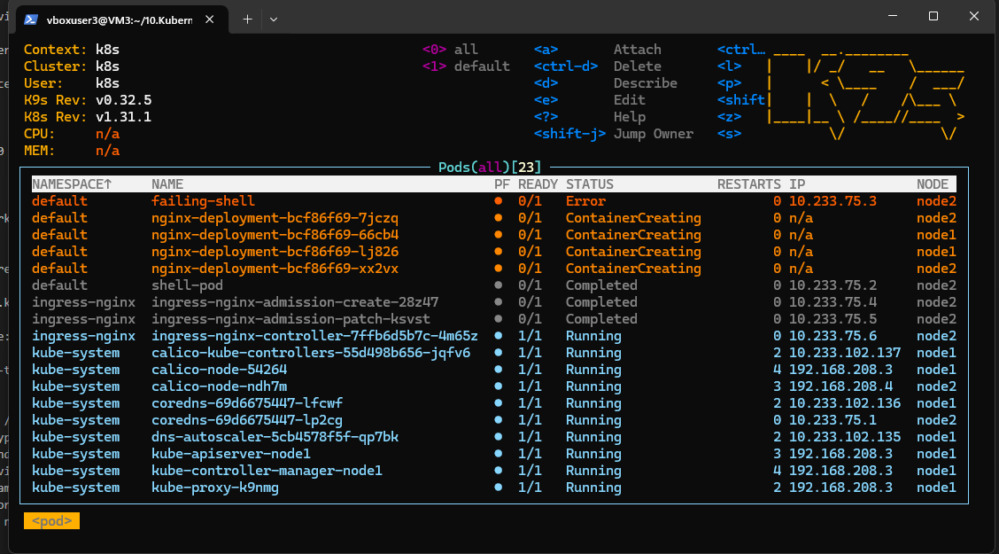
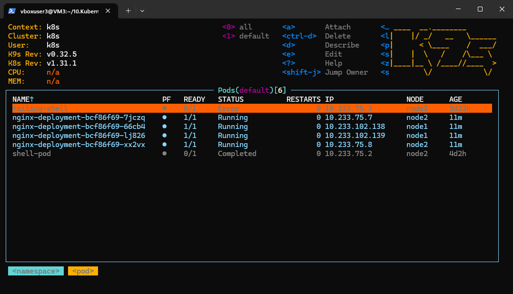
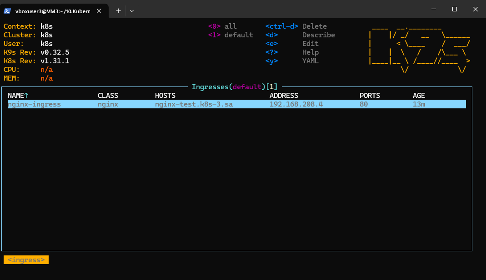
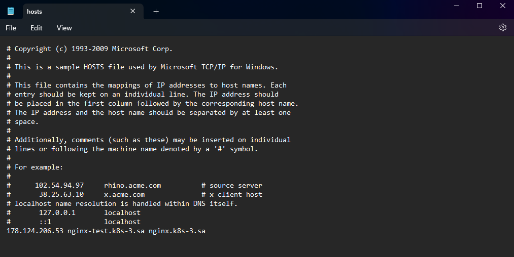
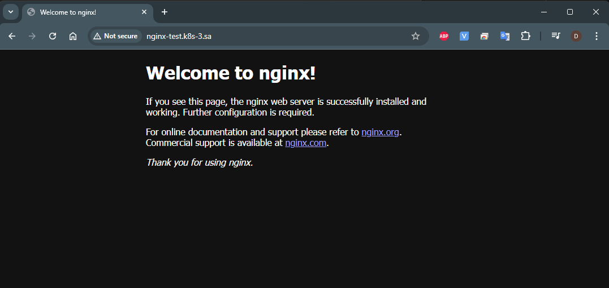
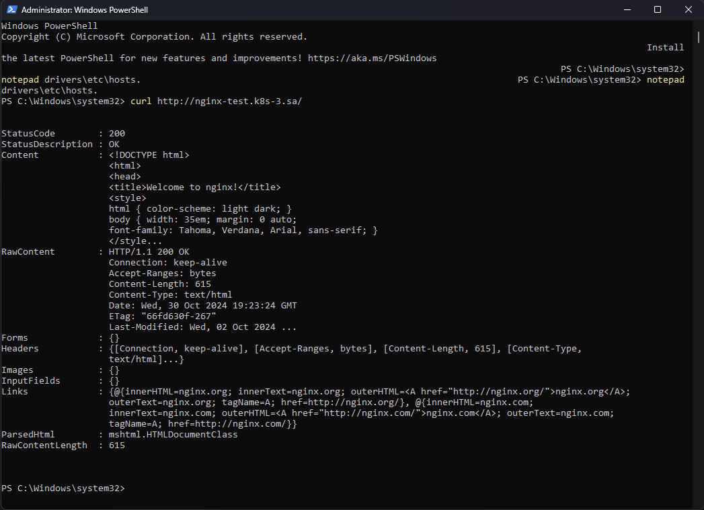

# 11. Kubernetes. Basic objects

# Homework Assignment 1. Nginx deployment

# Create deployment of nginx service:

 - replicas: 4

 - set resources for pods

 - deployment shouldn't have any outage (service is available all time)

 - ingress rule for host name (nginx-test.k8s-3.sa)


```bush
 # Ingress-controller

wget https://raw.githubusercontent.com/kubernetes/ingress-nginx/refs/tags/controller-v1.11.3/deploy/static/provider/baremetal/deploy.yaml -O ingress-controller.yaml

# apply ingress-controller.yaml
kubectl apply -f ingress-controller.yaml
```



```bush
#  nginx-deployment.yaml

apiVersion: apps/v1
kind: Deployment
metadata:
  name: nginx-deployment
  labels:
    app: nginx
spec:
  replicas: 4
  selector:
    matchLabels:
      app: nginx
  strategy:
    type: RollingUpdate
    rollingUpdate:
      maxUnavailable: 1     # Ensure zero downtime during updates
      maxSurge: 2           # Allow one extra pod during updates
  template:
    metadata:
      labels:
        app: nginx
    spec:
      containers:
      - name: nginx
        image: nginx:latest
        ports:
        - containerPort: 80
        resources:
          requests:
            cpu: "100m"
            memory: "100Mi"
          limits:
            cpu: "200m"
            memory: "200Mi"
---
apiVersion: v1
kind: Service
metadata:
  name: nginx-service
  labels:
     run: nginx-service
spec:
  type: LoadBalancer
  ports:
  - port: 80
    protocol: TCP
    targetPort: 80
  selector:
    app: nginx
---
apiVersion: networking.k8s.io/v1
kind: Ingress
metadata:
  name: nginx-ingress
  annotations:
    nginx.ingress.kubernetes.io/server-alias: "nginx.k8s-3.sa"
spec:
  ingressClassName: nginx
  rules:
    - host: nginx-test.k8s-3.sa
      http:
        paths:
          - path: /
            pathType: Prefix
            backend:
              service:
                name: nginx-service
                port:
                  number: 80
```
```bush
kubectl apply -f nginx-deployment.yaml
```
# Pods


# Ingresses


# Hosts config
```bush
notepad drivers\etc\hosts.
```


# Page



# Curl



Your manifests with short report add to PR