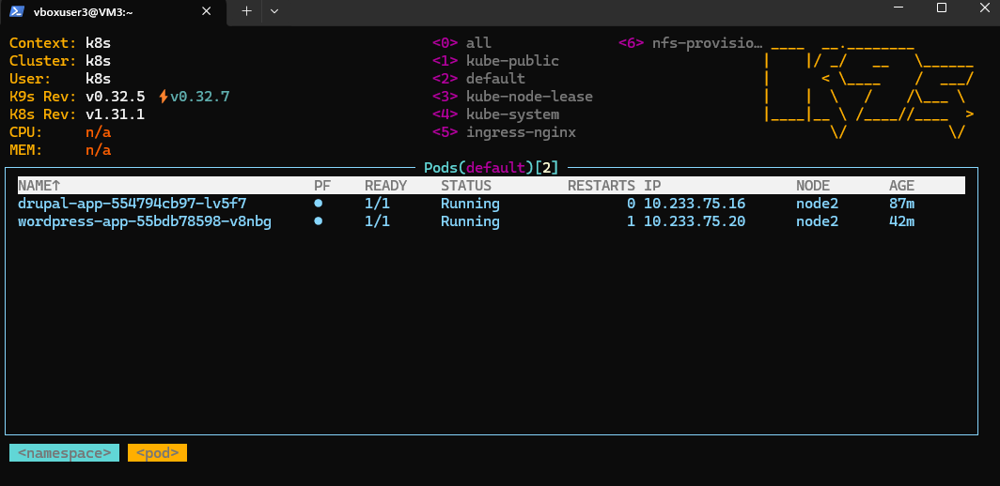
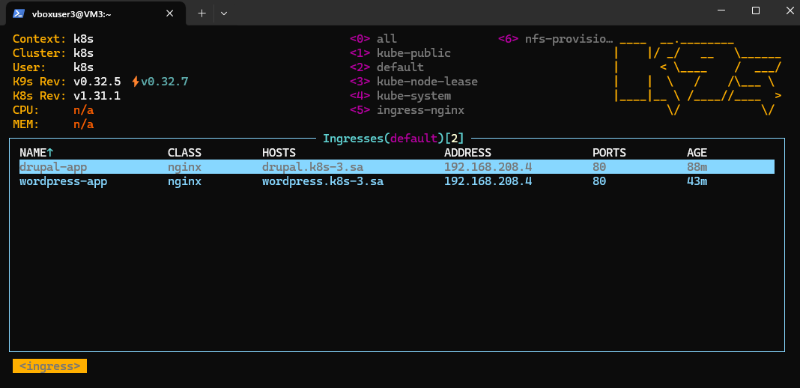
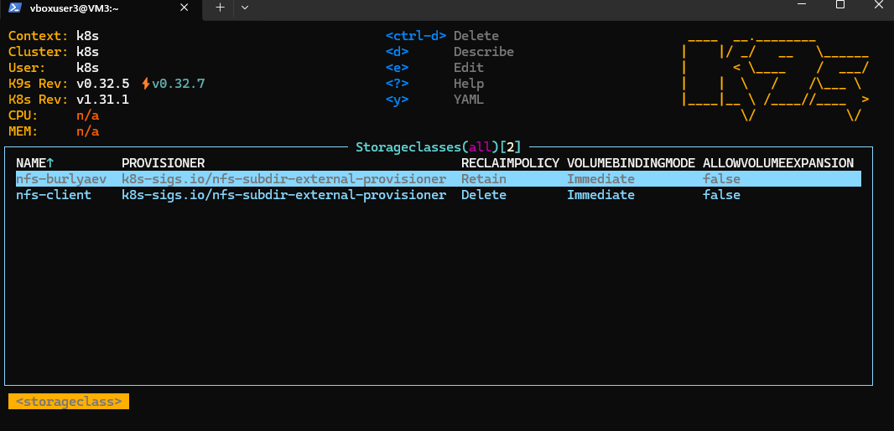
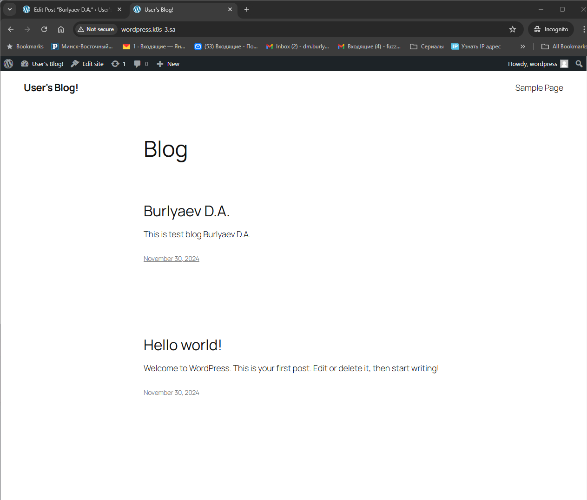
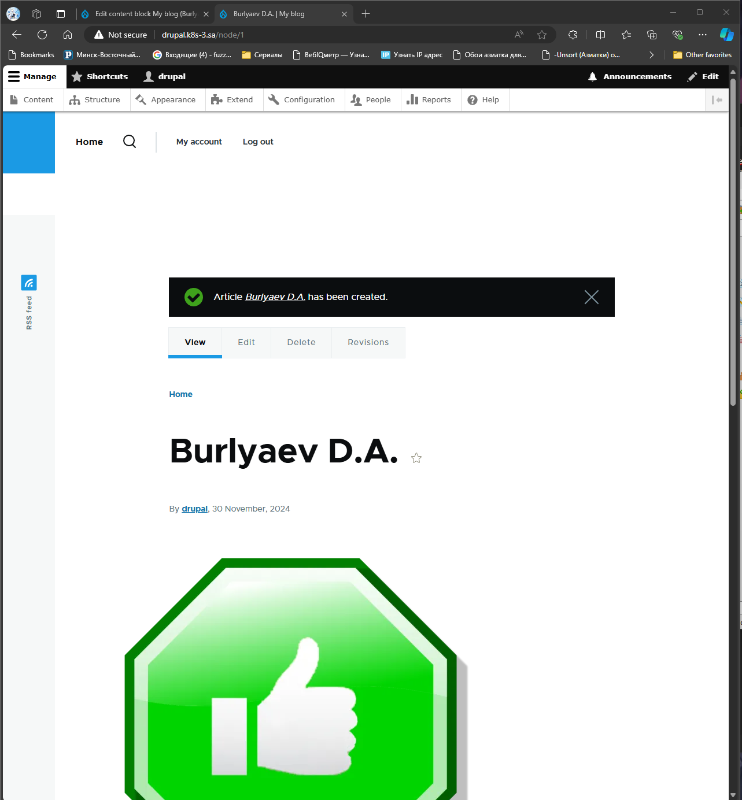

##  13. Kubernetes. Helm
```bsuh
    mkdir 13.K8s.Helm
    cd 13.K8s.Helm/
    mkdir {helm-releases,helm-sources}
    curl -fsSL -o get_helm.sh https://raw.githubusercontent.com/helm/helm/main/scripts/get-helm-3
    chmod +x get_helm.sh
    ./get_helm.sh
    helm
```

```bush
# kustomization.yaml
namespace: nfs-provisioner
bases:
  - github.com/kubernetes-sigs/nfs-subdir-external-provisioner//deploy
resources:
  - ns-nfs-dynamic.yaml
patchesStrategicMerge:
  - patch_nfs_details.yaml
```

```bush
nano StorageClass.yaml

# StorageClass.yaml
apiVersion: storage.k8s.io/v1
kind: StorageClass
metadata:
  name: nfs-burlyaev
provisioner: k8s-sigs.io/nfs-subdir-external-provisioner
parameters:
  server: 192.168.37.105  # IP NFS-сервера
  # pathPattern: "/mnt/IT-Academy/nfs-data/sa2-29-24/burlyaev/${.PVC.namespace}/${.PVC.annotations.nfs.io/storage-path}"
  pathPattern: "${.PVC.namespace}/${.PVC.annotations.nfs.io/storage-path}"  # Динамический путь на сервере NFS
  onDelete: retain  # Политика при удалении PVC
mountOptions:
#  - vers=3  # Версия NFS
reclaimPolicy: Retain  # Политика освобождения тома
```

##  Homework Assignment 1. Application deployment by Helm

Deploy in your K8s cluster the following applications using helm charts from public repositories:

  * Wordpress
```bush
helm install wordpress-app --set global.defaultStorageClass=nfs-burlyaev,mariadb.enabled=false,externalDatabase.host=192.168.202.3,externalDatabase.port=3306,externalDatabase.user=bn_wordpress,externalDatabase.password=XXXXXX,externalDatabase.database=bitnami_wordpress,wordpressUsername=wordpress,wordpressPassword=wordpressPassword,wordpressEmail=XXXXXX@gmail.com,volumePermissions.enabled=true,ingress.enabled=true,ingress.hostname=wordpress.k8s-3.sa,ingress.ingressClassName=nginx,livenessProbe.initialDelaySeconds=150,livenessProbe.periodSeconds=30,readinessProbe.initialDelaySeconds=150,readinessProbe.periodSeconds=30 oci://registry-1.docker.io/bitnamicharts/wordpress
```
  * Drupal
```bush
helm install drupal-app --set global.defaultStorageClass=nfs-client,mariadb.enabled=false,externalDatabase.host=192.168.202.3,externalDatabase.port=3306,externalDatabase.user=bn_wordpress,externalDatabase.password=XXXXXXXX,externalDatabase.database=drupal,drupalUsername=drupal,drupalPassword=drupalPassword,volumePermissions.enabled=true,ingress.enabled=true,ingress.hostname=drupal.k8s-3.sa,ingress.ingressClassName=nginx oci://registry-1.docker.io/bitnamicharts/drupal
```




(OPTIONAL) disable DBs deployment for these deployment and use ansible DBs provisioning from ansible workshop

  * inv.yaml
```bush
db_all:
  hosts:
    mariadb:
      ansible_host: 192.168.202.3
      ansible_user: root
```

  * mariadb.yaml
```bush
---
- hosts: mariadb
  become: yes
  vars:
    app_packages:
      - mariadb-server
      - mariadb-client
      - python3-pymysql
      - python3-mysqldb
    # Databases for WordPress and Drupal
    db_wordpress_name: "bitnami_wordpress"  # Database for WordPress
    db_drupal_name: "drupal"  # Database for Drupal
    db_user: "bn_wordpress"  # Database username
    db_pass: "XXXXXXXXXXX"  # Database user password
    root_pass: "XXXXXXXXX"  # Root password for MariaDB
  pre_tasks:
    - name: Validate input variables
      debug:
        msg:
          - "DB WordPress name: {{ db_wordpress_name }}"
          - "DB Drupal name: {{ db_drupal_name }}"
          - "DB user: {{ db_user }}"
          - "DB pass: {{ db_pass }}"
          - "Root pass: {{ root_pass }}"

    # Fix broken dependencies using the apt module
    - name: Fix broken dependencies
      apt:
        upgrade: dist
        force_apt_get: yes
        update_cache: yes
      when: ansible_facts['os_family'] == 'Debian'

  tasks:
    - name: Install curl for downloading MariaDB repos
      apt:
        name: "curl"
        state: latest
        update_cache: yes
      tags: install

    - name: Add MariaDB repository
      shell: |
        curl -LsS -O https://downloads.mariadb.com/MariaDB/mariadb_repo_setup
        bash mariadb_repo_setup --mariadb-server-version=10.6
      args:
        creates: /etc/apt/sources.list.d/mariadb.list
      tags: install

    # Install MariaDB 10.6 server and client packages
    - name: Install MariaDB 10.6 server and client packages
      apt:
        name:
          - mariadb-server=1:10.6.20+maria~ubu2204
          - mariadb-client=1:10.6.20+maria~ubu2204
        state: present
      environment:
        DEBIAN_FRONTEND: noninteractive
      tags: install

    - name: Update MariaDB bind-address
      ini_file:
        dest: /etc/mysql/my.cnf
        section: mysqld
        option: "bind-address"
        value: "192.168.202.3"  # Use your machine's IP address or substitute your own
      notify:
        - Restart MariaDB
      tags: config

    - name: Wait for MariaDB to be available
      wait_for:
        host: "192.168.202.3"
        port: 3306
        timeout: 60
        state: started

    - name: Remove existing WordPress database (if any)
      mysql_db:
        name: "{{ db_wordpress_name }}"
        state: absent
        login_unix_socket: /var/run/mysqld/mysqld.sock
      tags: cleanup

    - name: Create WordPress database
      mysql_db:
        name: "{{ db_wordpress_name }}"
        encoding: utf8mb4
        login_unix_socket: /var/run/mysqld/mysqld.sock

    - name: Remove existing Drupal database (if any)
      mysql_db:
        name: "{{ db_drupal_name }}"
        state: absent
        login_unix_socket: /var/run/mysqld/mysqld.sock
      tags: cleanup

    - name: Create Drupal database
      mysql_db:
        name: "{{ db_drupal_name }}"
        encoding: utf8mb4
        login_unix_socket: /var/run/mysqld/mysqld.sock

    - name: Create WordPress user and set permissions
      mysql_user:
        name: "{{ db_user }}"
        host: "%"
        password: "{{ db_pass }}"
        priv: "{{ db_wordpress_name }}.*:ALL"
        login_unix_socket: /var/run/mysqld/mysqld.sock
      no_log: yes

    - name: Create Drupal user and set permissions
      mysql_user:
        name: "{{ db_user }}"
        host: "%"
        password: "{{ db_pass }}"
        priv: "{{ db_drupal_name }}.*:ALL"
        login_unix_socket: /var/run/mysqld/mysqld.sock
#      no_log: yes

    - name: Set root password
      mysql_user:
        name: root
        password: "{{ root_pass }}"
        login_unix_socket: /var/run/mysqld/mysqld.sock
        priv: "*.*:ALL"
        host: "%"
        state: present
#        no_log: yes

  handlers:
    - name: Restart MariaDB
      service:
        name: mysql
        state: restarted
```
```bush
 ansible-playbook -i inv.yaml mariadb.yaml
```

After deployment you have to login to both application and create dummy article with your name as title

