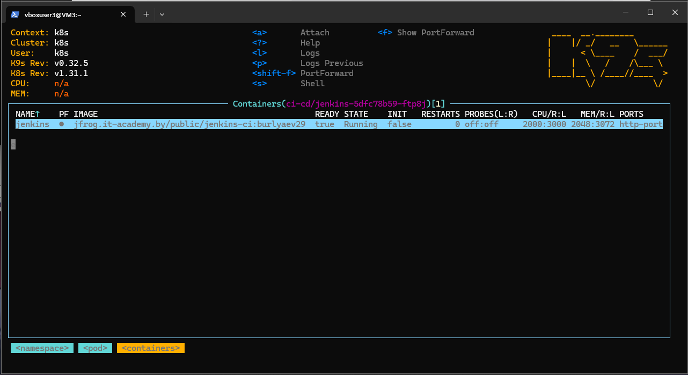
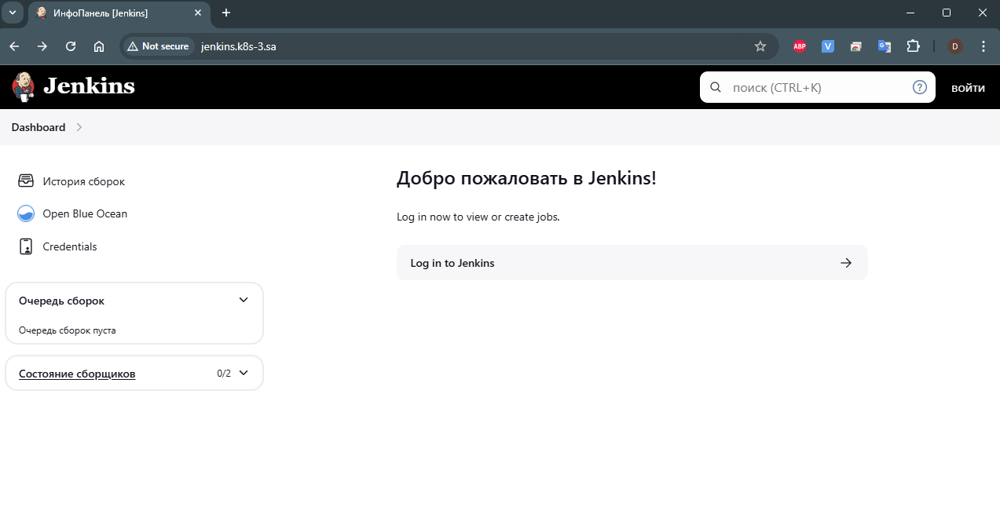
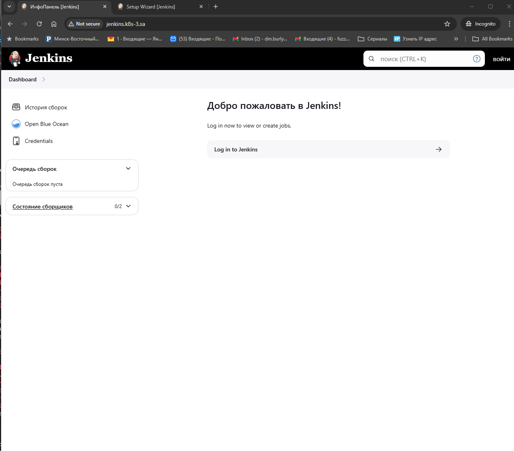
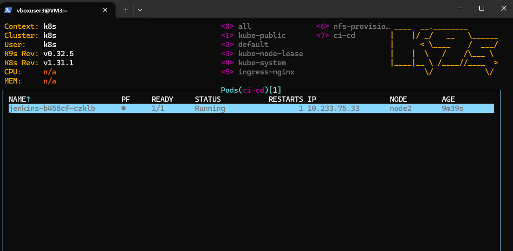
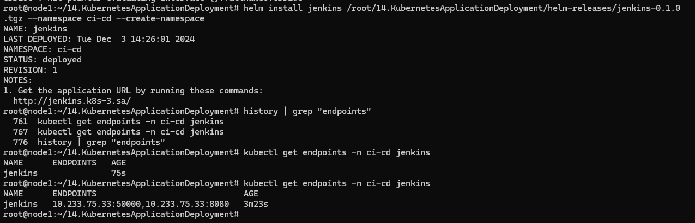
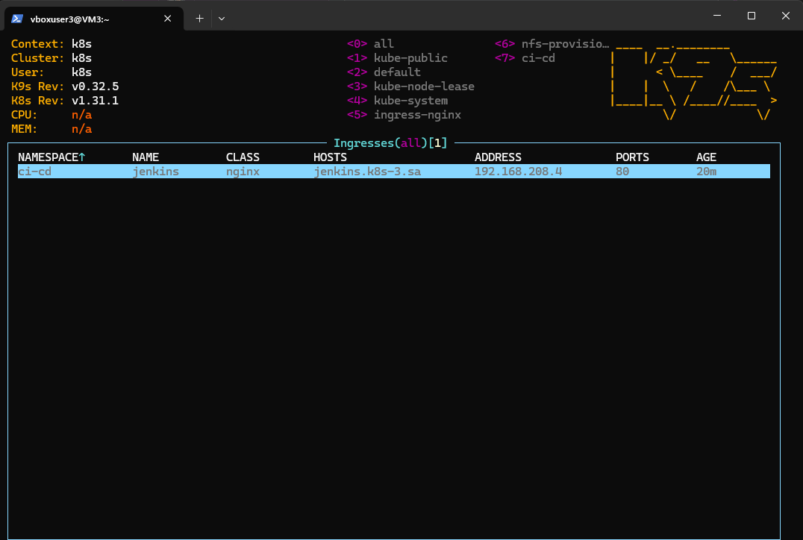
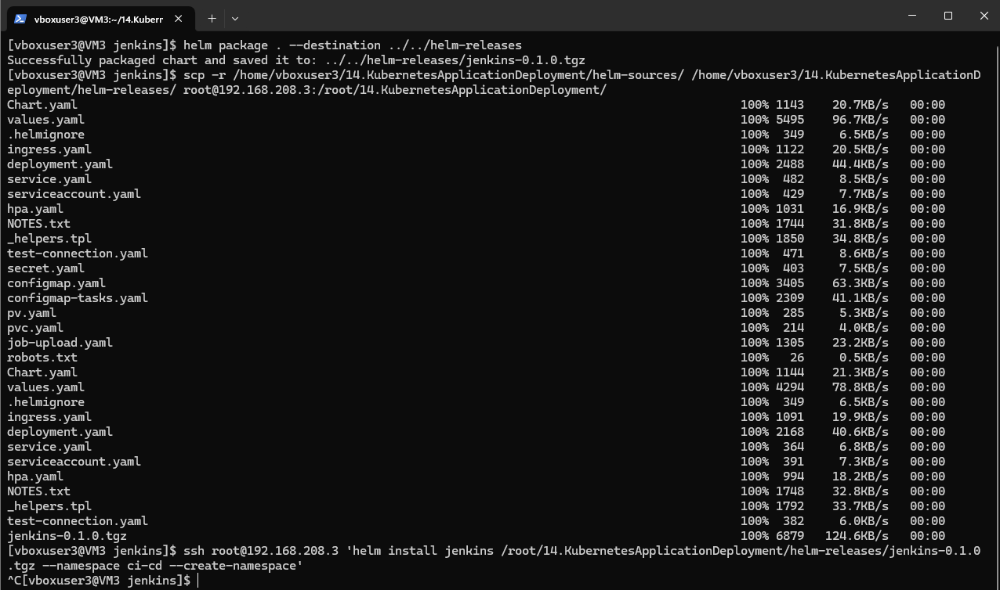
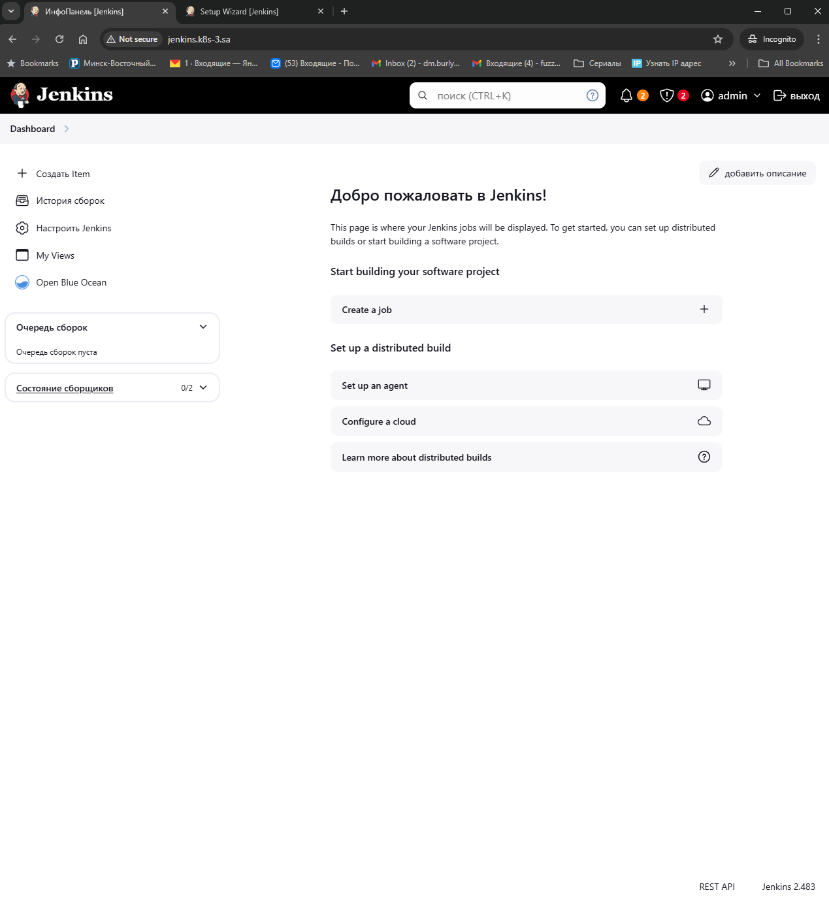
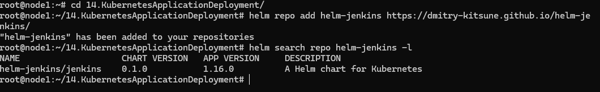

# 14. Kubernetes application deployment

# Homework Assignment 1. Transform Jenkins deployment to Helm
  * Finish application deployment
```bush
# jenkins.yaml
---
apiVersion: v1
kind: Namespace
metadata:
  name: ci-cd
---
apiVersion: v1
kind: Secret
metadata:
  name: jenkins-secret
  namespace: ci-cd
type: Opaque
data:
  password: bXlfc3Ryb25nX3Bhc3NfMTIz
---
apiVersion: apps/v1
kind: Deployment
metadata:
  name: jenkins
  namespace: ci-cd
spec:
  replicas: 1
  selector:
    matchLabels:
      app: jenkins
  template:
    metadata:
      labels:
        app: jenkins
    spec:
      containers:
        - name: jenkins
          image: jfrog.it-academy.by/public/jenkins-ci:burlyaev29
          imagePullPolicy: IfNotPresent
          env:
            - name: PASS
              valueFrom:
                secretKeyRef:
                  name: jenkins-secret
                  key: password
            - name: JAVA_OPTS
              value: "-Djenkins.install.runSetupWizard=false"
            - name: CASC_JENKINS_CONFIG
              value: /var/jenkins_home/casc_configs/jenkins.yaml
          ports:
            - name: http-port
              containerPort: 8080
            - name: jnlp-port
              containerPort: 50000
          # securityContext:
           # runAsUser: 0
          resources:
            requests:
              cpu: 2
              memory: 2Gi
            limits:
              cpu: 3
              memory: 3Gi
          volumeMounts:
            - name: jenkins-auth-config
              mountPath: /var/jenkins_home/init.groovy.d/basic-security.groovy
              subPath: basic-security.groovy
            - name: jenkins-config-yaml
              mountPath: /var/jenkins_home/casc_configs/jenkins.yaml
              subPath: jenkins.yaml
            - name: jenkins-config
              mountPath: /var/jenkins_home
      volumes:
        - name: jenkins-auth-config
          configMap:
            name: basic-security
        - name: jenkins-config-yaml
          configMap:
            name: jenkins-config
        - name: jenkins-config
          nfs:
            server: 192.168.37.105
            path: /mnt/IT-Academy/nfs-data/sa2-29-24/burlyaev/jenkins
---
apiVersion: v1
kind: ConfigMap
metadata:
  name: basic-security
  namespace: ci-cd
data:
  basic-security.groovy: |
    #!groovy
    import jenkins.model.*
    import hudson.security.*
    def instance = Jenkins.getInstance()
    println "--> creating local user 'admin'"
    def password = System.getenv("PASS")
    def hudsonRealm = new HudsonPrivateSecurityRealm(false)
    hudsonRealm.createAccount('admin', password)
    instance.setSecurityRealm(hudsonRealm)
    def strategy = new FullControlOnceLoggedInAuthorizationStrategy()
    strategy.setAllowAnonymousRead(true)
    instance.setAuthorizationStrategy(strategy)
    instance.save()
---
apiVersion: v1
kind: ConfigMap
metadata:
  name: jenkins-config
  namespace: ci-cd
data:
  jenkins.yaml: |
        jenkins:
          numExecutors: 2
          clouds:
          - kubernetes:
              containerCapStr: "10"
              maxRequestsPerHostStr: "32"
              jenkinsUrl: "http://jenkins:8080"
              name: "kubernetes"
              namespace: "ci-cd"
              skipTlsVerify: true
        credentials:
          system:
            domainCredentials:
            - credentials:
              - usernamePassword:
                  description: "Githubuser"
                  id: "some_randome"
                  password: "XXXXXXXXXXX"
                  scope: GLOBAL
                  username: "git_hub_user"
        unclassified:
          location:
            adminAddress: "pluhin@gmail.com"
            url: "http://jenkins.k8s-3.sa/"
          shell:
            shell: "/bin/bash"
---
apiVersion: rbac.authorization.k8s.io/v1
kind: ClusterRoleBinding
metadata:
  name: jenkins
  namespace: ci-cd
roleRef:
  apiGroup: rbac.authorization.k8s.io
  kind: ClusterRole
  name: cluster-admin
subjects:
- kind: ServiceAccount
  name: default
  namespace: ci-cd
---
apiVersion: networking.k8s.io/v1
kind: Ingress
metadata:
  name: ingress-jenkins
  namespace: ci-cd
spec:
  ingressClassName: nginx
  rules:
    - host: jenkins.k8s-3.sa
      http:
        paths:
          - path: /
            pathType: Prefix
            backend:
              service:
                name: jenkins
                port:
                  number: 8080
---
apiVersion: v1
kind: Service
metadata:
  name: jenkins
  namespace: ci-cd
spec:
  ports:
    - name: master
      port: 8080
      targetPort: 8080
    - name: slave
      port: 50000
      targetPort: 50000
  selector:
    app: jenkins
```




  * Create helm package for your Jenkins application
```bush
# Default values for Jenkins Helm Chart
# These values are configurable and passed into your templates.

# Replica configuration
replicaCount: 1

# Jenkins image configuration
image:
  repository: jfrog.it-academy.by/public/jenkins-ci
  pullPolicy: IfNotPresent
  tag: burlyaev29

# Image pull secrets (for private repositories, if needed)
imagePullSecrets: []
nameOverride: ""
#fullnameOverride: "jenkins"
fullnameOverride: ""

# Service Account
serviceAccount:
  create: true
  name: ""
  automount: true
  annotations: {}

# Pod annotations and labels
podAnnotations: {}
podLabels: {}

# Pod security context
podSecurityContext: {}

# Container security context
securityContext: {}

# Service configuration
service:
  type: ClusterIP
  port: 8080  
  slavePort: 50000

# Ingress configuration
ingress:
  enabled: true
  className: "nginx"
  annotations:
    kubernetes.io/ingress.class: "nginx"
  hosts:
    - host: jenkins.k8s-3.sa
      paths:
        - path: /
          pathType: Prefix
  tls: []

# Jenkins admin password from Secret
jenkinsSecret:
  password: bXlfc3Ryb25nX3Bhc3NfMTIz

# Resource requests and limits
resources:
  requests:
    cpu: 2
    memory: 2Gi
  limits:
    cpu: 3
    memory: 3Gi

# Liveness and readiness probes
livenessProbe:
  httpGet:
    path: /login
    port: 8080
  initialDelaySeconds: 150
  periodSeconds: 60
  timeoutSeconds: 10
  failureThreshold: 5

readinessProbe:
  httpGet:
    path: /login
    port: 8080
  initialDelaySeconds: 150
  periodSeconds: 60
  timeoutSeconds: 10
  failureThreshold: 5

# Autoscaling configuration
autoscaling:
  enabled: false
  minReplicas: 1
  maxReplicas: 10
  targetCPUUtilizationPercentage: 80

# Volumes configuration
pv:
  size: 10Gi
  nfs:
    path: /mnt/IT-Academy/nfs-data/sa2-29-24/burlyaev/jenkins
    server: 192.168.37.105

pvc:
  size: 10Gi

volumes:
  - name: jenkins-auth-config
    configMap:
      name: basic-security
  - name: jenkins-config-yaml
    configMap:
      name: jenkins-config
  - name: jenkins-config
  #for task
  - name: jenkins-tasks-config
    configMap:
      name: jenkins-tasks-config

    persistentVolumeClaim:
      claimName: jenkins-config  # PVC to be used by Jenkins

# Volume mounts
volumeMounts:
  - name: jenkins-auth-config
    mountPath: /var/jenkins_home/init.groovy.d/basic-security.groovy
    subPath: basic-security.groovy
  - name: jenkins-config-yaml
    mountPath: /var/jenkins_home/casc_configs/jenkins.yaml
    subPath: jenkins.yaml
  - name: jenkins-config
    mountPath: /var/jenkins_home
# task
  - name: jenkins-tasks-config
    mountPath: /var/jenkins_home/jobs/pre-configured-job/config.xml
    subPath: config.xml


# Node affinity, tolerations, and selector
nodeSelector: {}
tolerations: []
affinity: {}

# ConfigMap for Jenkins tasks (Step 6: Optional)
taskConfigMap:
  enabled: true
  name: jenkins-tasks-config
  data:
    config.xml: |
      <?xml version='1.1' encoding='UTF-8'?>
      <flow-definition plugin="workflow-job@1460.v28178c1ef6e6">
        <actions>
          <org.jenkinsci.plugins.pipeline.modeldefinition.actions.DeclarativeJobAction plugin="pipeline-model-definition@2.2214.vb_b_34b_2ea_9b_83"/>
          <org.jenkinsci.plugins.pipeline.modeldefinition.actions.DeclarativeJobPropertyTrackerAction plugin="pipeline-model-definition@2.2214.vb_b_34b_2ea_9b_83">
            <jobProperties/>
            <triggers/>
            <parameters/>
            <options/>
          </org.jenkinsci.plugins.pipeline.modeldefinition.actions.DeclarativeJobPropertyTrackerAction>
        </actions>
        <description>Pre-configured Jenkins task</description>
        <keepDependencies>false</keepDependencies>
        <properties>
          <com.sonyericsson.rebuild.RebuildSettings plugin="rebuild@332.va_1ee476d8f6d">
            <autoRebuild>false</autoRebuild>
            <rebuildDisabled>false</rebuildDisabled>
          </com.sonyericsson.rebuild.RebuildSettings>
        </properties>
        <definition class="org.jenkinsci.plugins.workflow.cps.CpsFlowDefinition" plugin="workflow-cps@3990.vd281dd77a_388">
          <script>pipeline {
        agent {
          kubernetes {
            containerTemplate {
              name &apos;curl-test&apos;
              image &apos;pluhin31/wget_curl:latest&apos;
              ttyEnabled true
              command &apos;sleep 180&apos;
            }
          }
        }
        stages {
          stage(&apos;Test&apos;) {
            steps {
              container(&apos;curl-test&apos;) {
                sh &quot;&quot;&quot;#!/bin/sh
                  curl --version
                  curl https://onliner.by
                  wget -O - https://onliner.by | egrep &quot;https://[0-9a-z]+[.]onliner[.]by&quot; -o | sort -u &gt; tmp.out
                  cat tmp.out
                  curl \$(cat tmp.out) -I | egrep HTTP
                &quot;&quot;&quot;
              }
            }
          }
        }
      }</script>
          <sandbox>true</sandbox>
        </definition>
        <triggers/>
        <disabled>false</disabled>
      </flow-definition>
# Configuration for test connection
testConnection:
  enabled: true
  port: 8080  # Make sure this port is defined for testing the connection

#for jankins Github
 jenkins:
  allowAnonymousRead: true
  numExecutors: 2
  kubernetes:
    containerCap: 10
    maxRequestsPerHost: 32
    jenkinsUrl: "http://jenkins:8080"
    name: "kubernetes"
    skipTlsVerify: true
  credentials:
    description: "Githubuser"
    id: "github-creds"
    username: "admin"
    password: "adminpassword"
  location:
    adminAddress: "fuzzyfox2012@gmail.com"
    url: "http://jenkins.k8s-3.sa/"
```
  * all variables should be inside variable file




	
	








  * publish helm on your repository
```bush
# index.yaml
apiVersion: v1
entries:
  jenkins:
  - apiVersion: v2
    appVersion: 1.16.0
    created: "2024-12-04T21:11:31.887377948+03:00"
    description: A Helm chart for Kubernetes
    digest: 708cab9119bdf3bc2456586b7903950f4672edbcdded0fec9257a16ce7eba066
    name: jenkins
    type: application
    urls:
    - https://dmitry-kitsune.github.io/helm-jenkins/helm-releases/jenkins-0.1.0.tgz
    version: 0.1.0
generated: "2024-12-04T21:11:31.886691843+03:00"
```
```bush
helm install jenkins /root/14.KubernetesApplicationDeployment/helm-releases/jenkins-0.1.0.tgz --namespace ci-cd --create-namespace
```
  * publish helm on your repository - https://github.com/dmitry-kitsune/helm-jenkins
```bush
git init
git commit -m "first commit"
git add --all
git commit -m "jenkins-helm done v.1.0"
git remote add origin git@github.com:dmitry-kitsune/helm-jenkins.git
git push -u origin master
 helm repo index --url "https://dmitry-kitsune.github.io/helm-jenkins/" .
```
```bush
cat index.yaml
```
```bush
# index.yaml
apiVersion: v1
entries:
  jenkins:
  - apiVersion: v2
    appVersion: 1.16.0
    created: "2024-12-04T21:11:31.887377948+03:00"
    description: A Helm chart for Kubernetes
    digest: 708cab9119bdf3bc2456586b7903950f4672edbcdded0fec9257a16ce7eba066
    name: jenkins
    type: application
    urls:
    - https://dmitry-kitsune.github.io/helm-jenkins/helm-releases/jenkins-0.1.0.tgz
    version: 0.1.0
generated: "2024-12-04T21:11:31.886691843+03:00"
```
```bush
root@node1:~/14.KubernetesApplicationDeployment# helm repo add helm-jenkins https://dmitry-kitsune.github.io/helm-jenkins/
"helm-jenkins" has been added to your repositories
```




# Homework Assignment 2. Add pre-set tasks to Jenkins deployment (Optional)

```bush
volumes:
  - name: jenkins-auth-config
    configMap:
      name: basic-security
  - name: jenkins-config-yaml
    configMap:
      name: jenkins-config
  - name: jenkins-config
  #for task
  - name: jenkins-tasks-config
    configMap:
      name: jenkins-tasks-config

    persistentVolumeClaim:
      claimName: jenkins-config  # PVC to be used by Jenkins

# Volume mounts
volumeMounts:
  - name: jenkins-auth-config
    mountPath: /var/jenkins_home/init.groovy.d/basic-security.groovy
    subPath: basic-security.groovy
  - name: jenkins-config-yaml
    mountPath: /var/jenkins_home/casc_configs/jenkins.yaml
    subPath: jenkins.yaml
  - name: jenkins-config
    mountPath: /var/jenkins_home
# task
  - name: jenkins-tasks-config
    mountPath: /var/jenkins_home/jobs/pre-configured-job/config.xml
    subPath: config.xml
```
Add as config map of your Jenkins tasks to the manifests
```bush
# templates/configmap-tasks.yaml
apiVersion: v1
kind: ConfigMap
metadata:
  name: jenkins-tasks-config
  namespace: {{ .Release.Namespace }}
  labels:
    {{- include "jenkins.labels" . | nindent 4 }}
data:
  config.xml: |
      <?xml version='1.1' encoding='UTF-8'?>
      <flow-definition plugin="workflow-job@1460.v28178c1ef6e6">
        <actions>
          <org.jenkinsci.plugins.pipeline.modeldefinition.actions.DeclarativeJobAction plugin="pipeline-model-definition@2.2214.vb_b_34b_2ea_9b_83"/>
          <org.jenkinsci.plugins.pipeline.modeldefinition.actions.DeclarativeJobPropertyTrackerAction plugin="pipeline-model-definition@2.2214.vb_b_34b_2ea_9b_83">
            <jobProperties/>
            <triggers/>
            <parameters/>
            <options/>
          </org.jenkinsci.plugins.pipeline.modeldefinition.actions.DeclarativeJobPropertyTrackerAction>
        </actions>
        <description>Pre-configured Jenkins task</description>
        <keepDependencies>false</keepDependencies>
        <properties>
          <com.sonyericsson.rebuild.RebuildSettings plugin="rebuild@332.va_1ee476d8f6d">
            <autoRebuild>false</autoRebuild>
            <rebuildDisabled>false</rebuildDisabled>
          </com.sonyericsson.rebuild.RebuildSettings>
        </properties>
        <definition class="org.jenkinsci.plugins.workflow.cps.CpsFlowDefinition" plugin="workflow-cps@3990.vd281dd77a_388">
          <script>pipeline {
        agent {
          kubernetes {
            containerTemplate {
              name 'curl-test'
              image 'pluhin31/wget_curl:latest'
              ttyEnabled true
              command 'sleep 180'
            }
          }
        }
        stages {
          stage('Test') {
            steps {
              container('curl-test') {
                sh """
                  curl --version
                  curl https://onliner.by
                  wget -O - https://onliner.by | egrep "https://[0-9a-z]+[.]onliner[.]by" -o | sort -u > tmp.out
                  cat tmp.out
                  curl $(cat tmp.out) -I | egrep HTTP
                """
              }
            }
          }
        }
      }</script>
          <sandbox>true</sandbox>
        </definition>
        <triggers/>
        <disabled>false</disabled>
      </flow-definition>
	  ```

Your Jenkins helm package, helm build steps, and Jenkins helm installation steps with variables add into PR
```bush
helm template jenkins /root/14.KubernetesApplicationDeployment/helm-releases/jenkins-0.1.0.tgz \
>   --namespace ci-cd > rendered.yaml
root@node1:~/14.KubernetesApplicationDeployment# cat rendered.yaml
```
# rendered.yaml
```bush
---
# Source: jenkins/templates/serviceaccount.yaml
apiVersion: v1
kind: ServiceAccount
metadata:
  name: jenkins
  namespace: "ci-cd"
  labels:
    helm.sh/chart: jenkins-0.1.0
    app.kubernetes.io/name: jenkins
    app.kubernetes.io/instance: jenkins
    app.kubernetes.io/version: "1.16.0"
    app.kubernetes.io/managed-by: Helm
automountServiceAccountToken: true
---
# Source: jenkins/templates/secret.yaml
apiVersion: v1
kind: Secret
metadata:
  name: jenkins-secret
  namespace: ci-cd  # dynamic based on Helm release
  labels:
    app.kubernetes.io/managed-by: Helm
  annotations:
    meta.helm.sh/release-name: jenkins
    meta.helm.sh/release-namespace: ci-cd
type: Opaque
data:
  password: YlhsZmMzUnliMjVuWDNCaGMzTmZNVEl6
---
# Source: jenkins/templates/configmap-tasks.yaml
# templates/configmap-tasks.yaml
apiVersion: v1
kind: ConfigMap
metadata:
  name: jenkins-tasks-config
  namespace: ci-cd
  labels:
    helm.sh/chart: jenkins-0.1.0
    app.kubernetes.io/name: jenkins
    app.kubernetes.io/instance: jenkins
    app.kubernetes.io/version: "1.16.0"
    app.kubernetes.io/managed-by: Helm
data:
  config.xml: |
      <?xml version='1.1' encoding='UTF-8'?>
      <flow-definition plugin="workflow-job@1460.v28178c1ef6e6">
        <actions>
          <org.jenkinsci.plugins.pipeline.modeldefinition.actions.DeclarativeJobAction plugin="pipeline-model-definition@2.2214.vb_b_34b_2ea_9b_83"/>
          <org.jenkinsci.plugins.pipeline.modeldefinition.actions.DeclarativeJobPropertyTrackerAction plugin="pipeline-model-definition@2.2214.vb_b_2ea_9b_83">
            <jobProperties/>
            <triggers/>
            <parameters/>
            <options/>
          </org.jenkinsci.plugins.pipeline.modeldefinition.actions.DeclarativeJobPropertyTrackerAction>
        </actions>
        <description>Pre-configured Jenkins task</description>
        <keepDependencies>false</keepDependencies>
        <properties>
          <com.sonyericsson.rebuild.RebuildSettings plugin="rebuild@332.va_1ee476d8f6d">
            <autoRebuild>false</autoRebuild>
            <rebuildDisabled>false</rebuildDisabled>
          </com.sonyericsson.rebuild.RebuildSettings>
        </properties>
        <definition class="org.jenkinsci.plugins.workflow.cps.CpsFlowDefinition" plugin="workflow-cps@3990.vd281dd77a_388">
          <script>pipeline {
        agent {
          kubernetes {
            containerTemplate {
              name 'curl-test'
              image 'pluhin31/wget_curl:latest'
              ttyEnabled true
              command 'sleep 180'
            }
          }
        }
        stages {
          stage('Test') {
            steps {
              container('curl-test') {
                sh """
                  curl --version
                  curl https://onliner.by
                  wget -O - https://onliner.by | egrep "https://[0-9a-z]+[.]onliner[.]by" -o | sort -u > tmp.out
                  cat tmp.out
                  curl $(cat tmp.out) -I | egrep HTTP
                """
              }
            }
          }
        }
      }</script>
          <sandbox>true</sandbox>
        </definition>
        <triggers/>
        <disabled>false</disabled>
      </flow-definition>
---
# Source: jenkins/templates/configmap.yaml
apiVersion: v1
kind: ConfigMap
metadata:
  name: basic-security
  namespace: ci-cd
data:
  basic-security.groovy: |
    #!groovy
    import jenkins.model.*
    import hudson.security.*

    def instance = Jenkins.getInstance()
    println "--> creating local user 'admin'"

    // Получаем пароль из переменной окружения или значений Helm
    def password = System.getenv("PASS") ?: "bXlfc3Ryb25nX3Bhc3NfMTIz"

    // Настройка пропуска аутентификации для liveness и readiness
    instance.servletContext.getContextHandler().addFilter("LivenessReadinessFilter", new Filter() {
        void init(FilterConfig filterConfig) {}
        void doFilter(ServletRequest request, ServletResponse response, FilterChain chain) {
            if (request instanceof HttpServletRequest) {
                def path = ((HttpServletRequest) request).getRequestURI()
                if (path.contains("/liveness") || path.contains("/readiness")) {
                    response.setStatus(200)
                    response.getWriter().println("OK")
                    return
                }
            }
            chain.doFilter(request, response)
        }
        void destroy() {}
    }, "/*")

    // Создаем учетную запись администратора
    def hudsonRealm = new HudsonPrivateSecurityRealm(false)
    hudsonRealm.createAccount('admin', password)
    instance.setSecurityRealm(hudsonRealm)

    // Настройка стратегии авторизации
    def strategy = new FullControlOnceLoggedInAuthorizationStrategy()
    strategy.setAllowAnonymousRead(true)
    instance.setAuthorizationStrategy(strategy)

    // Сохраняем настройки
    instance.save()
---
# Source: jenkins/templates/configmap.yaml
apiVersion: v1
kind: ConfigMap
metadata:
  name: jenkins-config
  namespace: ci-cd
data:
  jenkins.yaml: |
    jenkins:
      numExecutors: 2
      clouds:
        - kubernetes:
            containerCapStr: "10"
            maxRequestsPerHostStr: "32"
            jenkinsUrl: "http://jenkins:8080"
            name: "kubernetes"
            namespace: "ci-cd"
            skipTlsVerify: true
    credentials:
      system:
        domainCredentials:
          - credentials:
              - usernamePassword:
                  description: "Githubuser"
                  id: "github-creds"
                  password: "adminpassword"
                  scope: GLOBAL
                  username: "admin"
    unclassified:
      location:
        adminAddress: "fuzzyfox2012@gmail.com"
        url: "http://jenkins.k8s-3.sa/"
      shell:
        shell: "/bin/bash"
---
# Source: jenkins/templates/pv.yaml
apiVersion: v1
kind: PersistentVolume
metadata:
  name: jenkins-config-pv
spec:
  capacity:
    storage: 10Gi
  accessModes:
    - ReadWriteMany
  persistentVolumeReclaimPolicy: Retain
  nfs:
    path: /mnt/IT-Academy/nfs-data/sa2-29-24/burlyaev/jenkins
    server: 192.168.37.105
---
# Source: jenkins/templates/pvc.yaml
apiVersion: v1
kind: PersistentVolumeClaim
metadata:
  name: jenkins-config
spec:
  accessModes:
    - ReadWriteMany
  resources:
    requests:
      storage: 10Gi
  volumeName: jenkins-config-pv
---
# Source: jenkins/templates/service.yaml
apiVersion: v1
kind: Service
metadata:
  name: jenkins
  # name: jenkins
  namespace: "ci-cd"
spec:
  ports:
    - name: http
      port: 8080
      targetPort: 8080
    - name: jnlp
      port: 50000
      targetPort: 50000
  selector:
    app.kubernetes.io/name: jenkins
    app.kubernetes.io/instance: jenkins
---
# Source: jenkins/templates/deployment.yaml
apiVersion: apps/v1
kind: Deployment
metadata:
  name: jenkins
  namespace: "ci-cd"
  labels:
    helm.sh/chart: jenkins-0.1.0
    app.kubernetes.io/name: jenkins
    app.kubernetes.io/instance: jenkins
    app.kubernetes.io/version: "1.16.0"
    app.kubernetes.io/managed-by: Helm
spec:
  replicas: 1
  selector:
    matchLabels:
      app.kubernetes.io/name: jenkins
      app.kubernetes.io/instance: jenkins
  template:
    metadata:
      labels:
        helm.sh/chart: jenkins-0.1.0
        app.kubernetes.io/name: jenkins
        app.kubernetes.io/instance: jenkins
        app.kubernetes.io/version: "1.16.0"
        app.kubernetes.io/managed-by: Helm
    spec:
      serviceAccountName: jenkins
      securityContext:
        {}
      containers:
        - name: jenkins
          securityContext:
            {}
          image: "jfrog.it-academy.by/public/jenkins-ci:burlyaev29"
          imagePullPolicy: IfNotPresent
          ports:
            - name: http
              containerPort: 8080
              protocol: TCP
            - name: jnlp
              containerPort: 50000
              protocol: TCP
          env:
            - name: PASS
              valueFrom:
                secretKeyRef:
                  name: jenkins-secret
                  key: password
            - name: JAVA_OPTS
              value:
          livenessProbe:
            failureThreshold: 5
            httpGet:
              path: /login
              port: 8080
            initialDelaySeconds: 150
            periodSeconds: 60
            timeoutSeconds: 10
          readinessProbe:
            failureThreshold: 5
            httpGet:
              path: /login
              port: 8080
            initialDelaySeconds: 150
            periodSeconds: 60
            timeoutSeconds: 10
          resources:
            limits:
              cpu: 3
              memory: 3Gi
            requests:
              cpu: 2
              memory: 2Gi
          volumeMounts:
            - mountPath: /var/jenkins_home/init.groovy.d/basic-security.groovy
              name: jenkins-auth-config
              subPath: basic-security.groovy
            - mountPath: /var/jenkins_home/casc_configs/jenkins.yaml
              name: jenkins-config-yaml
              subPath: jenkins.yaml
            - mountPath: /var/jenkins_home
              name: jenkins-config
            - mountPath: /var/jenkins_home/jobs/pre-configured-job/config.xml
              name: jenkins-tasks-config
              subPath: config.xml
      volumes:
        - configMap:
            name: basic-security
          name: jenkins-auth-config
        - configMap:
            name: jenkins-config
          name: jenkins-config-yaml
        - name: jenkins-config
          persistentVolumeClaim:
            claimName: jenkins-config
        - configMap:
            name: jenkins-tasks-config
          name: jenkins-tasks-config
---
# Source: jenkins/templates/ingress.yaml
apiVersion: networking.k8s.io/v1
kind: Ingress
metadata:
  name: jenkins
  namespace: ci-cd
  labels:
    helm.sh/chart: jenkins-0.1.0
    app.kubernetes.io/name: jenkins
    app.kubernetes.io/instance: jenkins
    app.kubernetes.io/version: "1.16.0"
    app.kubernetes.io/managed-by: Helm
  annotations:
    nginx.ingress.kubernetes.io/rewrite-target: /
    nginx.ingress.kubernetes.io/backend-protocol: "HTTP"
    kubernetes.io/ingress.class: nginx
spec:
  ingressClassName: nginx
  rules:
    - host: "jenkins.k8s-3.sa"
      http:
        paths:
          - path: /
            pathType: Prefix
            backend:
              service:
                name: jenkins
                port:
                  number: 8080
---
# Source: jenkins/templates/configmap.yaml
# templates/configmap.yaml
---
# Source: jenkins/templates/tests/test-connection.yaml
apiVersion: v1
kind: Pod
metadata:
  name: "jenkins-test-connection"
  namespace: "ci-cd" # namespace from the release context
  labels:
    helm.sh/chart: jenkins-0.1.0
    app.kubernetes.io/name: jenkins
    app.kubernetes.io/instance: jenkins
    app.kubernetes.io/version: "1.16.0"
    app.kubernetes.io/managed-by: Helm
  annotations:
    "helm.sh/hook": test
spec:
  containers:
    - name: wget
      image: busybox
      command: ['wget']
      args: ['jenkins:8080']
  restartPolicy: Never
---
# Source: jenkins/templates/job-upload.yaml
apiVersion: batch/v1
kind: Job
metadata:
  name: jenkins-job-upload
  namespace: ci-cd
  annotations:
    "helm.sh/hook": post-install
spec:
  backoffLimit: 3
  completions: 1
  template:
    spec:
      initContainers:
        - name: wait-for-jenkins
          image: curlimages/curl
          command:
            - sh
            - "-c"
            - |
              echo "Waiting for Jenkins to be ready..."
              until curl -s -o /dev/null -w "%{http_code}" http://jenkins:8080/login | grep -q "200"; do
                echo "Jenkins not ready, retrying..."
                sleep 5
              done
              echo "Jenkins is ready!"
      containers:
        - name: upload-job
          image: curlimages/curl
          command:
            - sh
            - "-c"
            - |
              echo "Uploading job configuration..."
              curl -u admin:adminpassword -X POST "http://jenkins:8080/createItem?name=pre-configured-job" \
              --header "Content-Type: application/xml" --data-binary "@/mnt/config/config.xml"
          volumeMounts:
            - name: config-volume
              mountPath: /mnt/config
      restartPolicy: Never
      volumes:
        - name: config-volume
          configMap:
            name: jenkins-tasks-config

```