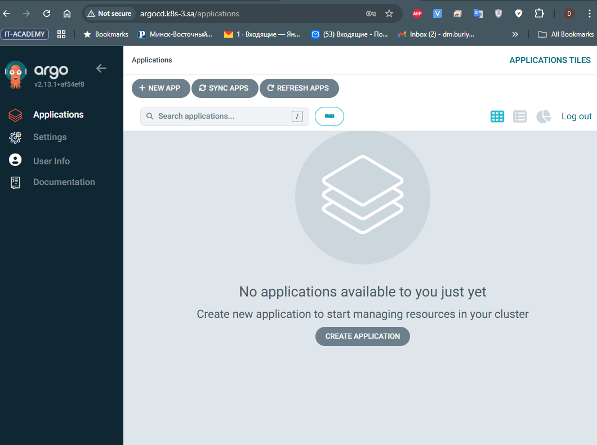
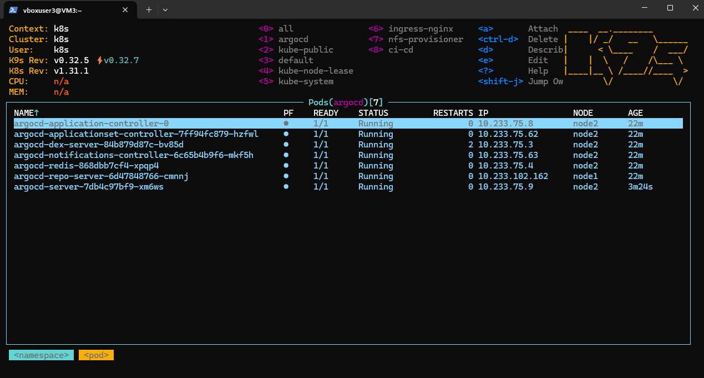
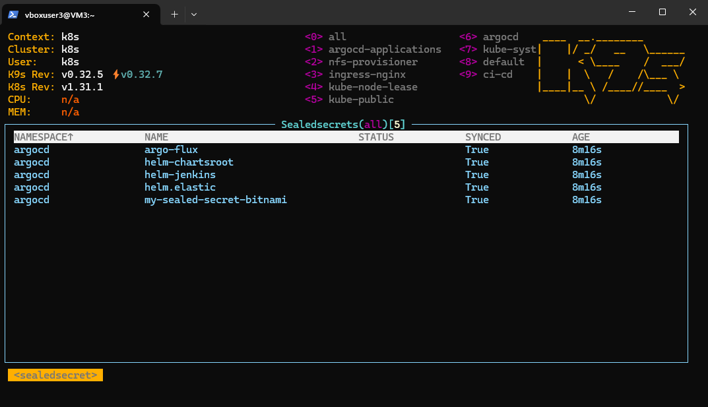
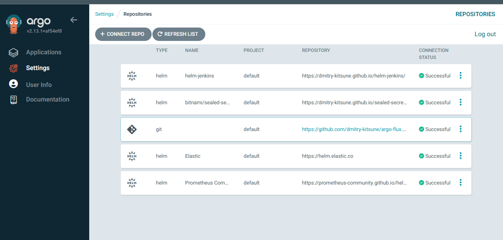
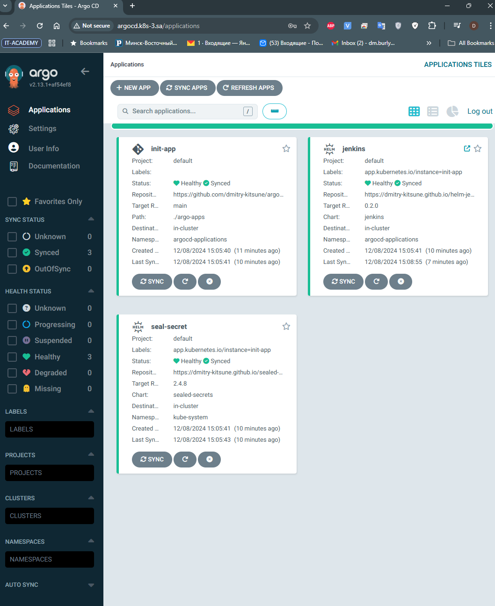
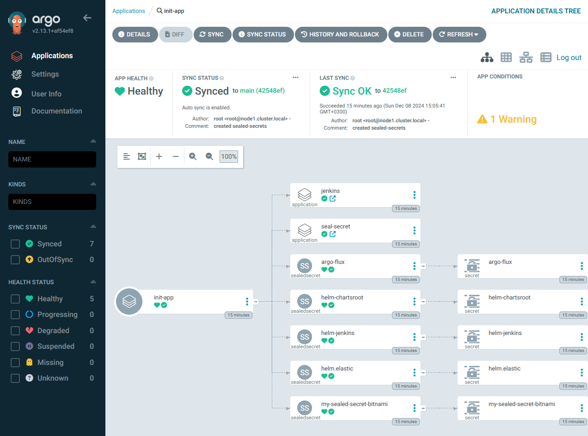
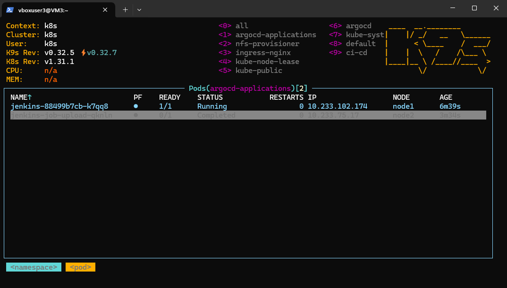
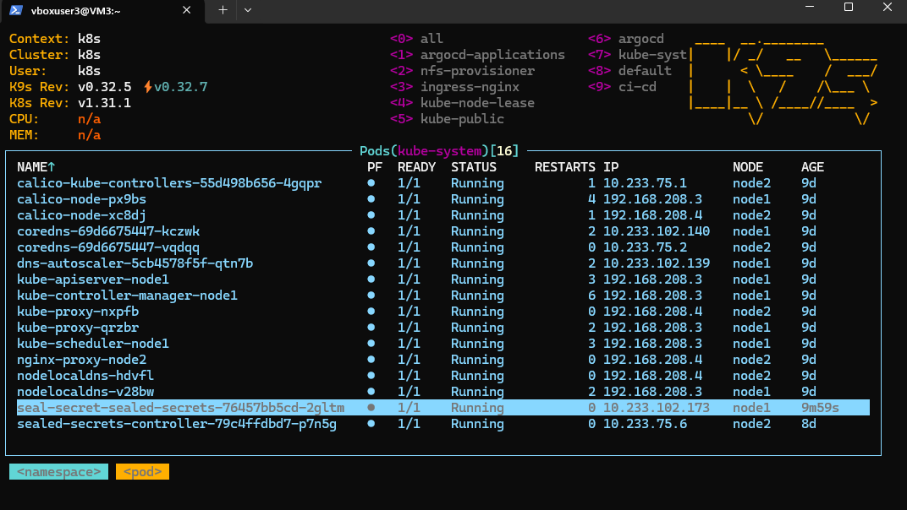

# 15. Kubernetes CI CD

# Homework Assignment 1. ArgoCD deployment and application

  * deploy ArgoCD into your cluster
```bush
 # on 192.168.208.3
  kubectl create namespace argocd
```
``` bush
mkdir 15.K8s.ArrgoCD
wget https://raw.githubusercontent.com/argoproj/argo-cd/stable/manifests/install.yaml -O argocd-install.yaml
kubectl apply -f argocd-install.yaml -n argocd
```
```bush
# login
kubectl -n argocd get secret argocd-initial-admin-secret -o jsonpath="{.data.password}" | base64 -d
```



  * add your repositories with helm packages as source for deployment
```bush
 ---
 source:
   chart: sealed-secrets
   repoURL: https://dmitry-kitsune.github.io/sealed-secret-bitnami/
   targetRevision: 2.4.8

 ---
 source:
   chart: jenkins
   repoURL: https://dmitry-kitsune.github.io/helm-jenkins/
   targetRevision: 0.2.0
```


  * create separate repository which contains application manifests for ArgoCD
  
     https://github.com/dmitry-kitsune/argo-flux.git

    * application objects
      
      * jenkins-helm-v2.yaml
        ```bush
        # jenkins-helm-v2.yaml
        apiVersion: argoproj.io/v1alpha1
        kind: Application
        metadata:
           name: jenkins
           namespace: argocd
        spec:
          destination:
          namespace: argocd-applications
          server: https://kubernetes.default.svc
        project: default
        source:
          chart: jenkins
          helm:
            valueFiles:
            - values.yaml
            parameters:
            - name: ingress.hosts[0].host
              value: argo-jenkins.k8s-3.sa
            - name: ingress.hosts[0].paths[0].path
             value: /
            - name: ingress.hosts[0].paths[0].pathType
              value: ImplementationSpecific
          repoURL: https://dmitry-kitsune.github.io/helm-jenkins/
          targetRevision: 0.2.0
        syncPolicy:
          automated:
            prune: true
          syncOptions:
          - CreateNamespace=true 
          ```
        * seal-secret.yaml
          ```bush
          ---
          apiVersion: argoproj.io/v1alpha1
          kind: Application
          metadata:
            name: seal-secret
            namespace: argocd
            spec:
            destination:
              namespace: kube-system
              server: https://kubernetes.default.svc
              project: default
              source:
              chart: sealed-secrets
                repoURL: https://dmitry-kitsune.github.io/sealed-secret-bitnami/
                targetRevision: 2.4.8
                syncPolicy:
                automated:
                  prune: true
          ```

    * git secrets objects as sealsecret objects
    ```bush
     # argo-flux-secret.yaml
    ---
    apiVersion: bitnami.com/v1alpha1
    kind: SealedSecret
    metadata:
      creationTimestamp: null
      name: argo-flux
      namespace: argocd
    spec:
      encryptedData:
        project: AgBO84zJP7Jusr/GZHfNVsm/bujkKLT6e4c2zCU7hCcvynmNZy/5uYsNl7redPWJh7OXyHzdzTNJM6nv7P29Jende+ghp1x527QdfHiBgDR1ESxXyLCNNuJkhovLXq9zm4z7Evpspmt//UYJ6bytDei5Qqbaz/fjJDgX4zS9HDihsZzHU5dt36QmpIHO+erjulvQIsZAVgqHMawBpS8iVgNuyN4pXnZZug2SO2nTHzwyCeELayL6doFCoxKu5o7r1TWSJ+6A9PzYPzf4k5+4SAR0tiTd9jJsNQiks1U34WLLCkLyOyoc+SfABv1qYiPIIoFoZScOQYmDZnebqv7YZAEf61/e+Es7UmlO2TZAapujolWn7dE2eCzoYy0KtTU8a01+S4zIdBEl0aAMkn9O3vP4gn/18xktJ5KP9MltEyDjAofJPk82YMcwbxqJA/ExI9hoNrRUEAlBGm4CfyVA6T0XhRK7ElAiwwEuFLpXuYoKGPR4m1GklbmYjO8wukZqtZKSjPcm5BpqqzDr1MXyZkIgql3XvOdOeviQdOI2a9KaE/jqtwehjIXKABUkKDaJ7xGD4jVfcfDaWAWT715gNJvFcoF6dx77Iy8GYbDZus8NV0zsXvaS6q0siQH/hvL7ORTqsmRDD4Em95yLnb/Mnuok+GxZGwbQk3whYxxBYYZ/hi12XOgeg19lfAYFpgqe5QhfNUCigLLH
        type: AgCrjpLAF2CCJLFSut+0jZLUqkvI7oxuXzLZJ1bHR7z6W/vFaUazLBmNrgWWj4q5gYTp5M4LCJchr/+AXke2gm7eChF5GeL34utvy6Oy8E73wadnPsLziBUXgQFHL3d/BEKGrBVdtrIXZ/ehQ7h8T32SDpLPt6sSOUe+uXuuFIG/fBV9/F4KVhfFJdIkXgNNyMkowcLvNrPBx5pblipQvP4pBhJqNbDjNlbm7ZApaySMY1V3a4X0SnPstowa2QCnoehNkprvzyZlvs0aU2swHBUZuBjSVlY26UJQY/+AA+uCZCKvVRLRYzC/Ep9sUOlOQlcF6QfUJ7uti8T3tJATwJUBYBm/5GnyWZp4EnTMNJL+w1gE8bSQBvAoNU9ztl7ejb5WJ5phNWTcK+rFUqSF4MuVhG8SLoWl7VeFTOO9XbbgcKiRuVJs7mbYou02HE0klUuPokFCcLEOBnZy046O/Kzlev92YLI1CvopyNmveKpIM7ASbI7HkTGdYYcJng+RjxedagMlDGTE1NACWO5tDKk/jd+TJ1EctIUMSR/uagFIR1qqM8UwO8REmxiFGRM2QpfK2WR0jloehCmOWlBRBtsmMycCvI8EfZAyl1AGvSdWJ+zHV9b+l+1Lr6ClxQYVjECVVnItLMb+pQX1xQLbIQ2D/XR5X+dW0OLp/OWjEMgpzKQzevtQEePjcrIrExxt7tiEAM8=
        url: AgCQQjDgXAynQLrw7Z9ab6W1u/N4FqmuUB+QwMvffkS0xHvMTCGrgZ45tSGON3qffx2/KFPVtkyA1Hg9i7XZcfRApTT2bFW+E/fM9cE74ombVxhThjgD8BFtygOhS7AuaWAHOsD2xe/tRa6nm0S9QYn89O+KDTseJkhzh2blfej7Aj9wXTQTHo51aPA9vipWpgW1ZP4T+hz14SQoJ4YZQ+GbVeSKFxvgi3A27XIbOb/1I6fYvbP8kLymQ9g9BBWYrpocCVK5DaQkhc+GBzOVGYz98Y8XxVyDAHkqeWdrqanJ0afZAMt28Ozf+lTXoI/8CclkCvrbsWFl0gu9Bw1neLtqif7wBeD1fqQp3ok7tDmBX4djbdOHkrkELrth8SqBYRt4O8dni3kWvRnp2jpRaXzY/N/Uqjq6a4KZn7hYwzD2C5OhXv4TmPRWsHFQIyxmWGbDgDzPwf56RV5d4LzSVu8xL+XbIaILLun44hH1l8gWF3oYDWfpTeqH2gpwC7MN0Mh7YP3Q1RvkC0qtHGjNJGsll5OTkPEcXHkX2kacES7BXa+ndwQ5V9cDmGxu9awSNK/7fj3wq+Q9bv0rR7d2e7G3BLKQfQgk9btUxt9pjzxlvXk+obZQSy9Co1IbK7sR1wREXC097eOaw9+f3JaKZ5CAfdzgkEgzC/dzMO1ZETI85/j2f/LHeHsf/pNHnTaImwHP+d6r4HTv3IoB75c6R2m8EMAY8Au0T5XwfpOPG4EepOjKgXSInXzkqMrC9e9WXA==
      template:
        metadata:
          creationTimestamp: null
          name: argo-flux
          namespace: argocd
        type: Opaque
    ```
    ```bush
    # helm-chartsroot-secret.yaml
    ---
    apiVersion: bitnami.com/v1alpha1
    kind: SealedSecret
    metadata:
      creationTimestamp: null
      name: helm-chartsroot
      namespace: argocd
    spec:
      encryptedData:
        name: AgA5zWlMNpbD4g3VLvNx1Qie8BQ7ri3/kgeWDGOQPfIRGemSwwdIcMyepSNxaWe6TtFkYleQ99HAFY0pPVRuQhBuk+yFWkEhh5N2ErFUPhi2FvapPKxk54XWip+c9X/47zymDQin36DjhrvmJhnfn4xyxK+EUHNplnEoa28uw1RqU4lI54Sf8rvILH01apD/DFJVqNoSMIqKTURlc7cvZqn9M2xi34AsfetoWo1xtIPiBsmKQVt/8Ex7o+zXs7aod8EAbonu6W1qJU0z2z0ar7rpJyoDXs1CclaPnVJj7de3Gc/Qv0mckqHuWktS9yeEYz3fDOWdrq35oyzXOzus5+LxCY4/YSbeW5DefNUzxgnjlbeokOp9M/0HLUU7/7y0V2dFTcI1N/t5EoFr8beyr91xtEAFNdYxdtiHoEAow6MqaG/lB64dTWzGzg86sHH1xFG02HbqrmPvTI6fPbZpt/PXfo0qrNIzSESyj6j6NPSHsbIsd2V9p8GeG8UBzaj6eZnJTzSqN/Qr9E9cJpHMPznBFmHhFhZ9yrBXFtW5JFrzqNXNNw37OnlMLIHKAGqKGttrrgF2FsEfUKEPmechKKzDuScWh81qAGGwwBKPWtNXf3GQseevslD4x6iXz/Ji1/Q/QwGMc6Cm5tL4WSQNAl4VR80DqBtVDKYi14GA+ujCTBID8DNObqJed1EN/SWIlGgAO4tuRHnKX22mtYkY/DWJs+EbZsw=
        project: AgCVv9w9pkOFh7o2YgJGN1WzkneeZH4+ygqZ0SoO2y0tr7xVrvkiys7MvAoE5XFYQpZvEF8NP/lX/7++fs277fsIC/4UgtNXeKpy3O64OsAEfIf8vYcli6wDutp7y+C0u32BaSSU367ciHZDDSnUJ56f0Qf98rVWxRX6BzFPl/TwgTG3si+kh40wnwLDtsIakvJ2n+VG8qt9YilpivdrRxPHa/bO34hGqYt1l2zYrZo7wvpF/LFuSihsUAEHlPnLgmYfGtG+gEFTToJcl0kiUtI0jTCMK5QK/rdnYTdlSjK1Dm5N0XW0xO9/9bsYf1WT1+0Wb4jsWv2I0SNsuFvXZr1cnvyNhPZPJhvVHCS8kENsQ49jn16lJ7UbYTy5qLaa7H8Ib1DB0jBJRx1wyVkmBsWF1hTa9DXaHGZMUrM+e12yZrjUG2aZ3twk18uyLHofighUSSCUpUsWCi28OA9nnKiV5H1CWWJ7wOJQWmnzeNfaJrpEkuoyzyOPx+0/Oy8dA30nEpu1PeIyibl+x5xuVBjxX604SmBqDkYWwZjSpSHWeIj+l0uJWcFPtZqrNYCM6t8muusX4V3ZRQjTm/uzF+8FYxYNECJdf66KLlJsbd7db/+fIpytEiIQxjZDdwUxOsTsa1uR3No8eExNNcf3VmGUkPnYZkxWzk01FEa+K73ggSQLb0cdtU3p2SaknbfLoKXnN/fQxxl+
        type: AgA0N67wROXZqQOrcLRblmwRfDno09teNBRwZZwHQ9tpISIqAFpoFmH9MTrAOzQGDR+kscNLExDwd09rlD9PlG3ZUK+j7z7CuXlgLZR6aOqAmWY+7lTRKzUgWkoPX9PixqWBOaR4Ev8kiKuY+4n6luHKwzqyKWXMVVW0rkzLcSzShT8+glJ3r/oUdUEngapuJ8BI3ucGEB8CMisjwwbYvC5mHxEQy6tr5SYP3ofTLs+4yrrRUF1NrgG4QUi20uwDjJw+wAhoN8RnzsFVm1hj0Jgvr/p3lPFun3xV1SZTqJgjDXHyImW5mlFzh1X+/lgtY9wVlbyxa/54GsP6ESmSgrt4YVc1SxzrwaBL8HBNaD8I/XPpeEYNAllpPkz61bfveZz1OqedR7TszvuoS+tLXXD/7ukhQT43isdmjRBuOrdyHqyFNOuR0nG6/wGpWek3epAtW8T8FjLjb9tQMkga9MPwlNFbGUiMEuL7zWgUXiaVQ+p9dOIRC3otp/WO4wzhhdfdzESMiRHg9swYRCrvDUvdHashXj9TCT+un396e8M37sDmJOJBsgHEr7rBFicR2IrJQBcBLGU05F1FxT0csNRNNC4tSBAhUlW6eX8OFEUis8+YjWrN22pZbRqxelbNsCjHu8qCFFgJiNTmIOB8bnce859v5Fs4Ot6fQ8EmuhqIlNfPzdVfrMJeUM+bokRHgXVed+XX
        url: AgBZ1yElKnQkJSiqTgjGfNW4jkuJGDyTUt6DJ0pRQi34ArojuTX+CyFLIIfhVxk8uUXSf/TvAMrRcr7WVrQ6NYzYOh5zY3uxY7QgnnfD/HipR2EsNtZ7AUE0qydsOC/83J3/nNGe/iBVfTkaXnkXsJNbU/PFyoENWIW+QfdPGq8bwa3xSouS969gfh+dj4rVULdc6JW473J+m419V51Fz17Fx8LKuuKtnOfD+IH2tVGrLE8LS9cCT1noiyHq98DAByUr8acga8hG3K5NKLVHU+FIbPCDWyE3joNqcj02WiSDjo+vu2zRcmEWtO7fTNvUvUF71fMoU/shUyf2pIbUabLhP2sF9948EHr7Fky9NnoWplcnOHl2WHzpwZuRUePnYyGTZwnjHWT39kIJy3DnIoykWIXPaZhRTY4PYU//DkQNW4sBIZpqi7NSFWZsKGeW01rvVeh+P5/ICsn4w8QaZu/tn8OnnIaVuYjX60T4u13gPiOk7q7oY+fP509cTzOsUIHR6gCP3BA6171KdTsxni6gkypR5H076C+Md+a2bfSNDdCTJIjrNwShnjj1q7OzzYLkMsYlIhysyzKjWG+zrQfd+c8Q52LdCI6qESKD+patOY/OcF0e1h+6FIrTN8kjueVZ6pom6hWanj0vfLks39O+4HvT3+kuiJVkHBYB2NEWIq6m0gNpKkJKnDJmpPJVfass0j0zoKeBqK2LwpUaqsfAKGqSMmAdAiXzLYVV4s6Aj9P5F04Als4GDRPBmrThD5+rGQ==
      template:
        metadata:
          creationTimestamp: null
          name: helm-chartsroot
          namespace: argocd
        type: Opaque
     ```
    
    ```bush
    # helm-elastic-secret.yaml
    ---
    apiVersion: bitnami.com/v1alpha1
    kind: SealedSecret
    metadata:
      creationTimestamp: null
      name: helm.elastic
      namespace: argocd
    spec:
      encryptedData:
        name: AgCYWMPIQ+sB/7nXzSKmTzbnTIh84xRUAl3xc/d5QcwGIRhnrDqw1QMC2IdHJWFmLrYzq1R35BNGE0+EVnbjB95DJYYC+U6V8JpaJjYtvSWABnVLBfU0y+DvJ/HrIpvYEwL3sXTruYg3spoGXKyTp7iAnHCkXJe3/KwkRMeQGNDvVsMrwF1cmQ6Z6yPZUS6AfepgbKWMmGJOOrgZNUyaGVmAkTkDuVKL793SLRtxwVpTaus5bcwnlQaqFaAzauvd5uJFqmN5RIo6YRkqH3re8Z6W0d5e11Sw9urURCVphvP7OK/UegDFJC7mg5cUV1xXbBzUC2Avba+yWSd+P5cJ5hTpSCgQkwuxHREqJ2qHzxDO1li5k0VEEyvo9PtqkiZWSLB11bXQ36rRaVW/8fbWFsfcnpaMwQk+Q8pOUqJP7Lxy4jFubMkTPdSX4dzmn8Z85kB4Oen48oELSrZOVqrOLzl2KmkidMg3IcnJTgF2WijS8DnJZkJ8qaEpPpNGj1dTIF6exWnqlDde3suP5VlCp13Hn4RGB3fPNe1uXeUZ90/abn9KUDWNDwJl42JRNPAU+cc61OyPq6Z2c735CMGyyA1LUdwaA+a1O9xecpWP3PafV7m9y0qH/uubyVEq/AGy/iJyoI+5FpuDpr0BRUbiotx3B+Zrywio+d7Jzs+eLemzExuFMTDmDtlIB5s1A60bRc1etDHR+m6Z
        project: AgCwXLCoMGtZDef8CiayKXqMSIlPcWQByDrHdj9kTjdjM0veD8RjoeK75lE50nGwyoRBlRtLmPM7d1uSQHQSnSeZZD/je8c80eovP7jmyc9KhBi0FCgydqK7xD8sZMJAqUB4h2LNry/qBUoLVSCo53/wZHyk0ADmN7OhlpnP9S4NoBBPBT2gz+iKQIc9cNtpH2UOCPA1rFe5MDUhIz2HxFDWpTSJJBM83K/eHJXuzrMCMC4brh7kFeZakdNzu2uesGKKfu6gEUegGn/K7eLrw7Fg0GTawVCORKSPbLdQHyEQVODuJ5gJre0l08vphlLFKz94pDeno27gLrDo2gGvotQWnq32ZQIWp9xGIf3gZR25TM2Sq17t6Qzvcz5GQjLWanYNLdOo+lJo7YOMMRdpQBQVHXxhSzPRPkA/NXyc6L7K18NMO1z9IfI8moxUk/gTKzLXaMjJBS4fSgdpRw7lTI4uv5KhNeGEQX0bbix7mY0ySkFG14ns+RHGYbKc93rWlEcpnBTd0n3rLN1hy3ryU48+Qa1il7lvbDpEmsWQ5xxC7Yj5mrKkB9b5qTiecXMp8S6IkNfbH3hRU/aBfkY2YTGm/tbxx8GN0wq0De6WVKwKXmv+bt024lRF46IsXOrbcym/flSe0WcvP/PViUdGoO3gH6sWQ1wcGx/gOeVWpV3ENvkcbPcfIaaiteZMjGNOw3fC9lp1uL2Q
        type: AgBL1NMKbYEC3xS6L/8d+5RDKKWJsHdH3U0/24nwIGCkef3YlwganZSR9DHgTNoEr06TDHvGzXFENhda5vzZ2SVfXdy5a1GuoLSiStLSHU1dGZhZ0cGAczAaQS81nAjKqiRpJrFdJqNbGKLHqdLYsjtEpkI0mOUGcs8aT6WrQtDNBpIz7LMzdOBl7nJzNxzGZu0UIzz/Kq0E8MpM/vV5t4JODJNRpG1bjbX1Y3OeORNbZJtRg9O1vTtRuj+1+nnATgDymDuKoWk9G9jZ+CygYzacc8pi6mpY/nFgezsc+K7edIOTaH9bTgMwkU/GxKHqGVmUn00vLNGrdJ8jpN9YNYEFcdUE18njJX8uH1Bek2dMC6+NMCQy9+p/WO85oXwqsGYGkfJPw5CK/EY5a+JgIoNs5xUCXKxKNQ8lmqb5apFDISeYmY7DZDX1U46nVLk/SRuEW+lUx1AlcdhK8/NGP1v4u3bSCtufDneScmw4dqQbFqdFcKBnoYoIdqLGn0PmXIN85SpZnjWcLeOGzRCQKcZz3PfYwVWIWsDdjapbjBxJUmlzHObAM62syFl0OL5EhYj7gkc54YKA3wTfb5lBV699EDaRy7/tyHsh3o4ZQwhhGYSshtBmrsERuMrRSMwjMrRYy1n1dDP6QtxOUXnDEOuNkBW/FXfM0QxAAhFfalSFI1+B9KeUQiPNIJu4NbxNzbwXZMUI
        url: AgA9QUuvErqrSKnfrm+vBKP7719UxQhnOGeKYXLgglvRcK/gRHAgBAfbVaNzjNqW7zFRU5ZQ0UtV5ygKgPq6/azJ1Ht0EifWQbOa9YONSGmtQzdg5NqF4rAJ1kIILJUvmN7uqtQc/sX8CL+yFvmqZ46SztlHVbmro5hnbFur5cNXVlfmU6iNPYFDUA75K6WLaIsLD2NmHUGxKlaOC9Ro3+cWkYaRTpefmcmGwuUuNI8j1WpZHrC4gh4M5lfpSPi1FaBec8fviNJtClRnffJpBzhXvi2BmQN5Nz5mwkBVBkJIRxx6QJzj7/rAyZPPjGFVSJe2UDVjJqr17JjF1pJ2qR557cP9xIuqnq+sBloeE890qCxLRg9zcVCICYGiBLTQKGcq/A63Sgd/8v6OCShnqpEyDYp2hePaWX9TiyShlx6fG3TIujxc/kg0JHjMK09iwS9mogEZPwfcwWCV7fG+50q6JyTNJBlnb3vdk5XS6Tz+0K3Ik3goynKeTU0BxwxTR34KU3yYxfpzQp16rEvWbD6vLJ0wLnemmbmghcXz+5Am7d3ZhRySwjHwopP9OgTAfZuY2EtxHyDnZpr4BHKd0wSmiqK/+YPaEzS5F78L0OiSxX/zYoYlqxCQ+YUsYGbw6KlKJQchvNyCHdZcR+cxQUzoXQq3ZsTxJWIXXRSOsIvBqpfFcEnjFTUBspWS5tLPa3KMgbDaVru2fS5vJvYHTUPpmETQlU9qQw==
      template:
        metadata:
          creationTimestamp: null
          name: helm.elastic
          namespace: argocd
        type: Opaque
    ```
    ```bush
    # helm-jenkins-secret.yaml
    ---
    apiVersion: bitnami.com/v1alpha1
    kind: SealedSecret
    metadata:
      creationTimestamp: null
      name: helm-jenkins
      namespace: argocd
    spec:
      encryptedData:
        name: AgAKKi8j9uvPv1GiCu9xZD61jU6eLUxD5ru4qgR5t3cSsVoIfdv9GYiM9lH6PAAgEN0E/TTT1mBHAUpnpJJj1xQ8OStYY8wfyzG/n+6DHLaV/T595kkN0kZCk0wBU97ZFwM7RJdzz3M6s7FvVWdbq2+Muq/SR6z3OFslFf9K62b4EXHM2Q3H7nw+B6FeRbHgqtCBHyTOJ62hZlhUFzgYFpLC4NBcPGMS1KzZTjdm5MtdsOwXHf8Bx2j9ft/ZJxKnf6bR51GA+4ye2uOiDBnzo7/WXqE79MAtSyvdagtp+jlsGiM+35kOFqHKOC9/FtqhvqlppN6odL61npOTGH2gbHIrlj+z5NRKPfRE1Zk5wcucVf9RKIH0ceNSRWLhWJS1BajvOJpBcQcn9vPtMqxyzAhObJLHomGoRSPax9JZOC7/3fmGPO4+7n89r60ry+sjEXc9/yV9qjcnjENEEJqu3h1YlbVYJC8vq+5VnjAj8Wo8+46q9eD3+bnICBTTFxxMvz7BorLuxMIW0rikjJuC8wCtFYDmkVzHfqDiWzKNKjmc824Il2xOjlEvQ2+YpWbZADsXxXSMvprjizIgFEb4Sd5rLHFWxS+KwOC93+1v2ClWXAkBuy+nc0H9Ph1mvrOFJS21y+Pnm9BS2/9dOfs6262X8b+8P5uVe3XmMK9xh5CKXTfbwmgz/8O4oJQoEu2Z35/mTSp67K88jmzUT8s=
        project: AgCR8uL1gWQimD4hASVpY7nRHCPVcByh6EdkQ6YFffJrihsyH9IlpV75r1KQlRzB9bkAJtrzTrEa/Q68LS3XcD9O0Cn4x4jBWanMdO3s0GBAkF7/TRsLBducrwPKSOJyCDuunbrKt94Gr7quKHU7giFQ6DjGEydmQq843qrmeVhJNLCNVlGYdMnDN19GdKgq8F9JqQAgjkUqbcPceZBTFDW/Y/Q48zjzBJ5OBfRfz+QikpxpHiqI5Ry96qYaEa4XoOlgf4Hl65+Trw67w7Nso438TfrFPNgkePrsBnOgX5zfmwsc3YFXN25yp/G2EhUmsZlcPsBedSP0eygHzzu/zNvOVRHfSvSKVj/gQ1yfqHwUE2cpZwKj/MvCq2g/CyUMSzl5QpxQmLr8P8OorXJF/P8FOUQ9NeazdW5SKe45als0DXp77iXYlx29+Ro9FWzxqd2AZrGflUUnA1+f7BG5hxD4JiQaoYHPkVFqABe2KQcDLHTs0u8DW5lO/6NAYUGnMaj8yUcgU9UZiHE9IAqdYXhTxFZC9CO9N26VvaUym64Hk/zquEMWG8XHihlUFAwCUHGO/zC5/TEgGn8H46+jmyX+CAs+a1QAXrZbeV9Qd0b1MnempBxA51hP0wk5cyHpX8GI6JOMyxo1qnH6UgHvKMAwC0Cs5PvFIMhJOYtYYBO/DTZMM7foPo9Eg5uc0DRwF3H79nD2uiy/
        type: AgBj83PQGqDlTelVvSj7Fw0u4Q5qrreO9rrr5BLVsRRwUVasU+g3j78vZ/GcmxQS5O0NPIGNAaUg+NzYkwUwa38wQ+mr02QBCkkdbY38AdTK2+QBqqIYLkv5karIy00gj3Pghz6w6yVbSNTtnIGUAKDF6Nn9D8Ufei3JtwenB2Xy7SWWMrI6oSlszNGZhMhK6rmJa6kC8emfQg/iOgJ0uS+oZYwyXz6hsqc/cDHGkxHwMaJoA1xTsDkgK/wO9BwCm9/Z+wShhlLBNLs2Uyn0lWRJpXZJkYQVdniPYoM3qq8YLVvuFWXYD8wEGfMqMKvTVTLDZPL+PmJNqE67fCqf6AEtd6HAXtWs0/6B2aXFnnGY1/dC7DjcYZE+ItCYvAGFWCIjYXtogPHWODy2KMu4MdJT1m1jLiOWq63NC7OY4ZR7wVSwNXj0uN5RMKQyPEem+kk5Lc1bo/6NWWMGktviKNg66q8MkiFaaLZvLmPDir/26zBtlQSMS+wGsYslFVZU74/k4A7hSW7hFtd7IDrlpvX9o88XEF6GRiYi7NtjVvBPRJBKL+WlM4JPA+OLXO68/PoRlGHv6kF6LiPnw1HJXn2ULlnFQwAENIiv1dCc0k14r3mGC9zfiWQsjjWO6hk8lwuWq12dm80uCgPC7wnj51+W7ax6NbQPAcdW/vNWj/W5hctsID/vZxClGQgc0SFoCGZOihdo
        url: AgDszC1Ybiw8VlRqYMpMegM+jPw8TTjc+N5xDToRReaBJNpvWXppGfKoomoYR3fSNlko4h6BrUr3UB1I/IKxR54W+Mt9UZ1Qc19nFaI6SEaROCEW6N5vTBlUijhhCAEfR3KwXJxJm+DjvL0bHP0I1svvLiplrB0ziH6XWyVpeVJwBioqIJoCeU+eYk1MrE7ITaz7BYEVyTMSs3kW8nGmaPXntms7M7pCJjK2AmmGrq7sbeR7qDDdxljeSKKQExqUCIjwiNaNDiCrWhwb8RQeUE45JSuYAj78EG36CfuGEEkN7JrN3nqCmo4gZjrBc57mnclTzyYrDKr/KTgmkwgSnu4NEc+FkipU6E9/k6r8QsesU0QRwYvXIk7DJp+rku0HVOB5aauQ6ivO2yO3U24wV3rWR0AW4cBG0mnx0GL754MPmSudAaL07rxF0u90xJLOvYQq0qrbZRMBK+JkUkN0ogNVCvthRzkBQJ+jKQYxWS6CNRnuy1hUQGOOSPal8a3CA+SX8R90GWaluGUT3em8seMlVPJqNUEt3Il1HWRAH8kkuLjZmSVWqdn2bUSpLyRNDO6bRNeTWs5yZ6669dI5r2Oek0QyFzs055lHhLfLRBkiUP2lInmvJDeZbea+yceTE8/RIRedCvD4XXpCODLURUAU/NAnSr7GS+J2PlLnS2Y/WeSiVQHw2zne24ZuCHYC9AxcB9dmW7IRV/gXYGz4IXASto6sEdakYfVm1GieqM0O68O8b6Wtw++kBpwg/k4A
      template:
        metadata:
          creationTimestamp: null
          name: helm-jenkins
          namespace: argocd
        type: Opaque 
    ```
    ```bush
    # sealed-secret-myrepo-bitnami-secret.yaml
    ---
    apiVersion: bitnami.com/v1alpha1
    kind: SealedSecret
    metadata:
     creationTimestamp: null
     name: my-sealed-secret-bitnami
     namespace: argocd
    spec:
      encryptedData:
        name: AgBmA2i0sAcTMlESON6yzPphg0IppYndOXRqCDSh6mKuo9qOMYyQuhhJOSmoZI9UFp2ZNzmtb3xso5QTIBBfdG1sNOEf668/7NHnavz6OP7amex3XWJQQ4/vwErrihUmyjUqHWObzf2QM3TT8ZI9e+llc5qlDcgtdYgiJZlH0kCfunvylBaSTik7BnoDf1OEv1DTwC2G/pYgCc9HGP5+AICoCnZ7lgAWOvNX4Ra815PTtb0IPgAg7eu0fGfdSTzV8WloNSKCh7GPlzbjPeHIcRiRCfUJP9QSj7DnfQBsayzelXolz6e5xKG0yTYAKrssDoZqzGYRkddImEs0Pmbzfj37i5ZRrXt+dX3ycQ/LVvjOqfsqnpl0PczmRjOQ20dsf02kp1Q0S7Th9Jfv6QDLVkYtHPVCaQZx/quyOayct5Fcq17kHj8Fp2KPgq77MpPRtvg/sFpDycoHoh/EZyAgi8eH479BMwbZr9xbV/8ADJfo7Etn5hS6ENgzuiXmB/tyr14OMjm5JbCSiWMNMkNWSroiaQI9+1FKL+R2Fc2lNpRTIII9dxDgZ4fLRxhv/FoZzBg2vsQUdis+u7f/zuRdjT6xzGsQ/sAjIhRrajQ1v9igcBTJEwsijh6tr5SZ9aW1a1V3Z3iXqcqJS8YG0Dxrh0iBquFRFFOWLSjQSreNvyHL7jNxPqQxD7vlRl+iH6BtIdWv6hLAuIjl1Z0h4a2KpMuAz4o0B94=
        project: AgAzAqbsbhmejizAiufgQRo3yg0iH/Z1g1h40DUjPyv8oJPFGyCXMgxKAHKI5Do8RsL5eaxpaUTj/2Hq7QG1LF1IGhpIiBXI0TW2F7j/3b28FKJZsY9rQoMeRBqCpoqNjvtIfFdfvou+j6OTE4dOvwsSlq8YIU08XM/fh9ekH2pSOO1zGZqyOt9W5OzElKfH9dCXf8VRBRuPWu/FlulVbf2QqeXEzFmG3cHey5hnGGcctd7V7oDJwLpSixURI5m4DX1geerFsR2/03yug06vudYvYulFAC1BoRG7tgIW8kQU+jdd/rIgyVvjpqYZnW3Zr0Kz0UkraRQrqyxQYDHaKbiSHtBy2keuZtuiPaKpSnfaVnAluZ98SAZddn/VjY5nMWOUAmWUhF8AQvnjBA48I7WNawJLSuKjNuB6KZrxrguxhjNiIsV4MJhfRLj4meqSLMU9/3YeauIG7Llf8ACPmmSPLEY9wx7+daIKhXfqheRzIO4KTuHR/qwlcfYc7qUqWz06KI19M+T3Ft22ccGHtfsVeDQikkoCA4Y6g4Nb7VjH0taFJxsFNwE3v3q3poCYI0bEZnuiXPAT0FPRWAYCdUzdcZsEHU/6VYpoyn6oBk95Vx3g6tyGlnrJs8UUiJiuWtaoMzvB1SGDBPbGsH+ANFKv8abGsKJpj+ApT32xwrWjru38UdJynDxjZ/yLnQOoVJFSMtGLePgo
        type: AgCDTr1N/NaNhFz90EasZYpV2fEmIdZi3Uyepc/eZdtMMKtUqhH/NTYaunqeFo1rhXI9PdLqx/aI0InOXeP39uOfl9wZ31NXa3BIFGNQVSi7uL8+IjmlsIiHOPBxlSKUWjzG2mKfjKxrvo/kie/JvrefN0Ck6PauF/L0aQcuoaD9m5CyzNJlmFgMfmubSb6lXMhpvCpDutuskguhiwH9fri9tOqvbcY3CtBX5QJ2WOcw0O+5HIsf/wdq2aFfyyD6z2gDNkcAv4xgPJFQdeqvS+h56PSNiefJDBw+kqYRM1NFz/d6v2Ho4mPCcRrgvXo8WeaESRHpjOxeGeuLtKSvkh4vDAFDqTtjcp4zBIe38hgLyzFNT5ppxAyXJ3H3P18ElelAOK25bjegTJshMwQAKRP8CdFvWuHDZyX364MZnHYAsu9r3PhyjVChLxB4YnzzctlW+5ARLq6eLKAkE1oZr24NuD4B2fW443/5dKACRwrhhxkGIrawneipyMhQinVYW6B6zKESU9FM2+XSY3s4n4HYYDI38ijQfdwOUt+gOBzjKzoYZv6GxUPVfoREftyrAbVGTCsJKs/RpHqXERaG7vMTn0LZWZ+pEftTMDhK70dB9fQXRK6M9090O9ztleIa0m51ZtPyrZFKEwi+/NXbselDslGtzDTkzppGhJBlM4PDjg+5AfH8pAi8DegEtuw1Mo48Mx49
        url: AgDkBHSMzuGIgD8N/uJXZoG3A6zhQHloHQKLhqq0BT4VUQO44vJP8I8jgrgiqfRSSraNkoP1eISE0cY24IBq1xedpjaeR5dPTO/aZdl9j0SlJcEe3SPtVOwc/fEtQzSfDI5fUi3OoY6Dv1pIm4FTGLtihGuu/XCbTTx8EcSZ0QbUvwCQoca+yHqIcktqkD6uG59CanspXmYWNz3bE8rI9Nwb/wX4INwDuHmP8EhOtrvDeeK2TqwIsxZBRUW71d1AZi3jk5HDCfyWfPoXXrjdUzuI+PIt9UBBJ3xLPpuNfvFL3YIOmbC/IVkV/Ammd67KlY8gzj3f8ilMmOfRjLB5BE3Uv/F+XuYfpiM4Ue3MegXZYm/HPC1f+xkwvOpNzegODOEsN4nKfWFH9PmxsWuIjiKweaJIS2OkDhb7S9+2WGZGTnAMIM5UC3ab3wMI1IF1MTJPuWqppYdl2fkobRu3Mb6vWwTc4h8xbphkVyPVfGVA+kP7c9eZUqAL3DEE0TZ2fYPe2zPH1l8hufFc/QhU+iIT1etPnFX2cIy/b2deWiUVZPy/y4t6m6Wquajx0GmI61Y/Gx019fi6/3nGayEuc/b43bXs/oulHs4KxhouuYY2z+34jaxlav+EUZy94E0HdA3V6fgZZ9EkBoWbCSaRlzgwHfrFrhcsBqVBhQ7xCz/ds2nETbySdmHOwqYMOiO+UkRf3jASGEO2MWOE3dbj2peXFWIenZaseUpZ7vEpk7GD8q4Wuqn6cCBGlYGLT27W2h9/87U4UIKr
      template:
        metadata:
          creationTimestamp: null
          name: my-sealed-secret-bitnami
          namespace: argocd
        type: Opaque
    ```
    

  * add this repository as project for your applications

      * Git repository
      

      * Applications
      
      
      
      
      * K8s Applications
      
       
       
       
Links your repositories, pritscreen of your project in ArgoCD add to PR