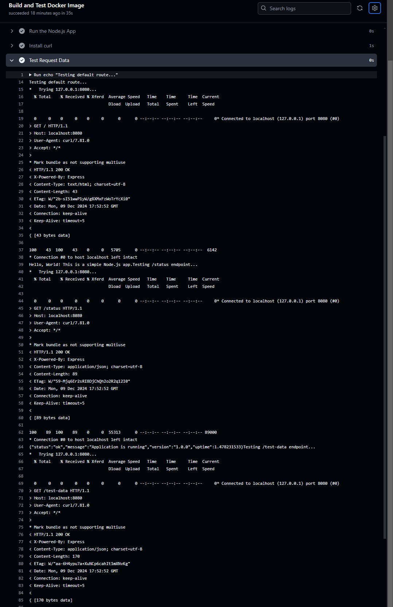
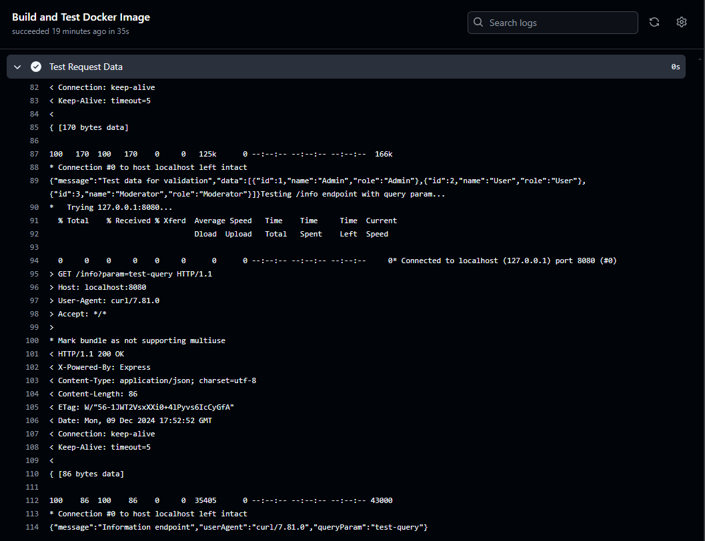
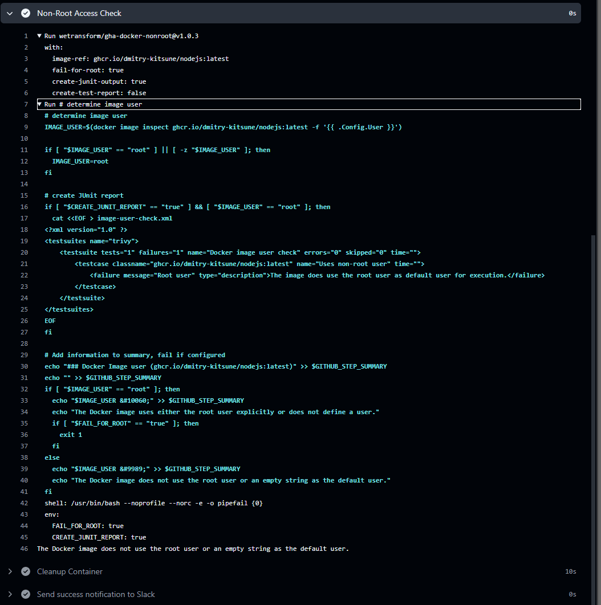
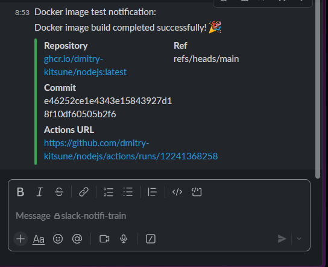
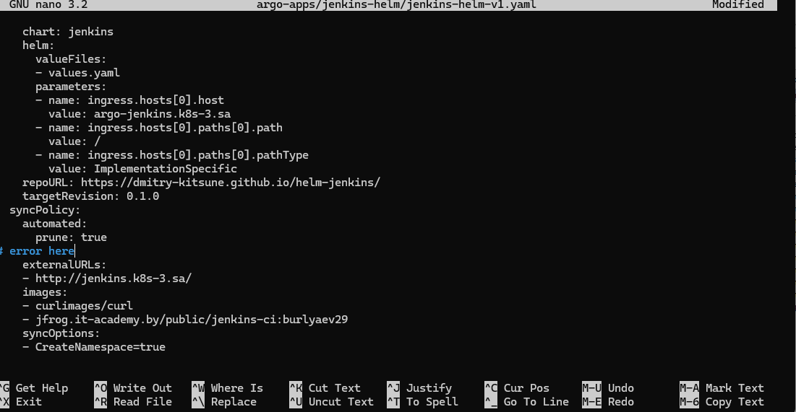
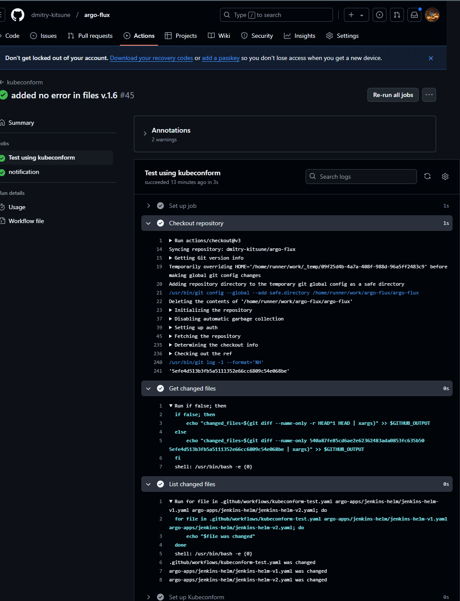
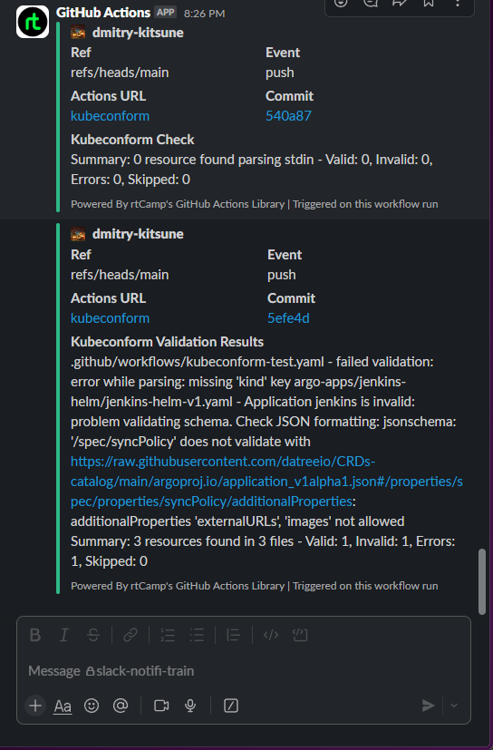

# 18. Testing

# Homework Assignment 1: Automate Docker images test by github action

  * deploy docker image for test
    - https://github.com/dmitry-kitsune/nodejs
   
    * test.yaml
```yml
name: Docker Image Test 2 Workflow

on:
  push:
    branches:
      - main
  workflow_dispatch:
    inputs:
      imageToBuild:
        description: 'The image directory to build'
        required: true
        default: 'my-nodejs-app'
      tagImage:
        description: 'Tag for the image'
        required: true
        default: 'latest'

jobs:
  build_and_test:
    name: Build and Test Docker Image
    runs-on: ubuntu-latest
    permissions:
      packages: write
      contents: read

    steps:
      # Step 1: Checkout code from the repository
      - name: Checkout code
        uses: actions/checkout@v3

      # Step 2: Log in to GitHub Container Registry
      - name: Log in to GitHub Container Registry
        uses: docker/login-action@v2
        with:
          registry: ghcr.io
          username: ${{ github.repository_owner }}
          password: ${{ secrets.GITHUB_TOKEN }}

      # Step 3: Build and push Docker image to GHCR
      - name: Build and push Docker image
        uses: docker/build-push-action@v3
        with:
          context: ${{ github.event.inputs.imageToBuild || '.' }}
          file: ${{ github.event.inputs.imageToBuild || '.' }}/Dockerfile
          push: true
          tags: ghcr.io/${{ github.repository_owner }}/${{ github.event.inputs.imageToBuild || 'nodejs' }}:${{ github.event.inputs.tagImage || 'latest' }}

      # Step 4: Run the Docker container for testing
      - name: Run the Node.js App
        run: |
          docker run --name nodejs-app -p 8080:8080 -d \
            ghcr.io/${{ github.repository_owner }}/${{ github.event.inputs.imageToBuild || 'nodejs' }}:${{ github.event.inputs.tagImage || 'latest' }}

      # Step 5: Install curl to test the running container
      - name: Install curl
        run: sudo apt-get install -y curl

      # Step 6: Test if the container serves data
      - name: Test Request Data
        run: |
          echo "Testing default route..."
          curl http://localhost:8080 -v
          
          echo "Testing /status endpoint..."
          curl http://localhost:8080/status -v
          
          echo "Testing /test-data endpoint..."
          curl http://localhost:8080/test-data -v
          
          echo "Testing /info endpoint with query param..."
          curl "http://localhost:8080/info?param=test-query" -v

      # Step 7: Verify that the Docker image does not run as root
      - name: Non-Root Access Check
        uses: wetransform/gha-docker-nonroot@v1.0.3
        with:
          image-ref: ghcr.io/${{ github.repository_owner }}/${{ github.event.inputs.imageToBuild || 'nodejs' }}:${{ github.event.inputs.tagImage || 'latest' }}
          fail-for-root: true

      # Step 8: Stop and remove the Docker container
      - name: Cleanup Container
        if: always()
        run: |
          docker stop nodejs-app
          docker rm nodejs-app

      # Step 9: Send success notification to Slack
      - name: Send success notification to Slack
        if: success()
        uses: slackapi/slack-github-action@v1.27.0
        with:
          payload: |
            {
              "text": "Docker image test notification:",
              "attachments": [
                {
                  "fallback": "Docker image test successfully: ghcr.io/${{ github.repository_owner }}/${{ github.event.inputs.imageToBuild || 'nodejs' }}:${{ github.event.inputs.tagImage || 'latest' }}",
                  "pretext": "Docker image build completed successfully! 🎉",
                  "color": "#36a64f",
                  "fields": [
                    {
                      "title": "Repository",
                      "value": "ghcr.io/${{ github.repository_owner }}/${{ github.event.inputs.imageToBuild || 'nodejs' }}:${{ github.event.inputs.tagImage || 'latest' }}",
                      "short": true
                    },
                    {
                      "title": "Ref",
                      "value": "${{ github.ref }}",
                      "short": true
                    },
                    {
                      "title": "Commit",
                      "value": "${{ github.sha }}",
                      "short": true
                    },
                    {
                      "title": "Actions URL",
                      "value": "${{ github.server_url }}/${{ github.repository }}/actions/runs/${{ github.run_id }}",
                      "short": false
                    }
                  ]
                }
              ]
            }
        env:
          SLACK_WEBHOOK_URL: ${{ secrets.SLACK_WEBHOOK_URL }}
          SLACK_WEBHOOK_TYPE: INCOMING_WEBHOOK

      # Step 10: Send failure notification to Slack
      - name: Send failure notification to Slack
        if: failure()
        uses: slackapi/slack-github-action@v1.27.0
        with:
          payload: |
            {
              "text": "Docker image test notification:",
              "attachments": [
                {
                  "fallback": "Docker image test failed for: ghcr.io/${{ github.repository_owner }}/${{ github.event.inputs.imageToBuild || 'nodejs' }}:${{ github.event.inputs.tagImage || 'latest' }}",
                  "pretext": "Docker image build encountered an error! ❌",
                  "color": "#FF0000",
                  "fields": [
                    {
                      "title": "Repository",
                      "value": "ghcr.io/${{ github.repository_owner }}/${{ github.event.inputs.imageToBuild || 'nodejs' }}:${{ github.event.inputs.tagImage || 'latest' }}",
                      "short": true
                    },
                    {
                      "title": "Ref",
                      "value": "${{ github.ref }}",
                      "short": true
                    },
                    {
                      "title": "Commit",
                      "value": "${{ github.sha }}",
                      "short": true
                    },
                    {
                      "title": "Actions URL",
                      "value": "${{ github.server_url }}/${{ github.repository }}/actions/runs/${{ github.run_id }}",
                      "short": false
                    }
                  ]
                }
              ]
            }
        env:
          SLACK_WEBHOOK_URL: ${{ secrets.SLACK_WEBHOOK_URL }}
          SLACK_WEBHOOK_TYPE: INCOMING_WEBHOOK
```


  * test by requesting data from image

  
   

  * test if image has not root access inside

  

  * test Slack notification

  

# Homework Assignment 2: Create CI for testing Kubernetes manifests using kubeconform

  * start on push or create PR to manifests repository

```yml
  #  kubeconform-test.yaml
name: kubeconform

on:
  push:
    branches:
      - main
  pull_request:
  workflow_dispatch:
```
  * integrate notification about status of validation

  * error file
  

```yml
      # Validate the changed manifests
      - name: Validate manifests
        id: init
        run: |
          CHECK_OUTPUT=""
          for line in $(kubeconform \
              -schema-location default \
              --summary \
              -schema-location 'https://raw.githubusercontent.com/datreeio/CRDs-catalog/main/{{.Group}}/{{.ResourceKind}}_{{.ResourceAPIVersion}}.json' \
              ${{ steps.changed-files.outputs.changed_files }}); do
            CHECK_OUTPUT="${CHECK_OUTPUT} $line"
          done
          echo "::set-output name=CHECK_OUTPUT::$CHECK_OUTPUT"
          echo $CHECK_OUTPUT

  # Send Slack notification with validation results     
  notification:
    needs: kubeconform
    runs-on: ubuntu-latest
    steps:
      - name: Slack Notification
        uses: rtCamp/action-slack-notify@v2
        env:
          SLACK_CHANNEL: slack-notifi-train
          SLACK_COLOR: ${{ job.status }}
          SLACK_MESSAGE: ${{ needs.kubeconform.outputs.CHECK_OUTPUT }}
          SLACK_TITLE: Kubeconform Check
          SLACK_USERNAME: GitHub Actions
          SLACK_WEBHOOK: ${{ secrets.SLACK_WEBHOOK }}
```

  * kubeconform-test.yaml

```yml
#  kubeconform-test.yaml
name: kubeconform

on:
  push:
    branches:
      - main
  pull_request:
  workflow_dispatch:

permissions:
  contents: read # Read-only access to repository contents

jobs:
  kubeconform:
    name: Test using kubeconform
    runs-on: ubuntu-latest
    outputs:
      CHECK_OUTPUT: ${{ steps.init.outputs.CHECK_OUTPUT }}

    steps:
      # Checkout the repository
      - name: Checkout repository
        uses: actions/checkout@v3
        with:
          fetch-depth: ${{ github.event_name == 'pull_request' && 2 || 0 }}
      
      # Get the list of changed files
      - name: Get changed files
        id: changed-files
        run: |
          if ${{ github.event_name == 'pull_request' }}; then
              echo "changed_files=$(git diff --name-only -r HEAD^1 HEAD | xargs)" >> $GITHUB_OUTPUT
          else
              echo "changed_files=$(git diff --name-only ${{ github.event.before }} ${{ github.event.after }} | xargs)" >> $GITHUB_OUTPUT
          fi
      
      # Display the list of changed files
      - name: List changed files
        run: |
          for file in ${{ steps.changed-files.outputs.changed_files }}; do
              echo "$file was changed"
          done
      
      - name: Set up Kubeconform
        uses: bmuschko/setup-kubeconform@v1
      
      # Validate the changed manifests
      - name: Validate manifests
        id: init
        run: |
          CHECK_OUTPUT=""
          for line in $(kubeconform \
              -schema-location default \
              --summary \
              -schema-location 'https://raw.githubusercontent.com/datreeio/CRDs-catalog/main/{{.Group}}/{{.ResourceKind}}_{{.ResourceAPIVersion}}.json' \
              ${{ steps.changed-files.outputs.changed_files }}); do
            CHECK_OUTPUT="${CHECK_OUTPUT} $line"
          done
          echo "::set-output name=CHECK_OUTPUT::$CHECK_OUTPUT"
          echo $CHECK_OUTPUT

  # Send Slack notification with validation results     
  notification:
    needs: kubeconform
    runs-on: ubuntu-latest
    steps:
      - name: Slack Notification
        uses: rtCamp/action-slack-notify@v2
        env:
          SLACK_CHANNEL: slack-notifi-train
          SLACK_COLOR: ${{ job.status }}
          SLACK_MESSAGE: ${{ needs.kubeconform.outputs.CHECK_OUTPUT }}
          SLACK_TITLE: "Kubeconform Validation Results"
          SLACK_USERNAME: GitHub Actions
          SLACK_WEBHOOK: ${{ secrets.SLACK_WEBHOOK }}
```
* GHAction log output:



```js
Run CHECK_OUTPUT=""
  CHECK_OUTPUT=""
  for line in $(kubeconform \
      -schema-location default \
      --summary \
      -schema-location 'https://raw.githubusercontent.com/datreeio/CRDs-catalog/main/{{.Group}}/{{.ResourceKind}}_{{.ResourceAPIVersion}}.json' \
      .github/workflows/kubeconform-test.yaml argo-apps/jenkins-helm/jenkins-helm-v1.yaml argo-apps/jenkins-helm/jenkins-helm-v2.yaml); do
    CHECK_OUTPUT="${CHECK_OUTPUT} $line"
  done
  echo "::set-output name=CHECK_OUTPUT::$CHECK_OUTPUT"
  echo $CHECK_OUTPUT
  shell: /usr/bin/bash -e {0}
.github/workflows/kubeconform-test.yaml - failed validation: error while parsing: missing 'kind' key argo-apps/jenkins-helm/jenkins-helm-v1.yaml - Application jenkins is invalid: problem validating schema. Check JSON formatting: jsonschema: '/spec/syncPolicy' does not validate with https://raw.githubusercontent.com/datreeio/CRDs-catalog/main/argoproj.io/application_v1alpha1.json#/properties/spec/properties/syncPolicy/additionalProperties: additionalProperties 'externalURLs', 'images' not allowed Summary: 3 resources found in 3 files - Valid: 1, Invalid: 1, Errors: 1, Skipped: 0
```
  * Slack notification:
  

Create PR to with your github action files and short report