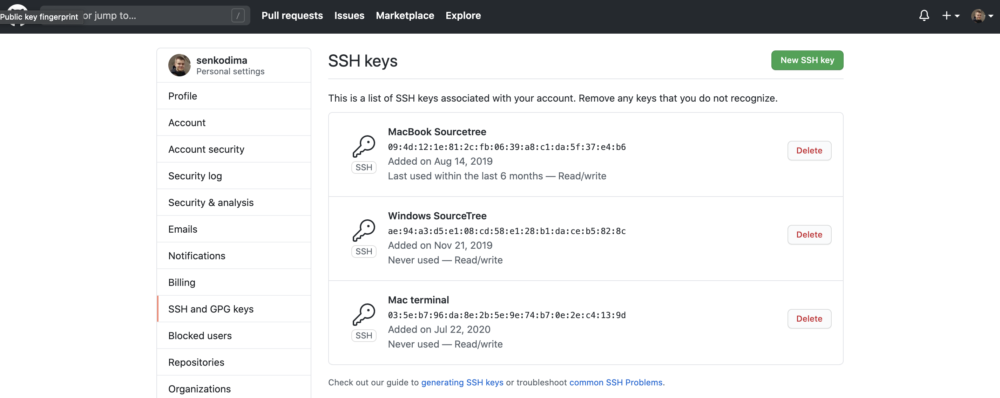
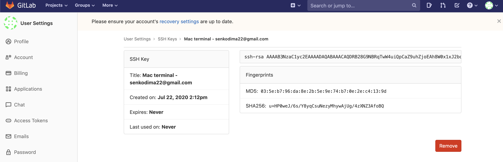
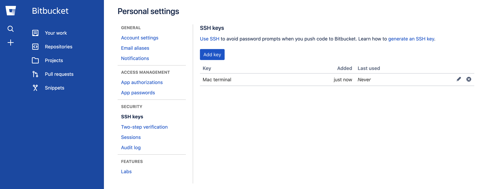
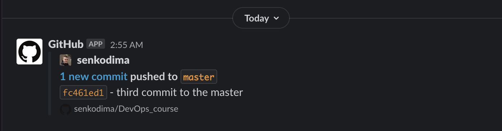
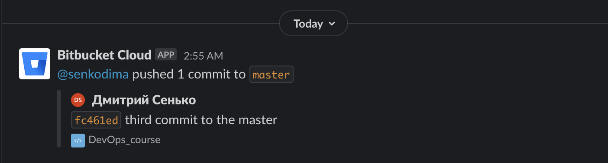
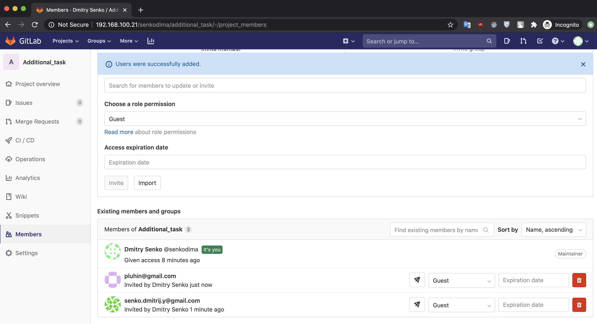
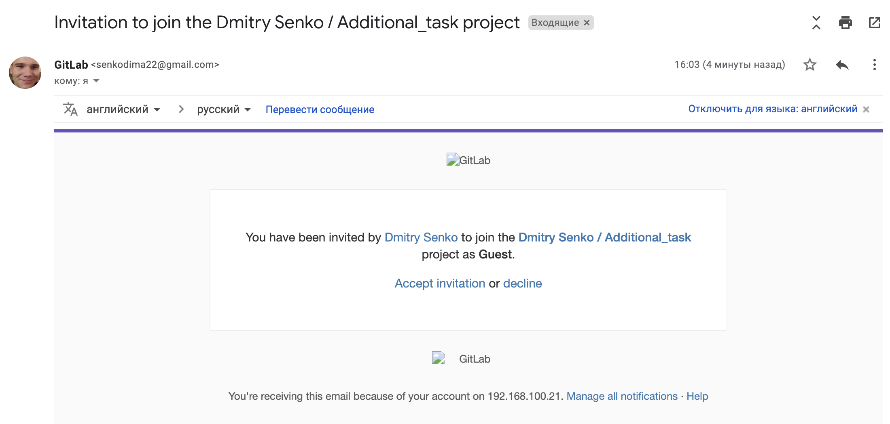

# 03.GIT.Hosting
## My remote repositories:
[Github](https://github.com/senkodima/DevOps_course)

[Gitlab](https://gitlab.com/senkodima/devops_course)

[Bitbucket](https://bitbucket.org/senkodima/devops_course)
## Add ssh key(s) to use ssh authentication:
### Generating a new SSH key and Copy the SSH key to your clipboard:
```
ssh-keygen -t rsa -b 4096 -C "senkodima22@gmail.com" 
pbcopy < ~/.ssh/id_rsa.pub
```



## Push local repository into remote repositories each all, one by one:
### Prepare to push local repository to remote repositories:
```
git remote add github https://github.com/senkodima/DevOps_course.git
git remote add gitlab https://gitlab.com/senkodima/devops_course.git
git remote add bitbucket https://senkodima@bitbucket.org/senkodima/devops_course.git
```
### Automating pushing changes to all remote repositories:
#### Prepare script to execute:
```
chmod +x push_script.sh
```
#### Script:
[push_script.sh](./push_script.sh)
#### push_script.sh:
```bash
#!/bin/bash
git push -u github --all
git push -u gitlab --all
git push -u bitbucket --all
```
### Pushing:
```
➜  02.Git git:(master) ./push_script.sh
Branch 'dev' set up to track remote branch 'dev' from 'github'.
Branch 'features/do_one' set up to track remote branch 'features/do_one' from 'github'.
Branch 'hotfix/we_gonna_die' set up to track remote branch 'hotfix/we_gonna_die' from 'github'.
Branch 'master' set up to track remote branch 'master' from 'github'.
Everything up-to-date
Branch 'dev' set up to track remote branch 'dev' from 'gitlab'.
Branch 'features/do_one' set up to track remote branch 'features/do_one' from 'gitlab'.
Branch 'hotfix/we_gonna_die' set up to track remote branch 'hotfix/we_gonna_die' from 'gitlab'.
Branch 'master' set up to track remote branch 'master' from 'gitlab'.
Everything up-to-date
Branch 'dev' set up to track remote branch 'dev' from 'bitbucket'.
Branch 'features/do_one' set up to track remote branch 'features/do_one' from 'bitbucket'.
Branch 'hotfix/we_gonna_die' set up to track remote branch 'hotfix/we_gonna_die' from 'bitbucket'.
Branch 'master' set up to track remote branch 'master' from 'bitbucket'.
Everything up-to-date
```
## Create slack integration push/commit events:
```
➜  02.Git git:(master) ✗ git commit -m "third commit to the master"
[master fc461ed] third commit to the master
 1 file changed, 1 insertion(+)
 create mode 100644 master3.txt
➜  02.Git git:(master) ./push_script.sh                      
Enumerating objects: 4, done.
Counting objects: 100% (4/4), done.
Delta compression using up to 8 threads
Compressing objects: 100% (2/2), done.
Writing objects: 100% (3/3), 293 bytes | 293.00 KiB/s, done.
Total 3 (delta 1), reused 0 (delta 0), pack-reused 0
remote: Resolving deltas: 100% (1/1), completed with 1 local object.
To https://github.com/senkodima/DevOps_course.git
   7417bc2..fc461ed  master -> master
Branch 'dev' set up to track remote branch 'dev' from 'github'.
Branch 'features/do_one' set up to track remote branch 'features/do_one' from 'github'.
Branch 'hotfix/we_gonna_die' set up to track remote branch 'hotfix/we_gonna_die' from 'github'.
Branch 'master' set up to track remote branch 'master' from 'github'.
Enumerating objects: 4, done.
Counting objects: 100% (4/4), done.
Delta compression using up to 8 threads
Compressing objects: 100% (2/2), done.
Writing objects: 100% (3/3), 293 bytes | 293.00 KiB/s, done.
Total 3 (delta 1), reused 0 (delta 0), pack-reused 0
To https://gitlab.com/senkodima/devops_course.git
   7417bc2..fc461ed  master -> master
Branch 'dev' set up to track remote branch 'dev' from 'gitlab'.
Branch 'features/do_one' set up to track remote branch 'features/do_one' from 'gitlab'.
Branch 'hotfix/we_gonna_die' set up to track remote branch 'hotfix/we_gonna_die' from 'gitlab'.
Branch 'master' set up to track remote branch 'master' from 'gitlab'.
Enumerating objects: 4, done.
Counting objects: 100% (4/4), done.
Delta compression using up to 8 threads
Compressing objects: 100% (2/2), done.
Writing objects: 100% (3/3), 293 bytes | 293.00 KiB/s, done.
Total 3 (delta 1), reused 0 (delta 0), pack-reused 0
To https://bitbucket.org/senkodima/devops_course.git
   7417bc2..fc461ed  master -> master
Branch 'dev' set up to track remote branch 'dev' from 'bitbucket'.
Branch 'features/do_one' set up to track remote branch 'features/do_one' from 'bitbucket'.
Branch 'hotfix/we_gonna_die' set up to track remote branch 'hotfix/we_gonna_die' from 'bitbucket'.
Branch 'master' set up to track remote branch 'master' from 'bitbucket'.
```


## Additional task:
```
invite notification sent to pluhin@gmail.com
```



