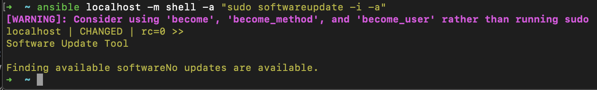
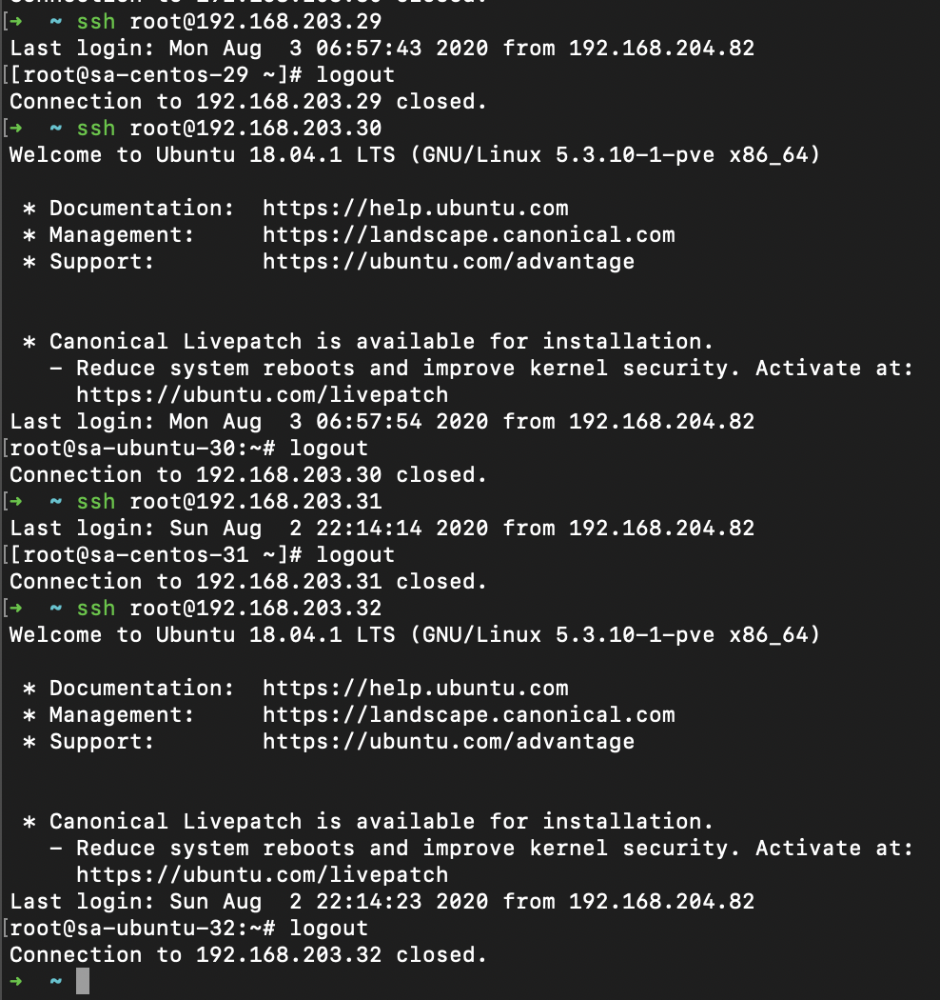

# 05.Ansible.start
## Install Ansible into my local macOS 
### Setup existing local user in my local machine to run SUDO without password
```bash
visudo 
# added line:
#	senko ALL=(ALL) NOPASSWD:ALL
```

### Vagrant file
```bash
vim Vagrantfile 
vagrant up
```
```bash
$script = <<-SCRIPT
export DEBIAN_FRONTEND=noninteractive
apt-get update && apt-get upgrade -yqq
apt-get install -yqq vim mc net-tools
cat /tmp/pub_key.pub >> /home/vagrant/.ssh/authorized_keys
chown vagrant:vagrant /home/vagrant/.ssh/authorized_keys
chmod 600 /home/vagrant/.ssh/authorized_keys
SCRIPT

$script2 = <<-SCRIPT
yum update -y 
yum install -y vim mc net-tools
cat /tmp/pub_key.pub >> /home/vagrant/.ssh/authorized_keys
chown vagrant:vagrant /home/vagrant/.ssh/authorized_keys
chmod 600 /home/vagrant/.ssh/authorized_keys
SCRIPT

PUB_KEY_PATH = "~/.ssh/id_rsa.pub"

MACHINES = {
  'host1Ubuntu'  =>  { vcpu: '1', ram: '512', ip: '10.20.30.20'},
  'host2Centos' =>  { vcpu: '1', ram: '512', ip: '10.20.30.21'},
  'jump' =>  { vcpu: '1', ram: '512', ip: '10.20.30.22'},
}

INSTANCES = MACHINES.flat_map do |server_name, server|
    server.merge({
      :vagrant_name => "#{server_name}",
    })
end

Vagrant.configure("2") do |config|
  config.vm.synced_folder ".", "/vagrant", disabled: true

  INSTANCES.each do |instance|

    config.vm.define instance[:vagrant_name] do |node|
      if instance[:vagrant_name] == "host1Ubuntu"
        node.vm.box = "ubuntu/bionic64" 
      end
      if instance[:vagrant_name] == "host2Centos"
      	node.vm.box = "centos/7"
      end
      if instance[:vagrant_name] == "jump"
      	node.vm.box = "debian/buster64"
	  end
      
      node.vm.hostname = instance[:vagrant_name]

      node.vm.network "private_network", ip: instance[:ip]

      if instance[:vagrant_name] == "jump"
        node.vm.network "public_network", ip: "192.168.100.40", bridge: "en0"
      end

      node.vm.provider "virtualbox" do |vb|
        vb.gui = false
        vb.memory = instance[:ram]
        vb.cpus = instance[:vcpu]
        #vb.name = instance[:vagrant_name]
      end

      node.vm.provision "file", source: PUB_KEY_PATH, destination: "/tmp/pub_key.pub"
      if instance[:vagrant_name] == "host1Ubuntu"
         node.vm.provision "shell", inline: $script
      end
      if instance[:vagrant_name] == "host2Centos"
         node.vm.provision "shell", inline: $script2
      end
      if instance[:vagrant_name] == "jump"
         node.vm.provision "shell", inline: $script
      end
    end
  end
end
```
### SSH config: 
```bash
vim ~/.ssh/config
```
```bash
###################################
## Home ansible
Host home_bastion
        User vagrant
        HostName 192.168.100.40
Host 10.20.30.2*
        ProxyJump home_bastion

###################################
## EC HTP
Host ec_bastion
        User jump_sa
        HostName 178.124.206.53
Host 192.168.37.* 192.168.31.* 192.168.203.*
	ProxyJump ec_bastion
```
### Change ansible config:
```bash
vim ~/.ansible/inventory.yaml
# change line inventory = 
# 	inventory = ~/.ansible/inventory.yaml
```
[ansible.cfg](./ansible.cfg)
#### Use YAML 
```yaml
all:
  children:
    ec:
      children:
        ec_centos:
          hosts:
            ec_host1:
              ansible_host: 192.168.203.29
            ec_host3:
              ansible_host: 192.168.203.31
        ec_ubuntu:
          hosts:
            ec_host2:
              ansible_host: 192.168.203.30
            ec_host4:
              ansible_host: 192.168.203.32
    infra:
      children:
        internal:
          hosts:
            centos:
              ansible_host: 10.20.30.20
            ubuntu:
              ansible_host: 10.20.30.21
    jump:
      hosts:
        bastion:
          ansible_host: 192.168.100.40
    ungrouped: {}
```
#### or use file hosts
```bash
vim ~/.ansible/hosts
# change line inventory = 
# 	inventory = ~/.ansible/hosts
```
[ansible.cfg](./ansible.cfg)
```bash
[infra:children]
internal

[internal]
centos ansible_host=10.20.30.20
ubuntu ansible_host=10.20.30.21

[ec:children]
ec_centos
ec_ubuntu

[ec_centos]
ec_host1 ansible_host=192.168.203.29
ec_host3 ansible_host=192.168.203.31

[ec_ubuntu]
ec_host2 ansible_host=192.168.203.30
ec_host4 ansible_host=192.168.203.32

[jump]
bastion ansible_host=192.168.100.40
```
### Check connection to the local hosts
```bash
➜  ~ ansible -m ping internal -u vagrant
ubuntu | SUCCESS => {
    "ansible_facts": {
        "discovered_interpreter_python": "/usr/bin/python"
    },
    "changed": false,
    "ping": "pong"
}
centos | SUCCESS => {
    "ansible_facts": {
        "discovered_interpreter_python": "/usr/bin/python3"
    },
    "changed": false,
    "ping": "pong"
}
➜  ~ 
```
## Connection to the remote host:
### Setup hosts for connection without password:
```bash
ssh-copy-id jump_sa@178.124.206.53
ssh-copy-id root@192.168.203.29
ssh-copy-id root@192.168.203.30
ssh-copy-id root@192.168.203.31
ssh-copy-id root@192.168.203.32
```

### Check connection to the remote hosts
```bash
➜  ~ ansible -m ping ec -u root    
ec_host1 | SUCCESS => {
    "ansible_facts": {
        "discovered_interpreter_python": "/usr/bin/python"
    },
    "changed": false,
    "ping": "pong"
}
ec_host3 | SUCCESS => {
    "ansible_facts": {
        "discovered_interpreter_python": "/usr/bin/python"
    },
    "changed": false,
    "ping": "pong"
}
ec_host2 | SUCCESS => {
    "ansible_facts": {
        "discovered_interpreter_python": "/usr/bin/python3"
    },
    "changed": false,
    "ping": "pong"
}
ec_host4 | SUCCESS => {
    "ansible_facts": {
        "discovered_interpreter_python": "/usr/bin/python3"
    },
    "changed": false,
    "ping": "pong"
}
➜  ~ 
```
### ec_centos group
#### Print out host names and IP ec_centos group
```bash
➜  ~ ansible -m shell -a "cat /etc/os-release && ip addr" ec_centos -u root
ec_host3 | CHANGED | rc=0 >>
NAME="CentOS Linux"
VERSION="7 (Core)"
ID="centos"
ID_LIKE="rhel fedora"
VERSION_ID="7"
PRETTY_NAME="CentOS Linux 7 (Core)"
ANSI_COLOR="0;31"
CPE_NAME="cpe:/o:centos:centos:7"
HOME_URL="https://www.centos.org/"
BUG_REPORT_URL="https://bugs.centos.org/"

CENTOS_MANTISBT_PROJECT="CentOS-7"
CENTOS_MANTISBT_PROJECT_VERSION="7"
REDHAT_SUPPORT_PRODUCT="centos"
REDHAT_SUPPORT_PRODUCT_VERSION="7"

1: lo: <LOOPBACK,UP,LOWER_UP> mtu 65536 qdisc noqueue state UNKNOWN group default qlen 1000
    link/loopback 00:00:00:00:00:00 brd 00:00:00:00:00:00
    inet 127.0.0.1/8 scope host lo
       valid_lft forever preferred_lft forever
    inet6 ::1/128 scope host 
       valid_lft forever preferred_lft forever
292: eth0@if293: <BROADCAST,MULTICAST,UP,LOWER_UP> mtu 1500 qdisc noqueue state UP group default qlen 1000
    link/ether 32:13:3c:8f:d9:14 brd ff:ff:ff:ff:ff:ff link-netnsid 0
    inet 192.168.203.31/16 brd 192.168.255.255 scope global eth0
       valid_lft forever preferred_lft forever
    inet6 fe80::3013:3cff:fe8f:d914/64 scope link 
       valid_lft forever preferred_lft forever
ec_host1 | CHANGED | rc=0 >>
NAME="CentOS Linux"
VERSION="7 (Core)"
ID="centos"
ID_LIKE="rhel fedora"
VERSION_ID="7"
PRETTY_NAME="CentOS Linux 7 (Core)"
ANSI_COLOR="0;31"
CPE_NAME="cpe:/o:centos:centos:7"
HOME_URL="https://www.centos.org/"
BUG_REPORT_URL="https://bugs.centos.org/"

CENTOS_MANTISBT_PROJECT="CentOS-7"
CENTOS_MANTISBT_PROJECT_VERSION="7"
REDHAT_SUPPORT_PRODUCT="centos"
REDHAT_SUPPORT_PRODUCT_VERSION="7"

1: lo: <LOOPBACK,UP,LOWER_UP> mtu 65536 qdisc noqueue state UNKNOWN group default qlen 1000
    link/loopback 00:00:00:00:00:00 brd 00:00:00:00:00:00
    inet 127.0.0.1/8 scope host lo
       valid_lft forever preferred_lft forever
    inet6 ::1/128 scope host 
       valid_lft forever preferred_lft forever
288: eth0@if289: <BROADCAST,MULTICAST,UP,LOWER_UP> mtu 1500 qdisc noqueue state UP group default qlen 1000
    link/ether c2:78:20:da:77:dc brd ff:ff:ff:ff:ff:ff link-netnsid 0
    inet 192.168.203.29/16 brd 192.168.255.255 scope global eth0
       valid_lft forever preferred_lft forever
    inet6 fe80::c078:20ff:feda:77dc/64 scope link 
       valid_lft forever preferred_lft forever
➜  ~ 
```
#### Upgrade packages ec_centos group
```bash
➜  ~ ansible -m shell -a "yum update -y" ec_centos -u root                 
[WARNING]: Consider using the yum module rather than running 'yum'.  If you need to use command because yum is
insufficient you can add 'warn: false' to this command task or set 'command_warnings=False' in ansible.cfg to get rid
of this message.
ec_host3 | CHANGED | rc=0 >>
Loaded plugins: fastestmirror
Loading mirror speeds from cached hostfile
 * base: centos.slaskdatacenter.com
 * extras: centos.slaskdatacenter.com
 * updates: mirror.datacenter.by
No packages marked for update
ec_host1 | CHANGED | rc=0 >>
Loaded plugins: fastestmirror
Loading mirror speeds from cached hostfile
 * base: centos.slaskdatacenter.com
 * extras: centos.slaskdatacenter.com
 * updates: centos1.hti.pl
No packages marked for update
➜  ~ 
```
### ec_ubuntu group
#### Print out host names and IP ec_ubuntu group
```bash
➜  ~ ansible -m shell -a "cat /etc/os-release && ip addr" ec_ubuntu -u root 
ec_host2 | CHANGED | rc=0 >>
NAME="Ubuntu"
VERSION="18.04.1 LTS (Bionic Beaver)"
ID=ubuntu
ID_LIKE=debian
PRETTY_NAME="Ubuntu 18.04.1 LTS"
VERSION_ID="18.04"
HOME_URL="https://www.ubuntu.com/"
SUPPORT_URL="https://help.ubuntu.com/"
BUG_REPORT_URL="https://bugs.launchpad.net/ubuntu/"
PRIVACY_POLICY_URL="https://www.ubuntu.com/legal/terms-and-policies/privacy-policy"
VERSION_CODENAME=bionic
UBUNTU_CODENAME=bionic
1: lo: <LOOPBACK,UP,LOWER_UP> mtu 65536 qdisc noqueue state UNKNOWN group default qlen 1000
    link/loopback 00:00:00:00:00:00 brd 00:00:00:00:00:00
    inet 127.0.0.1/8 scope host lo
       valid_lft forever preferred_lft forever
    inet6 ::1/128 scope host 
       valid_lft forever preferred_lft forever
290: eth0@if291: <BROADCAST,MULTICAST,UP,LOWER_UP> mtu 1500 qdisc noqueue state UP group default qlen 1000
    link/ether ca:33:b0:76:47:a2 brd ff:ff:ff:ff:ff:ff link-netnsid 0
    inet 192.168.203.30/16 brd 192.168.255.255 scope global eth0
       valid_lft forever preferred_lft forever
    inet6 fe80::c833:b0ff:fe76:47a2/64 scope link 
       valid_lft forever preferred_lft forever
ec_host4 | CHANGED | rc=0 >>
NAME="Ubuntu"
VERSION="18.04.1 LTS (Bionic Beaver)"
ID=ubuntu
ID_LIKE=debian
PRETTY_NAME="Ubuntu 18.04.1 LTS"
VERSION_ID="18.04"
HOME_URL="https://www.ubuntu.com/"
SUPPORT_URL="https://help.ubuntu.com/"
BUG_REPORT_URL="https://bugs.launchpad.net/ubuntu/"
PRIVACY_POLICY_URL="https://www.ubuntu.com/legal/terms-and-policies/privacy-policy"
VERSION_CODENAME=bionic
UBUNTU_CODENAME=bionic
1: lo: <LOOPBACK,UP,LOWER_UP> mtu 65536 qdisc noqueue state UNKNOWN group default qlen 1000
    link/loopback 00:00:00:00:00:00 brd 00:00:00:00:00:00
    inet 127.0.0.1/8 scope host lo
       valid_lft forever preferred_lft forever
    inet6 ::1/128 scope host 
       valid_lft forever preferred_lft forever
294: eth0@if295: <BROADCAST,MULTICAST,UP,LOWER_UP> mtu 1500 qdisc noqueue state UP group default qlen 1000
    link/ether ca:6b:20:be:02:7c brd ff:ff:ff:ff:ff:ff link-netnsid 0
    inet 192.168.203.32/16 brd 192.168.255.255 scope global eth0
       valid_lft forever preferred_lft forever
    inet6 fe80::c86b:20ff:febe:27c/64 scope link 
       valid_lft forever preferred_lft forever
➜  ~ 
```
#### Upgrade packages ec_ubuntu group
```bash
➜  ~ ansible -m shell -a "apt update -y" ec_ubuntu -u root
ec_host4 | CHANGED | rc=0 >>
Hit:1 http://archive.ubuntu.com/ubuntu bionic InRelease
Hit:2 http://archive.ubuntu.com/ubuntu bionic-updates InRelease
Hit:3 http://archive.ubuntu.com/ubuntu bionic-security InRelease
Reading package lists...
Building dependency tree...
Reading state information...
176 packages can be upgraded. Run 'apt list --upgradable' to see them.
WARNING: apt does not have a stable CLI interface. Use with caution in scripts.
ec_host2 | CHANGED | rc=0 >>
Hit:1 http://archive.ubuntu.com/ubuntu bionic InRelease
Hit:2 http://archive.ubuntu.com/ubuntu bionic-updates InRelease
Hit:3 http://archive.ubuntu.com/ubuntu bionic-security InRelease
Reading package lists...
Building dependency tree...
Reading state information...
176 packages can be upgraded. Run 'apt list --upgradable' to see them.
WARNING: apt does not have a stable CLI interface. Use with caution in scripts.
➜  ~ 
```