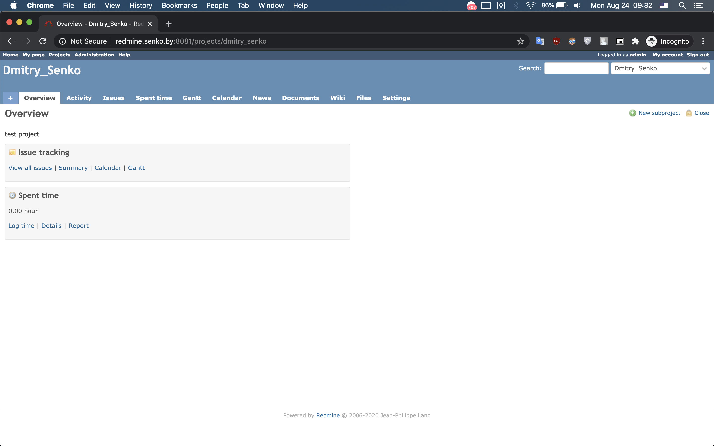

# 09.Ansible.Workshop
##### Run ansible-playbook 
```bash
ansible-playbook -i inventory.yaml play.yaml > play_output.txt
``` 
##### Output of play.yaml
[play_output.txt](./play_output.txt)
##### Slack notifications

##### Check on jump host (ec_bastion) via terminal
```bash
curl --header "Host: redmine.senko.by" http://192.168.31.17 
```
##### Create tunnel to workshop host (via jump host)
```bash
ssh -L 8081:localhost:80 root@192.168.31.17 -f -N
```
##### Check tunnel
```bash
ps aux | grep localhost
```
##### Kill tunnel
```bash
kill -9 [process_number]
```
##### Check via terminal
```bash
curl --header "Host: redmine.senko.by" http://localhost:8081 
```
##### Check via browser 
```bash
http://redmine.senko.by:8081/
```
##### Test project
