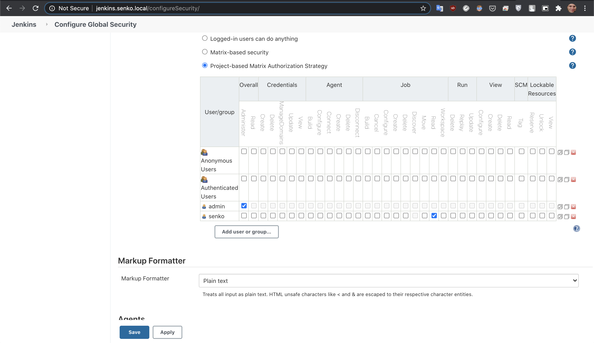
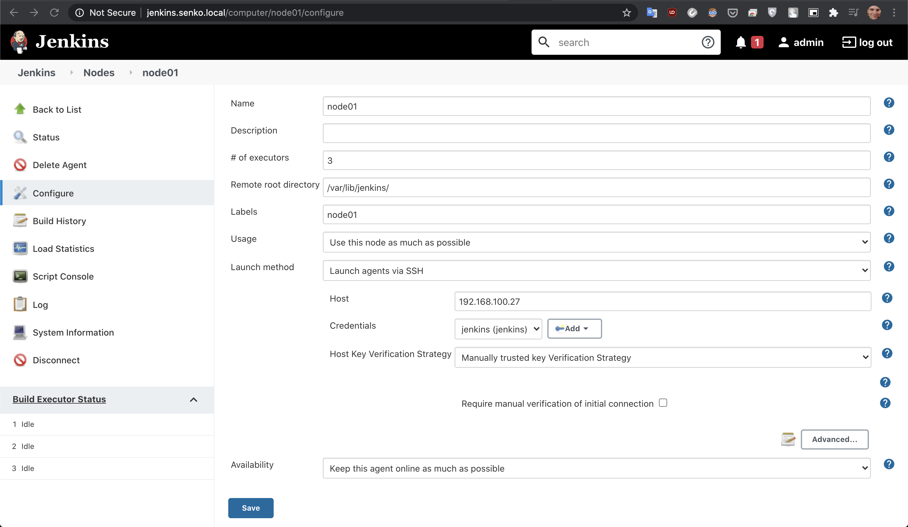
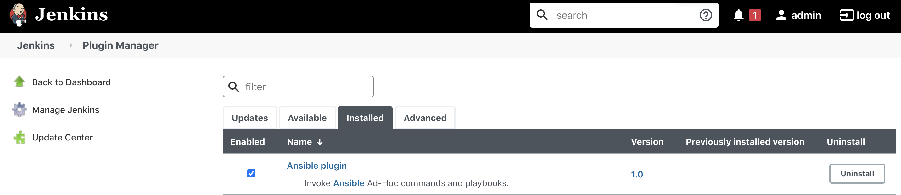
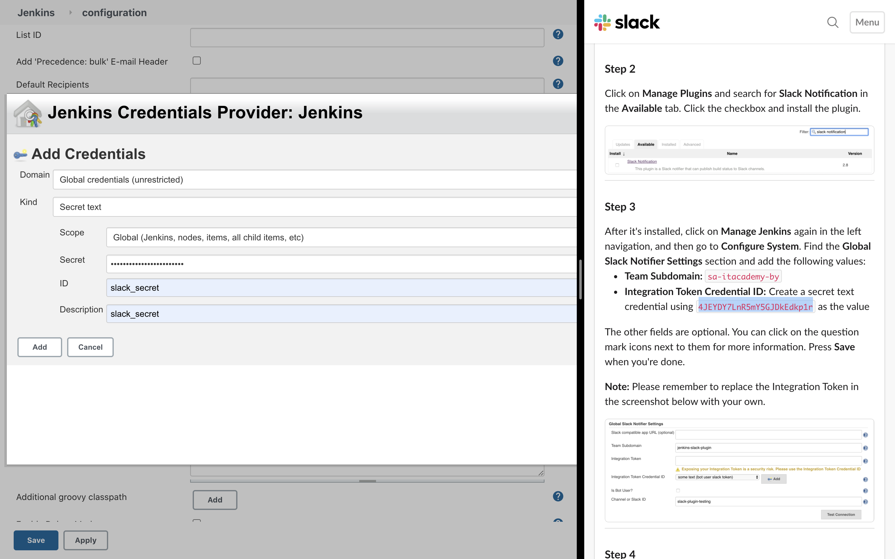
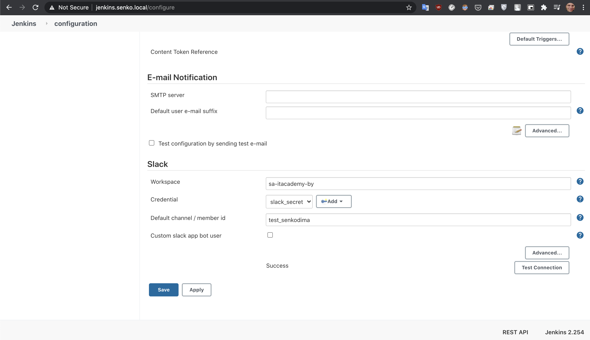
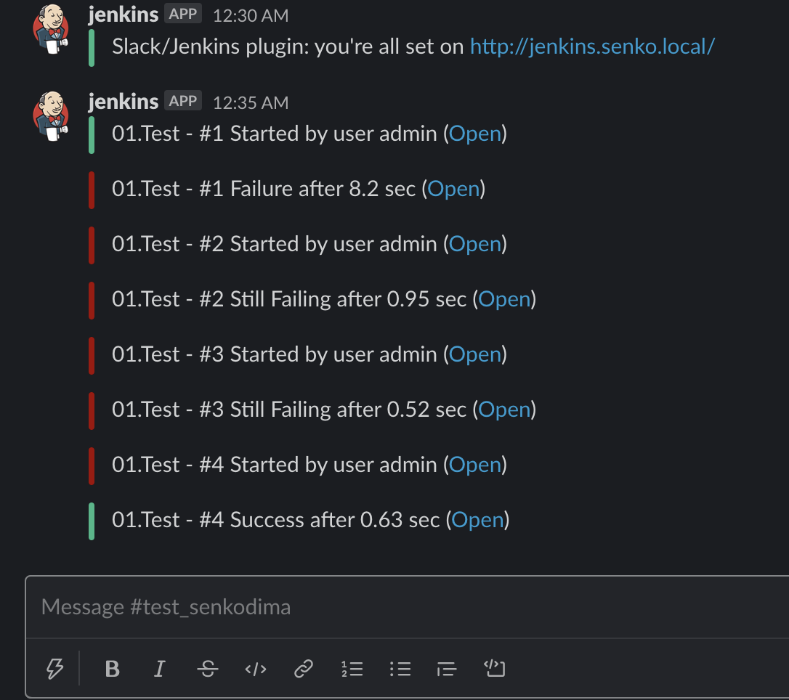
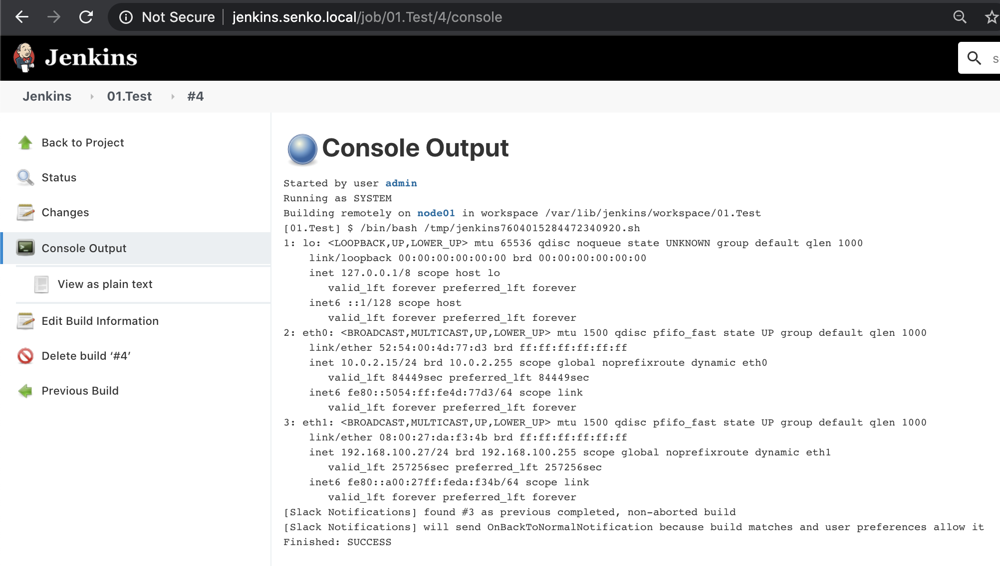

# 10.Jenkins.Start
### Vagrant file of master node 
[Vagrantfile](./master/Vagrantfile)
#### To re-run a provision (playbook) on an existing VM, just run:
```bash
vagrant provision
```
### Playbook
[play.yaml](./master/play.yaml)
### Get ip address of vagrant host (Jenkins master or node)
```bash
vagrant ssh -c "ip addr show eth1" | grep 'inet\b' | awk '{print $2}' | cut -d/ -f1
```
#### or use
```bash
vagrant ssh
ip addr show eth1 | grep "inet\b" | awk '{print $2}' | cut -d/ -f1
```
#### or better use script to get IP address of Jenkins master & nodes
[script_get_ip.sh](./script_get_ip.sh)

### Restricted user


### Create new Jenkins node


### Ansible plugin


### Add slack credentionals


### Configure global slack notification


### Slack notification


### Jenkins task output
