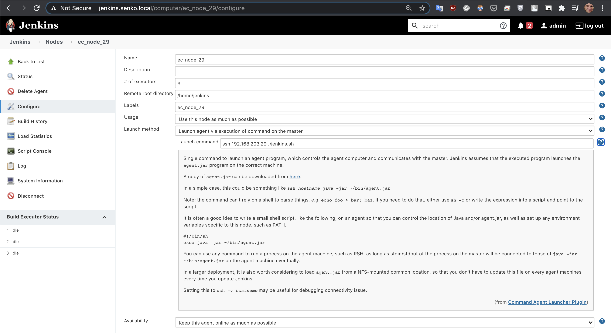
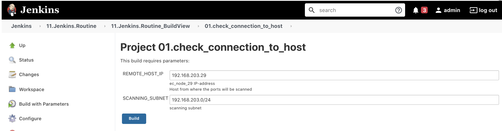
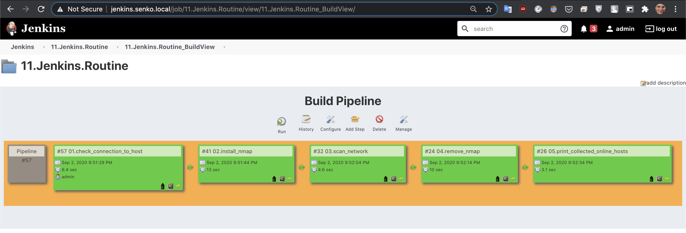

# 11.Jenkins.Routine
### Add remote node to local jenkins master. Preparing
#### on local jenkins master
```bash
vagrant ssh
sudo -i 
su - jenkins
```
#### on local jenkins master. make ssh config for user jenkins
```bash
cd .ssh/
vi config
chmod 600 config
```
#### on local jenkins master. cat /var/lib/jenkins/.ssh/config
```bash
## EC
Host ec_host_29_jenkins_node
	User jenkins
	HostName 192.168.203.29
	ProxyJump ec_bastion

Host ec_bastion
        User jump_sa
        HostName 178.124.206.53

Host 192.168.37.* 192.168.31.* 192.168.203.*
	ProxyJump ec_bastion
```
#### on remote mashine, add java and user jenkins
```
apt update
apt install openjdk-8-jdk
useradd -m -s /bin/bash jenkins
passwd jenkins
```
#### on local jenkins master
```bash
vagrant ssh
sudo -i 
su - jenkins
```
```bash
ssh-copy-id jump_sa@178.124.206.53
ssh-copy-id jenkins@192.168.203.29
```

### Add remote node to local jenkins master. Adding
#### jenkins.sh
```bash
vi jenkins.sh 
chmod 777 jenkins.sh 
```
```bash
#!/bin/sh
exec java -jar ~/agent.jar
```


#### on my machine
##### download agent from here
```
http://jenkins.senko.local/jnlpJars/agent.jar
```
##### and add this agent to remote mashine
```
cd ~/Downloads
scp agent.jar jenkins@192.168.203.29:/home/jenkins
```

### Implement Pipeline. Preparing
#### install ansible on local jenkins master
```bash
sudo yum -y update
sudo yum -y install epel-repo
sudo yum -y update
sudo yum -y install ansible
```
#### install Parameterized Trigger Plugin
```
Go to Manage Jenkins > Manage Plugins > Avaible 
    Parameterized Trigger
```
#### install Build Pipeline Plugin
```
Go to Manage Jenkins > Manage Plugins > Avaible 
    Build Pipeline Plugin
```
#### pipeline parameters

#### Build Pipeline


### Implement Pipeline. Output
#### 01.check_connection_to_host
```
Started by user admin
Running as SYSTEM
[EnvInject] - Loading node environment variables.
Building on master in workspace /var/lib/jenkins/workspace/11.Jenkins.Routine/01.check_connection_to_host
[01.check_connection_to_host] $ ansible all -i /tmp/inventory7581731348798509500.ini -m ping -f 5
192.168.203.29 | SUCCESS => {
    "ansible_facts": {
        "discovered_interpreter_python": "/usr/bin/python"
    }, 
    "changed": false, 
    "ping": "pong"
}
Triggering a new build of 11.Jenkins.Routine » 02.install_nmap
Finished: SUCCESS
```
#### 02.install_nmap
```
Started by upstream project "11.Jenkins.Routine/01.check_connection_to_host" build number 57
originally caused by:
 Started by user admin
Running as SYSTEM
[EnvInject] - Loading node environment variables.
Building on master in workspace /var/lib/jenkins/workspace/11.Jenkins.Routine/02.install_nmap
[02.install_nmap] $ sshpass ******** ansible all -i /tmp/inventory6438088024554277656.ini -m yum -a "name=nmap state=latest" -f 5 -u root -k
192.168.203.29 | SUCCESS => {
    "ansible_facts": {
        "discovered_interpreter_python": "/usr/bin/python"
    }, 
    "changed": false, 
    "changes": {
        "installed": [], 
        "updated": []
    }, 
    "msg": "", 
    "rc": 0, 
    "results": [
        "All packages providing nmap are up to date", 
        ""
    ]
}
Triggering a new build of 11.Jenkins.Routine » 03.scan_network
Finished: SUCCESS
```
#### 03.scan_network
```
Started by upstream project "11.Jenkins.Routine/02.install_nmap" build number 41
originally caused by:
 Started by upstream project "11.Jenkins.Routine/01.check_connection_to_host" build number 57
 originally caused by:
  Started by user admin
Running as SYSTEM
[EnvInject] - Loading node environment variables.
Building on master in workspace /var/lib/jenkins/workspace/11.Jenkins.Routine/03.scan_network
[03.scan_network] $ ansible all -i /tmp/inventory5574435014635219674.ini -m shell -a "nmap -sP 192.168.203.0/24 > /tmp/online_hosts.txt" -f 5
192.168.203.29 | CHANGED | rc=0 >>

Triggering a new build of 11.Jenkins.Routine » 04.remove_nmap
Finished: SUCCESS
```
#### 04.remove_nmap
```
Started by upstream project "11.Jenkins.Routine/03.scan_network" build number 32
originally caused by:
 Started by upstream project "11.Jenkins.Routine/02.install_nmap" build number 41
 originally caused by:
  Started by upstream project "11.Jenkins.Routine/01.check_connection_to_host" build number 57
  originally caused by:
   Started by user admin
Running as SYSTEM
[EnvInject] - Loading node environment variables.
Building on master in workspace /var/lib/jenkins/workspace/11.Jenkins.Routine/04.remove_nmap
[04.remove_nmap] $ sshpass ******** ansible all -i /tmp/inventory689005372373590202.ini -m yum -a "name=nmap state=absent" -f 5 -u root -k
192.168.203.29 | CHANGED => {
    "ansible_facts": {
        "discovered_interpreter_python": "/usr/bin/python"
    }, 
    "changed": true, 
    "changes": {
        "removed": [
            "nmap"
        ]
    }, 
    "msg": "", 
    "rc": 0, 
    "results": [
        "Loaded plugins: fastestmirror\nResolving Dependencies\n--> Running transaction check\n---> Package nmap.x86_64 2:6.40-19.el7 will be erased\n--> Finished Dependency Resolution\n\nDependencies Resolved\n\n================================================================================\n Package        Arch             Version                  Repository       Size\n================================================================================\nRemoving:\n nmap           x86_64           2:6.40-19.el7            @base            16 M\n\nTransaction Summary\n================================================================================\nRemove  1 Package\n\nInstalled size: 16 M\nDownloading packages:\nRunning transaction check\nRunning transaction test\nTransaction test succeeded\nRunning transaction\n  Erasing    : 2:nmap-6.40-19.el7.x86_64                                    1/1 \n  Verifying  : 2:nmap-6.40-19.el7.x86_64                                    1/1 \n\nRemoved:\n  nmap.x86_64 2:6.40-19.el7                                                     \n\nComplete!\n"
    ]
}
Triggering a new build of 11.Jenkins.Routine » 05.print_collected_online_hosts
Finished: SUCCESS
```
#### 05.print_collected_online_hosts
```
Started by upstream project "11.Jenkins.Routine/04.remove_nmap" build number 24
originally caused by:
 Started by upstream project "11.Jenkins.Routine/03.scan_network" build number 32
 originally caused by:
  Started by upstream project "11.Jenkins.Routine/02.install_nmap" build number 41
  originally caused by:
   Started by upstream project "11.Jenkins.Routine/01.check_connection_to_host" build number 57
   originally caused by:
    Started by user admin
Running as SYSTEM
[EnvInject] - Loading node environment variables.
Building on master in workspace /var/lib/jenkins/workspace/11.Jenkins.Routine/05.print_collected_online_hosts
[05.print_collected_online_hosts] $ ansible all -i /tmp/inventory504841343824193841.ini -m shell -a "cat /tmp/online_hosts.txt
rm -rf /tmp/online_hosts.txt" -f 5
192.168.203.29 | CHANGED | rc=0 >>

Starting Nmap 6.40 ( http://nmap.org ) at 2020-09-02 21:52 UTC
Nmap scan report for 192.168.203.2
Host is up (0.0040s latency).
Nmap scan report for 192.168.203.4
Host is up (0.0030s latency).
Nmap scan report for 192.168.203.6
Host is up (0.0022s latency).
Nmap scan report for 192.168.203.8
Host is up (0.0013s latency).
Nmap scan report for 192.168.203.10
Host is up (0.00047s latency).
Nmap scan report for 192.168.203.12
Host is up (0.00045s latency).
Nmap scan report for 192.168.203.14
Host is up (0.0040s latency).
Nmap scan report for 192.168.203.16
Host is up (0.0032s latency).
Nmap scan report for 192.168.203.18
Host is up (0.0023s latency).
Nmap scan report for 192.168.203.19
Host is up (0.0019s latency).
Nmap scan report for 192.168.203.20
Host is up (0.0013s latency).
Nmap scan report for 192.168.203.22
Host is up (0.00043s latency).
Nmap scan report for 192.168.203.24
Host is up (0.00088s latency).
Nmap scan report for 192.168.203.26
Host is up (0.0054s latency).
Nmap scan report for 192.168.203.28
Host is up (0.0046s latency).
Nmap scan report for remote_centos.site (192.168.203.29)
Host is up (0.0042s latency).
Nmap scan report for remote_ubuntu.site (192.168.203.30)
Host is up (0.0040s latency).
Nmap scan report for 192.168.203.32
Host is up (0.0031s latency).
Nmap scan report for 192.168.203.34
Host is up (0.0022s latency).
Nmap scan report for 192.168.203.36
Host is up (0.0014s latency).
Nmap scan report for 192.168.203.37
Host is up (0.0010s latency).
Nmap scan report for 192.168.203.38
Host is up (0.00046s latency).
Nmap scan report for 192.168.203.40
Host is up (0.00042s latency).
Nmap scan report for 192.168.203.42
Host is up (0.0067s latency).
Nmap scan report for 192.168.203.44
Host is up (0.0059s latency).
Nmap scan report for 192.168.203.46
Host is up (0.0051s latency).
Nmap scan report for 192.168.203.48
Host is up (0.0043s latency).
Nmap scan report for 192.168.203.50
Host is up (0.0035s latency).
Nmap scan report for 192.168.203.52
Host is up (0.0027s latency).
Nmap scan report for 192.168.203.54
Host is up (0.0019s latency).
Nmap scan report for 192.168.203.56
Host is up (0.0012s latency).
Nmap scan report for 192.168.203.58
Host is up (0.00039s latency).
Nmap scan report for 192.168.203.60
Host is up (0.00050s latency).
Nmap done: 256 IP addresses (33 hosts up) scanned in 2.16 seconds
Finished: SUCCESS
```