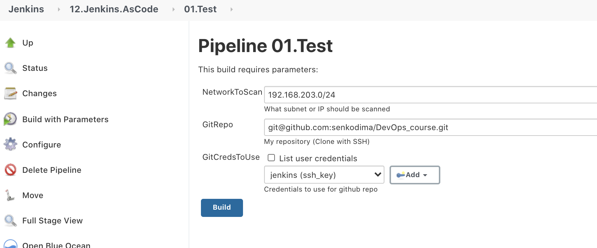
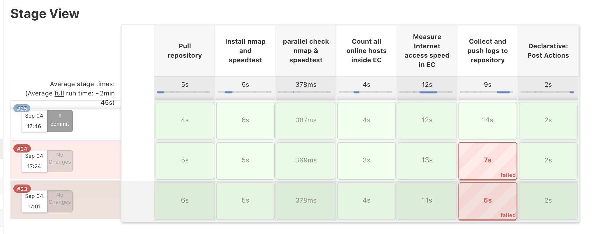
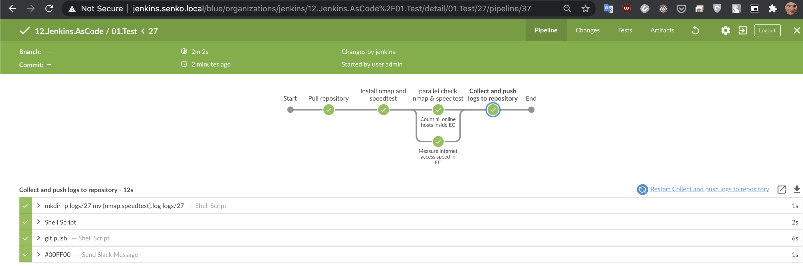
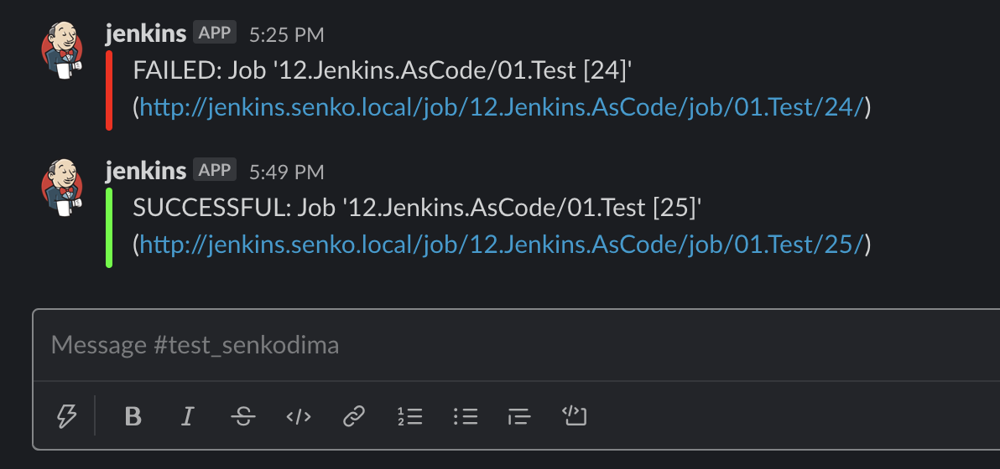
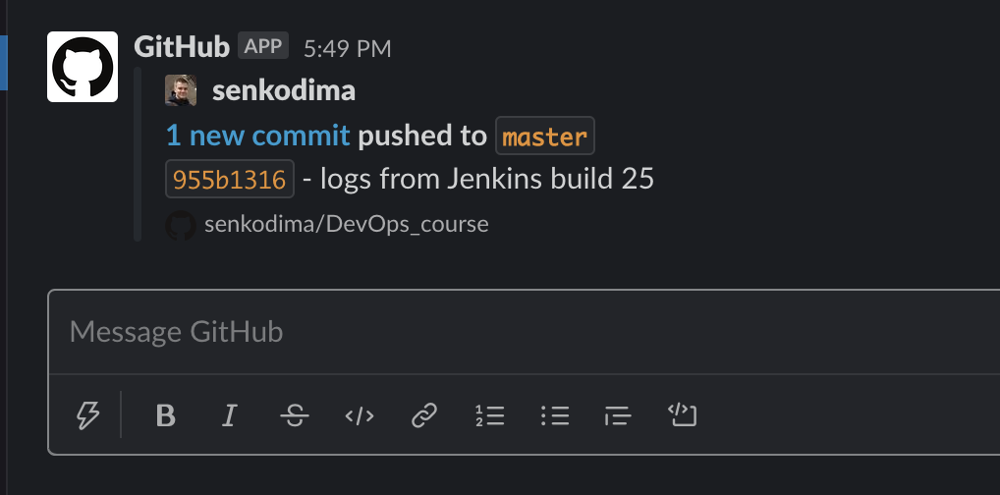

# 12.Jenkins.AsCode
### on remote node (root@192.168.203.29)
```bash
visudo
```
```bash
# added line:
jenkins ALL=(ALL) NOPASSWD: ALL
```

### copy id_rsa and id_rsa.pub to remote node (jenkins@192.168.203.29)
#### local jenkins
```bash
-bash-4.2$ pwd
/var/lib/jenkins/.ssh
-bash-4.2$ ls -la
total 28
drwx------.  2 jenkins jenkins   71 Sep  2 10:26 .
drwxr-xr-x. 20 jenkins jenkins 8192 Sep  4 14:02 ..
-rw-------.  1 jenkins jenkins  234 Sep  2 10:26 config
-rw-------.  1 jenkins jenkins 1679 Aug 28 21:01 id_rsa
-rw-r--r--.  1 jenkins jenkins  411 Aug 28 21:01 id_rsa.pub
-rw-r--r--.  1 jenkins jenkins  757 Sep  4 11:09 known_hosts
-bash-4.2$ scp id_rsa jenkins@192.168.203.29:~/.ssh/
id_rsa                                                                                100% 1679    30.3KB/s   00:00    
Killed by signal 1.
-bash-4.2$ scp id_rsa.pub jenkins@192.168.203.29:~/.ssh/
id_rsa.pub                                                                            100%  411     7.2KB/s   00:00    
Killed by signal 1.
-bash-4.2$ 
```
#### remote node
```bash
[jenkins@sa-centos-29 .ssh]$ pwd
/home/jenkins/.ssh
[jenkins@sa-centos-29 .ssh]$ ls -la 
total 24
drwx------  2 jenkins jenkins 4096 Sep  4 14:24 .
drwx------ 10 jenkins jenkins 4096 Sep  4 12:06 ..
-rw-------  1 jenkins jenkins  411 Sep  2 06:45 authorized_keys
-rw-------  1 jenkins jenkins 1679 Sep  4 14:23 id_rsa
-rw-r--r--  1 jenkins jenkins  411 Sep  4 14:24 id_rsa.pub
-rw-r--r--  1 jenkins jenkins  799 Sep  4 12:02 known_hosts
[jenkins@sa-centos-29 .ssh]$ 
```

### Add content of id_rsa.pub to https://github.com/settings/keys

### Install SSH Agent Plugin
```
Go to Manage Jenkins > Manage Plugins > Avaible 
    SSH Agent
```

### Jenkinsfile
[Jenkinsfile](./Jenkinsfile)

Reports are pushed to [https://github.com/senkodima/DevOps_course/tree/master/logs](https://github.com/senkodima/DevOps_course/tree/master/logs) to folder that matches `BUILD_ID` inside Jenkins.

### Pipeline parameters


#### Pipeline Stage View


#### Blue Ocean View


#### Slack notification Jenkins


#### Slack notification GitHub
