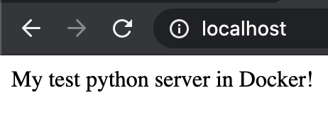
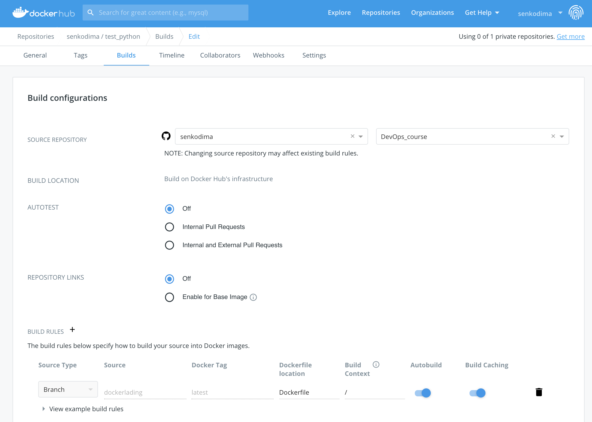
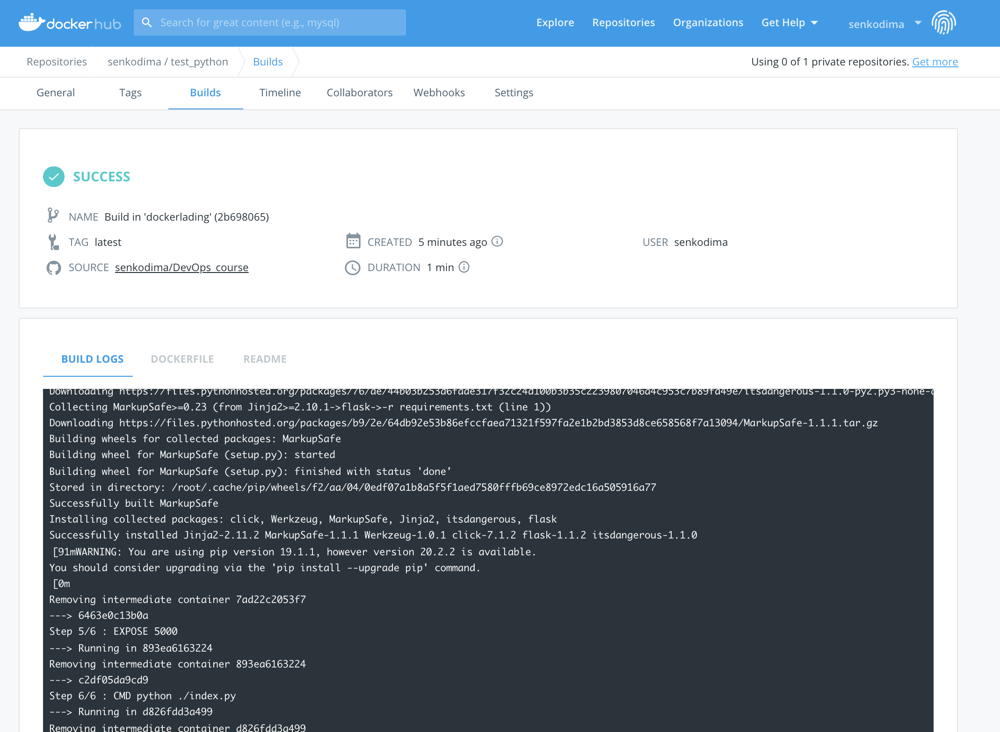

# 13.Docker.Lading
### Info containers/images
```bash
docker images # list of docker images
docker ps # list of docker containers
docker stop CONTAINER_ID
docker start CONTAINER_ID
```
### Remove containers/images
```bash
docker rm $(docker ps -aq) # (docker ps -aq) : get all containers, (-a) : list all, (-q) : prints only the container ID’s
docker rm CONTAINER_ID # to remove just that container
docker rmi $(docker images -aq) # (docker images -aq) : get all images, (-a) : to see all containers, including those not running, (-q) : prints only the images ID’s
docker rmi -f $(docker images -aq) # (-f : to force delete if image is referenced in multiple repositories)
```
### Build & run
```bash
docker build -t senkodima/test_python:first -f Dockerfile . # (-f) : Name of the Dockerfile (Default is ‘PATH/Dockerfile’)
```
```bash
docker run -d --name test_python -p 80:5000 senkodima/test_python:first # (-d) : detatch from console, 80 - local port, 5000 - container port
```
### or other build
```bash
docker build -t my_test_python_app .
# or
docker build --tag my_test_python_app .
```
```bash
docker run -d --name python_app -p 80:5000 my_test_python_app # (-d) : detatch from console, 80 - local port, 5000 - container port
```
### You can push to hub.docker.com
```bash
docker login # login to hub.docker.com
docker push senkodima/test_python:first
```
#### Create empty git branch
```bash
# Cheate a branch that is empty and have no history
git checkout --orphan empty-branch-name
# Then remove all the files you'll have in the staging area (so that they don't get committed)
git rm -rf .
```

[GitHub repo with Dockerfile](https://github.com/senkodima/DevOps_course/tree/dockerlading)

[Automated build image on hub.docker.com](https://hub.docker.com/repository/docker/senkodima/test_python)

#### Python app in docker


#### Creating repository on hub.docker.com


#### Automated build image
