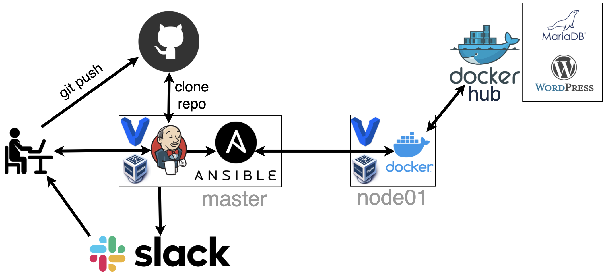

## Project report

### Project's reporter: Dmitry Senko 
### Group number: m-sa2-13-20

## Description of application for deployment
- Name: Wordpress
- Application is written in PHP
- Used database: MariaDB
- Proxy: Apache
- [CI & CD GitHub repository](https://github.com/senkodima/DevOps_course_Project)

### Pipeline. High Level Design

### Technologies which were used in project
- **Orchestration:** Jenkins
- **Automation tools:** Ansible
- **Infrastructure:** VirtualBox, Vagrant
- **Container:** Docker
- **SCM:** GitHub
- **Notification:** Slack

### Preparing infrastructure & CMS Installation Description:

  * Deployment starts with Jenkins
  * Jenkins (master) downloads GitHub repository and runs .yaml files with Ansible
  * Ansible runs playbook **install_init.yaml** with inventory file **inventory.yaml**
  * Installing and Configuring Docker
  * Running Docker containers with DB & CMS images
  * Creating local Docker volumes to 
  * Notify Slack about the results of that pipeline

### CMS Update Description:

  * Download a new CMS image (docker pull)
  * Stop old CMS container
  * Optionally test backup (rsync) Docker volumes with user data.
  * Delete the old CMS container
  * Start the new CMS container
  * Test working CMS homepage
  * Notify Slack about the results of that pipeline

### Usefull links

[Github bitnami-docker-wordpress](https://github.com/bitnami/bitnami-docker-wordpress)