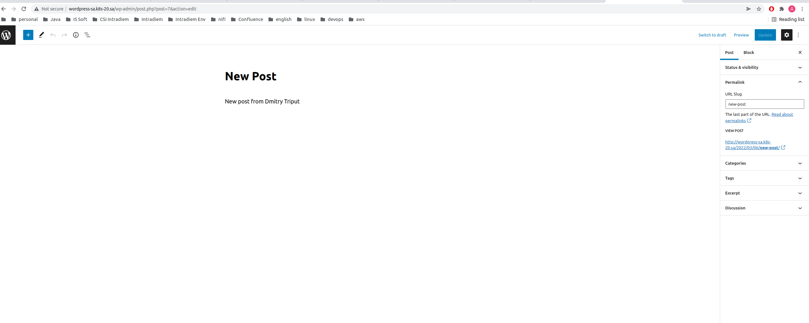

## 13.Kubernetes.Helm

## Script
```bash
303  cd ..
304  cd helm_drupal/
305  kubectl apply -f drupal_ingress.yaml
306  helm install nfs-subdir-external-provisioner nfs-subdir-external-provisioner/nfs-subdir-external-provisioner     --set nfs.server=192.168.37.105     --set nfs.path=/mnt/IT-Academy/nfs-data/sa2-19-22/dimatriput/
307  helm install dmitry-drupal  --set global.storageClass=nfs-client,drupalUsername=admin,drupalPassword=password bitnami/drupal
308  cd ..
309  cd helm_wordpress/
310  kubectl apply -f wordpress_ingress.yaml
311  helm install dmitry-wordpress  --set global.storageClass=nfs-client,wordpressUsername=admin,wordpressPassword=password bitnami/wordpress
```

### Screenshots



