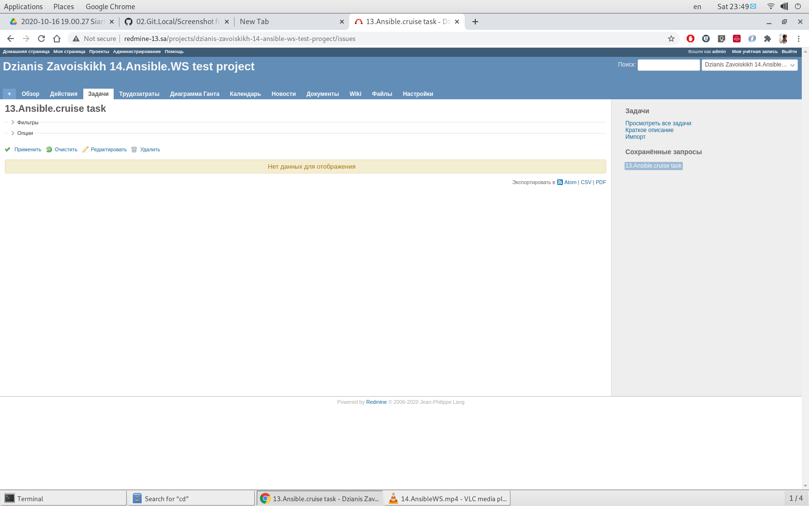

## 14.Ansible.Workshop

## Playbook log

 $ ansible-playbook -i inv.yaml --vault-password-file ~/vpass.txt play.yaml

 ```bash

PLAY [redmine] *****************************************************************

TASK [Gathering Facts] *********************************************************
Sunday 01 November 2020  00:16:03 +0300 (0:00:00.053)       0:00:00.053 ******* 
ok: [redmine]

TASK [Redmine. Install packages] ***********************************************
Sunday 01 November 2020  00:16:17 +0300 (0:00:13.702)       0:00:13.756 ******* 
ok: [redmine]

TASK [MySQL. Install packages] *************************************************
Sunday 01 November 2020  00:16:27 +0300 (0:00:10.571)       0:00:24.327 ******* 
ok: [redmine]

TASK [mysql : MySQL. Install and setup my.conf] ********************************
Sunday 01 November 2020  00:16:37 +0300 (0:00:09.509)       0:00:33.836 ******* 
ok: [redmine]

TASK [mysql : MySQL. Create db] ************************************************
Sunday 01 November 2020  00:16:52 +0300 (0:00:15.070)       0:00:48.907 ******* 
ok: [redmine]

TASK [mysql : MySQL. Create user] **********************************************
Sunday 01 November 2020  00:17:00 +0300 (0:00:08.138)       0:00:57.046 ******* 
ok: [redmine]

TASK [redmine : Redmine. Clone repository] *************************************
Sunday 01 November 2020  00:17:09 +0300 (0:00:09.087)       0:01:06.133 ******* 
ok: [redmine]

TASK [redmine : Redmine. Change permissions] ***********************************
Sunday 01 November 2020  00:17:20 +0300 (0:00:10.996)       0:01:17.129 ******* 
ok: [redmine]

TASK [redmine : Redmine. Change permissions] ***********************************
Sunday 01 November 2020  00:17:29 +0300 (0:00:08.754)       0:01:25.883 ******* 
ok: [redmine]

TASK [redmine : Config database] ***********************************************
Sunday 01 November 2020  00:17:37 +0300 (0:00:08.491)       0:01:34.375 ******* 
ok: [redmine]

TASK [redmine : Redmine. Setup 01] *********************************************
Sunday 01 November 2020  00:17:51 +0300 (0:00:13.277)       0:01:47.653 ******* 
changed: [redmine]

TASK [redmine : Session store secret generation] *******************************
Sunday 01 November 2020  00:18:08 +0300 (0:00:17.248)       0:02:04.901 ******* 
ok: [redmine]

TASK [redmine : Redmine. Setup 02] *********************************************
Sunday 01 November 2020  00:18:17 +0300 (0:00:08.724)       0:02:13.626 ******* 
changed: [redmine]

TASK [redmine : Configuration files for virtualhost] ***************************
Sunday 01 November 2020  00:18:33 +0300 (0:00:16.878)       0:02:30.504 ******* 
ok: [redmine]

TASK [Add redmine-13.sa to host file] ******************************************
Sunday 01 November 2020  00:18:46 +0300 (0:00:12.999)       0:02:43.504 ******* 
changed: [redmine]

TASK [uri] *********************************************************************
Sunday 01 November 2020  00:18:55 +0300 (0:00:08.670)       0:02:52.174 ******* 
ok: [redmine]

TASK [lineinfile] **************************************************************
Sunday 01 November 2020  00:19:04 +0300 (0:00:09.250)       0:03:01.424 ******* 
changed: [redmine]

TASK [Slack notification] ******************************************************
Sunday 01 November 2020  00:19:14 +0300 (0:00:09.767)       0:03:11.191 ******* 
ok: [redmine] => {
    "msg": "final Slack notification message"
}

PLAY RECAP *********************************************************************
redmine                    : ok=18   changed=4    unreachable=0    failed=0    skipped=0    rescued=0    ignored=0   

Playbook run took 0 days, 0 hours, 3 minutes, 11 seconds
Sunday 01 November 2020  00:19:14 +0300 (0:00:00.069)       0:03:11.261 ******* 
=============================================================================== 
redmine : Redmine. Setup 01 -------------------------------------------- 17.25s
redmine : Redmine. Setup 02 -------------------------------------------- 16.88s
mysql : MySQL. Install and setup my.conf ------------------------------- 15.07s
Gathering Facts -------------------------------------------------------- 13.70s
redmine : Config database ---------------------------------------------- 13.28s
redmine : Configuration files for virtualhost -------------------------- 13.00s
redmine : Redmine. Clone repository ------------------------------------ 11.00s
Redmine. Install packages ---------------------------------------------- 10.57s
lineinfile -------------------------------------------------------------- 9.77s
MySQL. Install packages ------------------------------------------------- 9.51s
uri --------------------------------------------------------------------- 9.25s
mysql : MySQL. Create user ---------------------------------------------- 9.09s
redmine : Redmine. Change permissions ----------------------------------- 8.75s
redmine : Session store secret generation ------------------------------- 8.72s
Add redmine-13.sa to host file ------------------------------------------ 8.67s
redmine : Redmine. Change permissions ----------------------------------- 8.49s
mysql : MySQL. Create db ------------------------------------------------ 8.14s
Slack notification ------------------------------------------------------ 0.07s


 ```


 