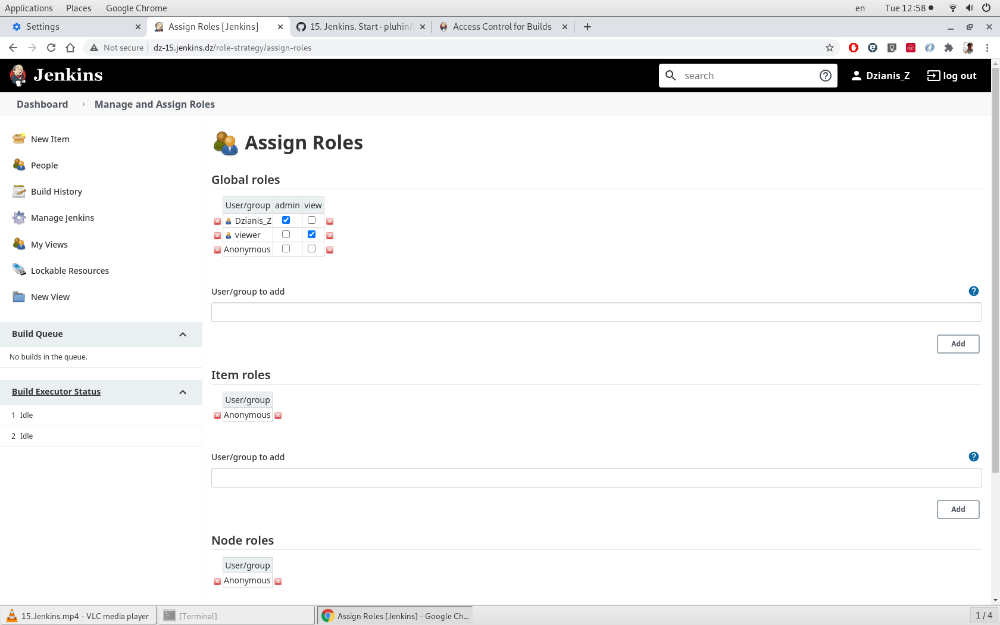

## 15.Jenkins.Start

Jenkins insalled via [Vagrantfile](Vagrantfile) plus [bootstrap.sh](bootstrap.sh)

The Ansible and the slack notification plugins installed via Web interface. The Role-based plugin added too.

Then the user named "viewer" added via Dashboard just to view Jobs, without any changes inside Jobs and Jenkins settings (the role "viewer" also created and assined to this user). See the printscreen below.



Jenkins on the virtual host hided behind the Nginx on the main (parent) host. It installed via [ansible-playbook](ansib_nginx/play.yaml), than configured manually by adding this lines to the default nginx server configuration file:

```bash
# The lines below added to the
# Default server configuration at the main host
# to hide the virtual (vagrant) host behind nginx as a proxy

server {
        listen 80;
	listen [::]:80;

        server_name dz-15.jenkins.dz;
        location / {
            proxy_pass http://192.168.100.41:8080/;
            proxy_redirect     off;
            proxy_set_header   Host             $host;
            proxy_set_header   X-Real-IP        $remote_addr;
            proxy_set_header   X-Forwarded-For  $proxy_add_x_forwarded_for;
        }
}

```