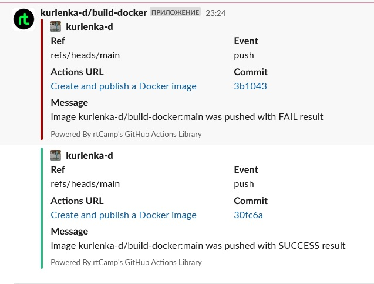

# 08.Docker.Docker-compose


## Repositories

[Github packages](https://github.com/kurlenka-d?tab=packages)

[Github Action](https://github.com/kurlenka-d/build-docker/actions/workflows/build.yaml)

[DockerHub Tags](https://hub.docker.com/r/elkin8ivan/build-docker/tags)


## Action file build

```yaml
name: Create and publish a Docker image

on: push

env:
  REGISTRY: ghcr.io
  IMAGE_NAME: ${{ github.repository }}

jobs:
  build-and-push-image:
    runs-on: ubuntu-latest
    permissions:
      contents: read
      packages: write
    steps:
      - name: Checkout repository
        uses: actions/checkout@v3

      - name: Log in to the Container registry
        uses: docker/login-action@f054a8b539a109f9f41c372932f1ae047eff08c9
        with:
          registry: ${{ env.REGISTRY }}
          username: ${{ github.actor }}
          password: ${{ secrets.CR_TOKEN }}

      - name: Extract metadata (tags, labels) for Docker
        id: meta
        uses: docker/metadata-action@98669ae865ea3cffbcbaa878cf57c20bbf1c6c38
        with:
          images: ${{ env.REGISTRY }}/${{ env.IMAGE_NAME }}
          tags: |
                  type=ref, event=branch
                  type=sha
                  
      - name: Build and push Docker image
        uses: docker/build-push-action@ad44023a93711e3deb337508980b4b5e9bcdc5dc
        with:
          context: .
          push: true
          tags: ${{ steps.meta.outputs.tags }}
          labels: ${{ steps.meta.outputs.labels }}
      - name: Send Slack SUCCESS notification
        uses: rtCamp/action-slack-notify@v2
        if: success()
        env:
          SLACK_CHANNEL: test_my_repo
          SLACK_COLOR: ${{ job.status }}
          SLACK_TITLE: Message
          SLACK_MESSAGE: 'Image ${{ github.repository }}:${{ github.ref_name }} was pushed with SUCCESS result'
          SLACK_USERNAME: ${{ github.repository }}
          SLACK_WEBHOOK: ${{ secrets.SLACK_WEBHOOK }}

      - name: Send Slack FAIL notification
        uses: rtCamp/action-slack-notify@v2
        if: failure()
        env:
          SLACK_CHANNEL: test_my_repo
          SLACK_COLOR: ${{ job.status }}
          SLACK_TITLE: Message
          SLACK_MESSAGE: 'Image ${{ github.repository }}:${{ github.ref_name }} was pushed with FAIL result'
          SLACK_USERNAME: ${{ github.repository }}
          SLACK_WEBHOOK: ${{ secrets.SLACK_WEBHOOK }}

```


## Mesagge slack



