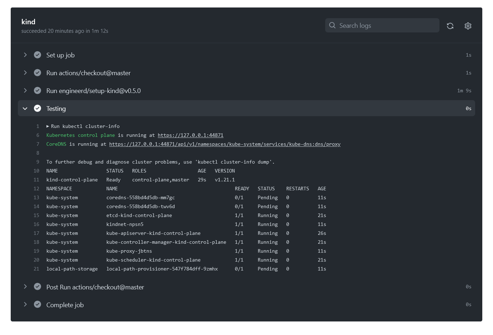
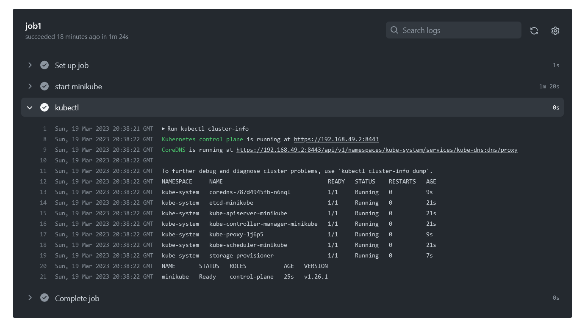

# 09.Kubernetes


## Repositories

[Github Action](https://github.com/kurlenka-d/build-docker/actions/workflows/build.yaml)

## Create cluster using KinD

```yaml
name: "Create cluster using KinD"
on: [pull_request, push]

jobs:
  kind:
    runs-on: ubuntu-latest
    steps:
      - uses: actions/checkout@master
      - uses: engineerd/setup-kind@v0.5.0
        with:
          version: "v0.11.1"
      - name: Testing
        run: | 
          kubectl cluster-info
          kubectl get node -A
          kubectl get pods -A 
          
```

## Setup minikube as CI

```yaml
name: "Setup minikube as CI"
on: [pull_request, push]

jobs:
  job1:
    runs-on: ubuntu-latest
    name: job1
    steps:
      - name: start minikube
        uses: medyagh/setup-minikube@latest
        id: minikube
        with:
          cache: false
      - name: kubectl
        run: |
          kubectl cluster-info
          kubectl get pods -A
          kubectl get node -A
```

## Cluster KinD



## Cluster Minikube

