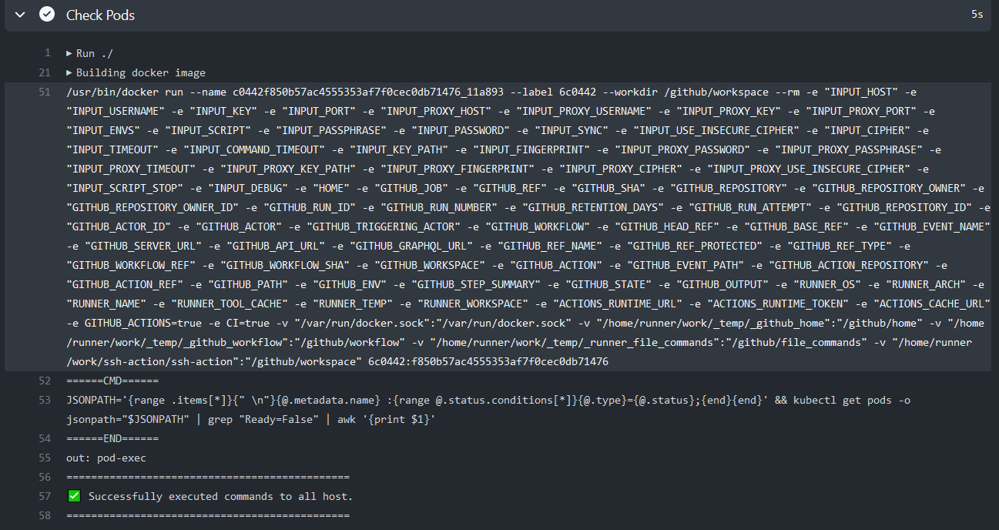
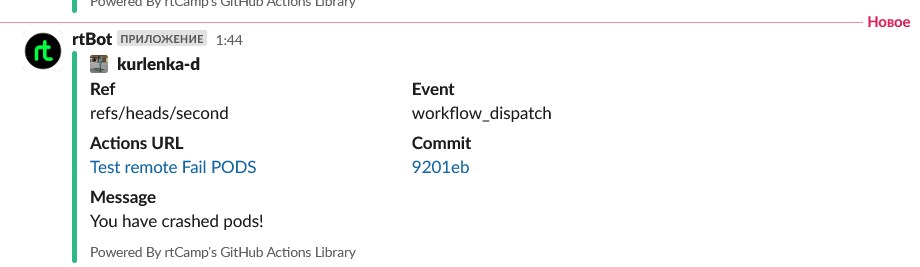

# 10. Kubernetes installation

## Repositories

[Github Action](https://github.com/kurlenka-d/ssh-action/actions/workflows/ci_3.yml)

## LocalHost Test

With problem  "pod-exec" pods for test message.

## Test Running Action

## Slack Notification

