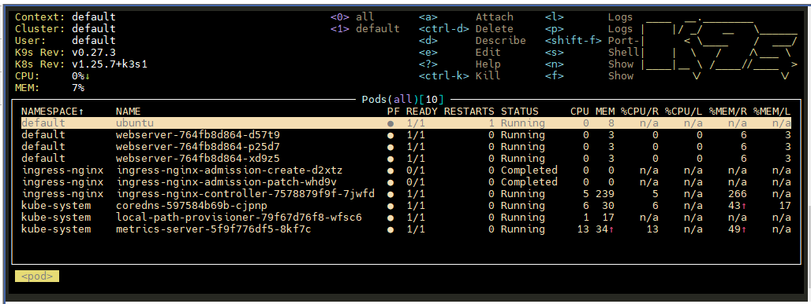
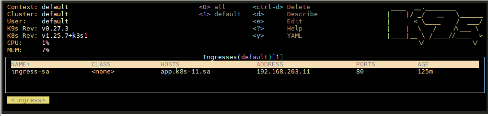
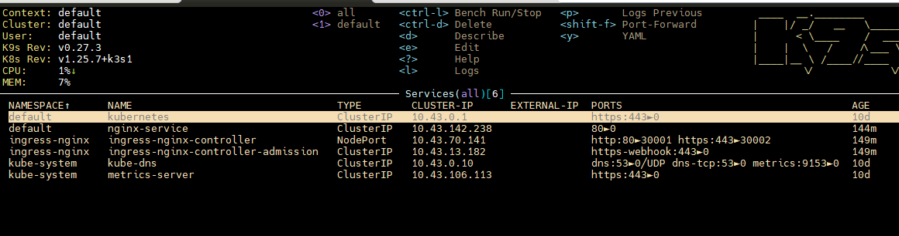
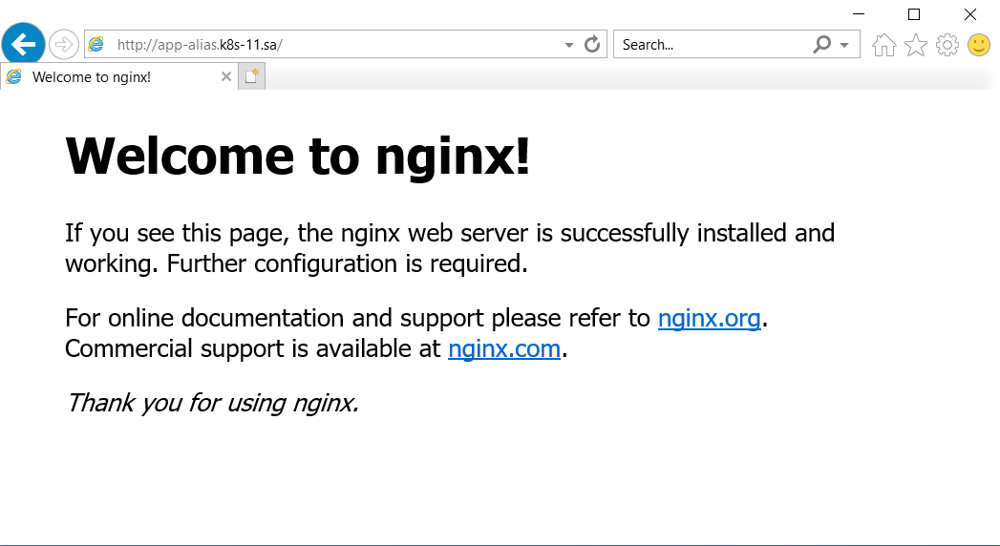

# 11. Kubernetes. Basic objects

Create deployment of nginx service:

- kubectl apply -f ingress-controller.yaml
- kubectl apply -f app.yaml

## Tets Pods

## Ingress

## Service

## Web server test

