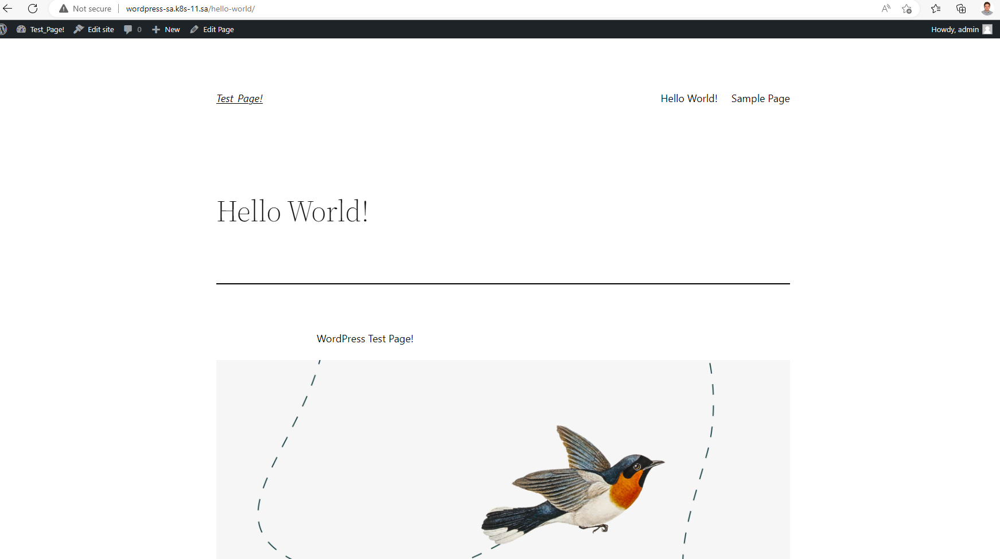
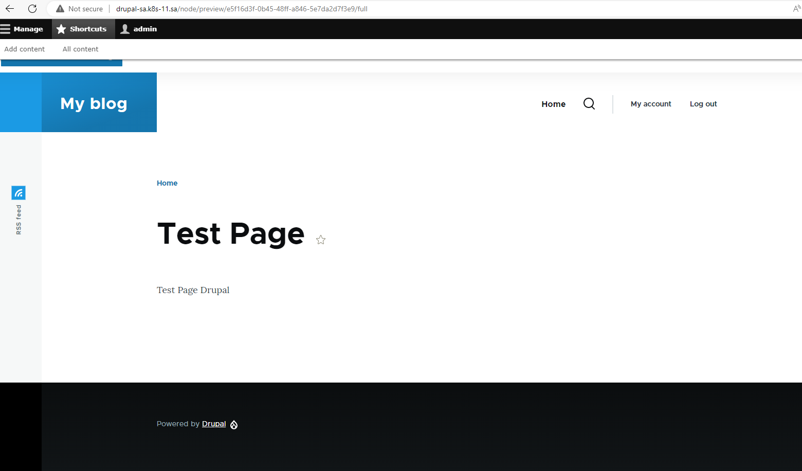

# 13. Kubernetes. Helm


### Create databases
```bash
ansible-playbook -i inv.yaml mariadb.yaml -e name_db=bitnami_wordpress -e user_db=bn_wordpress -e pass_db=bn_wordpress

ansible-playbook -i inv.yaml mariadb.yaml -e name_db=bitnami_drupal -e user_db=bn_drupal -e pass_db=bn_drupal
```

### Deploy in K8s cluster the applications:

<li><b>Wordpress</li>

```bash
helm install sa-wordpress  --set mariadb.enabled=false,externalDatabase.host=192.168.201.11,externalDatabase.password=bn_wordpress,externalDatabase.user=bn_wordpress,externalDatabase.database=bitnami_wordpress,global.storageClass=nfs,wordpressUsername=admin,wordpressPassword=wordpress my-repo/wordpress

```
<li>Drupal</b></li>

```bash
helm install sa-drupal  --set mariadb.enabled=false,externalDatabase.host=192.168.201.11,externalDatabase.password=bn                          _drupal,externalDatabase.user=bn_drupal,externalDatabase.database=bitnami_drupal,global.storageClass=nfs,drupalUsername=admin,drupalPassword=drupal

```


## Test Pages




