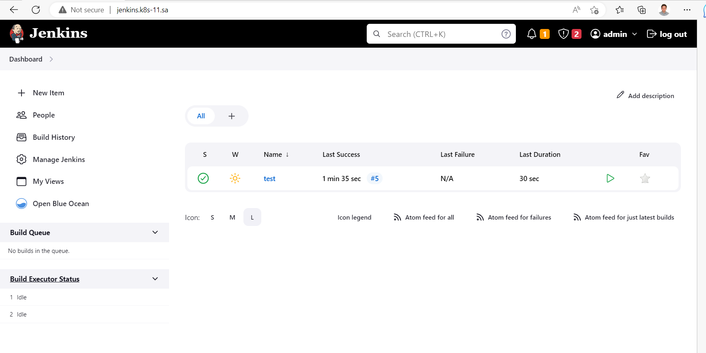

# 14.Kubernetes-application-deployment

## Create helm package for your Jenkins application

[>> Helm values file <<](https://github.com/kurlenka-d/sa.it-academy.by/blob/md-sa2-23-23/Dzmitry_Kurlenka/14.%20Kubernetes%20application%20deployment/helm-jenkins/values.yaml)

## Printscreen of work Jenkins app

