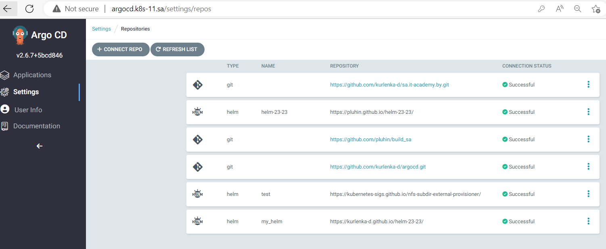
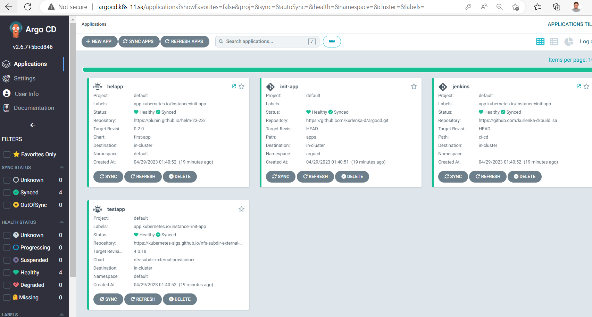
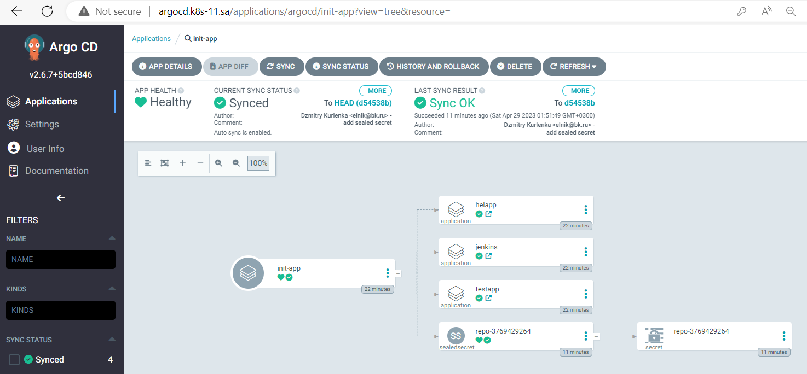

## 15. Kubernetes CI CD

### Repositories
[Argo CD] (https://github.com/kurlenka-d/argocd.git)

[Helm] (https://github.com/kurlenka-d/helm-23-23)


### Apps

### init-apps


<b>adding git secrets</b>
```bash
kubectl get secret repo-3769429264 -n argocd -o yaml > sec264.yaml
cat sec264.yaml | kubeseal --format yaml > sealed_sec264.yaml
kubectl apply -f apps/sealed_sec264.yaml
```