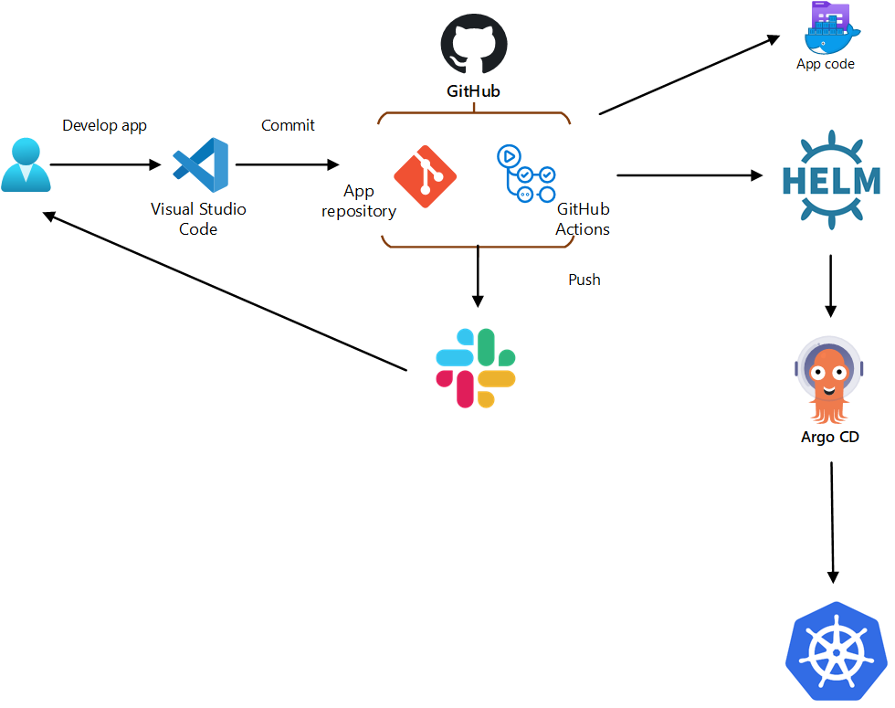

## Project report

### Project's reporter: Dzmitry Kurlenka

### Group number: md-sa2-23-23

## Description of application for deployment:

- Application: WordPress

- Programming language: PHP

- DB: MySQL 

- Link on git repository: https://github.com/docker-library/wordpress

## Pipeline

## Technologies which were used in project:

- Orchestration: 
Kubernetes

- Automation tools:
GitHub's action, Argo CD 

- SCM:
GitHub

- Notification:
Slack

- Other tools:
 Docker, Helm

## CI/CD description:
After pushing to the master branch, GitAction builds 
and pushes the image to DockerHUB, creates a HELM package.
Argo CD deploys application in Kubernetes cluster.

## Rollback flow description and implementation:

Version selection in Argo CD

## Links:

Project repository: https://github.com/kurlenka-d/project-itacad

