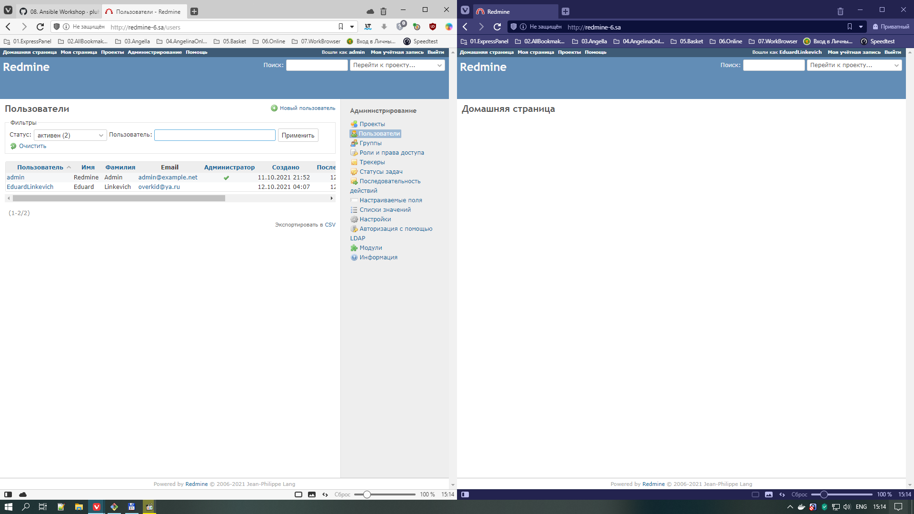
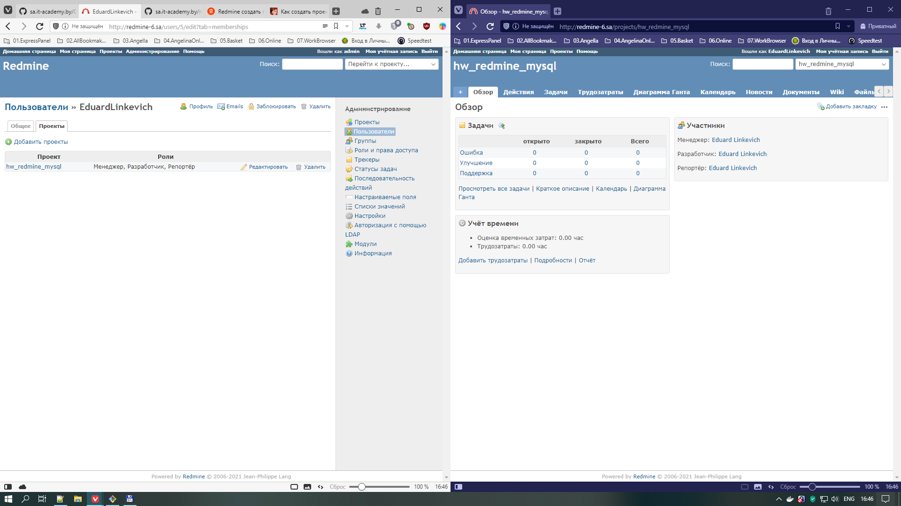

# 08. Ansible Workshop

## presets
- ansiblehost - docker container with ubuntu/latest
- bastion - jump server specified in the lesson
- workhost - vm for students

> All configuration files are in their folders

## shell
```bash
mkdir -p roles/mysql/{defaults,handlers,tasks,templates}
mkdir -p roles/redmine_hw/{defaults,handlers,tasks,templates}
ansible -m ping -i inv.yaml redmine

ansible-playbook redmine_mysql.yaml -i inv.yaml
```




