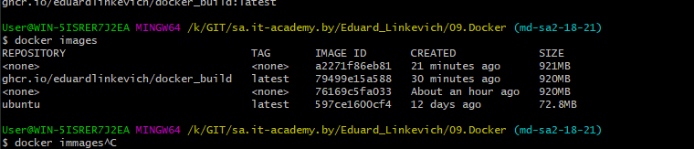
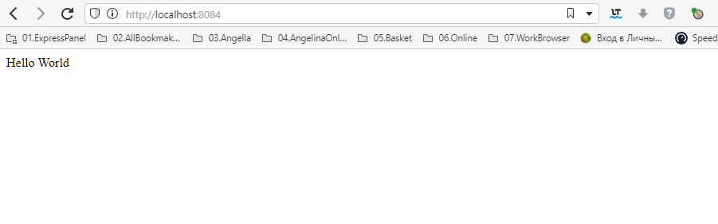

# 09.Docker

## presets
- ansiblehost - docker container with ubuntu/latest
- bastion - jump server specified in the lesson
- workhost - vm for students

[FlaskAPI](https://pythonru.com/uroki/3-osnovy-flask)

[dockerhub](https://hub.docker.com/_/python)

[github](https://github.com/EduardLinkevich/docker_build)


## shell
```bash
docker build .
docker run -p 8084:5000 76169c5fa033
docker run -p 8084:5000 --network=host -h 127.0.0.1 76169c5fa033


winpty docker login https://ghcr.io/
docker pull ghcr.io/eduardlinkevich/docker_build:latest
docker run -p 8084:5000 79499e15a588
curl http://localhost:8084
```

### Dockerfile
```bash
FROM python:3.8
MAINTAINER Eduard Linkevich <edlink911@gmail.com>

WORKDIR /app

COPY ./requirements.txt ./
RUN pip3 install -r ./requirements.txt

COPY . /app
WORKDIR /app

ENTRYPOINT python main.py
```

### main.py
```python
from flask import Flask

app = Flask(__name__)

@app.route('/')
def index():
    return 'Hello World'

if __name__ == "__main__":
    app.run(host='0.0.0.0')
```

### requirements.txt
```
Flask
```






