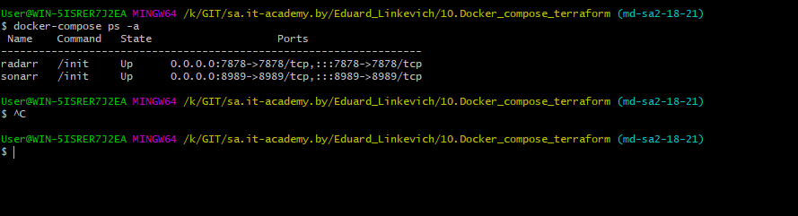
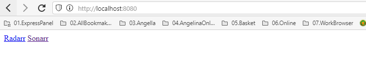
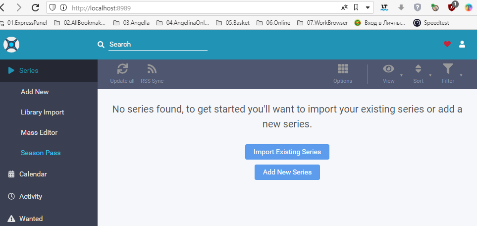
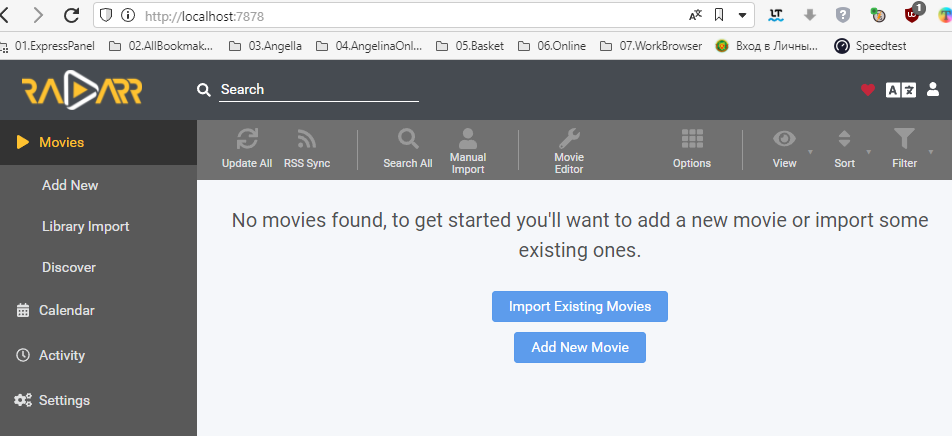

# 10.Docker compose terraform

## presets
[sonarr](https://hub.docker.com/r/linuxserver/sonarr)

[radarr](https://hub.docker.com/r/linuxserver/radarr)

[apache2](https://hub.docker.com/r/ubuntu/apache2)

## commands
```shel
docker version
docker-compose --version
docker-compose up -f docker-compose.yaml
docker-compose ps -a
 docker-compose -f docker-compose.yaml up -d
```
[content docker-compose.yaml](docker-compose.yaml)




##running applications





##terraform
```shel
terraform init
terraform plan > tf.plan
terraform apply --auto-approve
```

[content main.tf](main.tf)

[content "terraform plan"](tf.plan)

