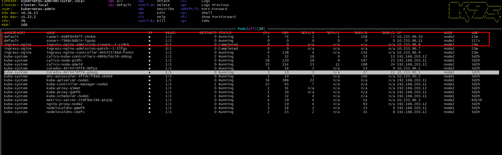
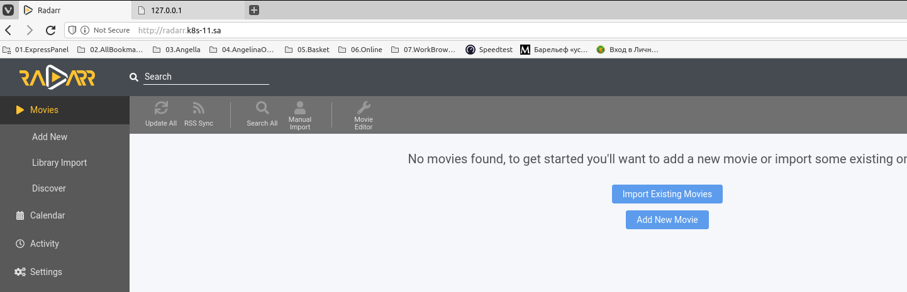
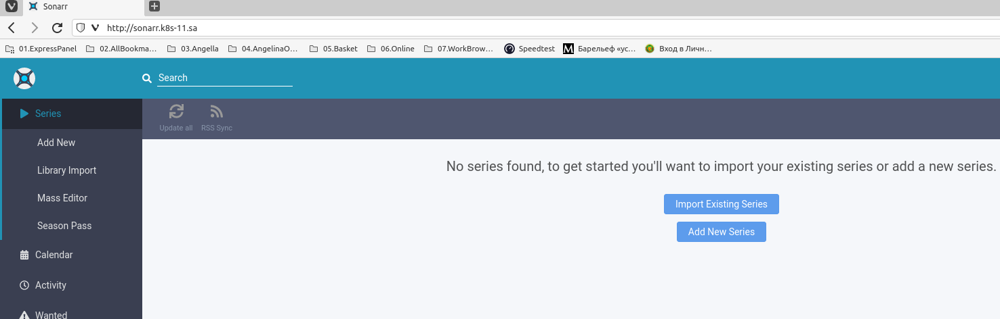

# 13.Kubernetes manifests

## presets
[sonarr](https://hub.docker.com/r/linuxserver/sonarr)
[radarr](https://hub.docker.com/r/linuxserver/radarr)
[Helm Install](https://helm.sh/docs/intro/install/)
[Helm Commands](https://helm.sh/ru/docs/intro/using_helm/)
[helm sonarr](https://artifacthub.io/packages/helm/k8s-at-home/sonarr)
[helm radarr](https://artifacthub.io/packages/helm/k8s-at-home/radarr)


### radarr + sonarr
```bash
#
k9s --all-namespaces
kubectl apply -f app.yaml
kubectl get deploy
kubectl delete -f app.yaml
kubectl delete deploy/webserver
kubectl describe pod webserver-5fbbfb7956-2rz7r
kubectl scale deployment webserver --replicas=0

#
kubectl apply -f ingress.yaml
kubectl apply -f radarr.yaml
kubectl apply -f sonarr.yaml
kubectl delete -f sonarr.yaml
```


[radarr.yaml](radarr.yaml)


[sonarr.yaml](sonarr.yaml)



### helm
```bash
curl -fsSL -o get_helm.sh https://raw.githubusercontent.com/helm/helm/main/scripts/get-helm-3
chmod 700 get_helm.sh
./get_helm.sh
helm version
helm create radarr-app
helm create sonarr-app
helm package radarr-app
helm package sonarr-app
helm install hradarr-app radarr-app-0.1.0.tgz
helm install hsonarr-app sonarr-app-0.1.0.tgz
helm delete hradarr-app
helm delete hsonarr-app
kubectl get ingress
kubectl get services
```
#### helm logs
```bash
root@node1:~#
root@node1:~# helm install hradarr-app radarr-app-0.1.0.tgz
NAME: hradarr-app
LAST DEPLOYED: Thu Oct 28 16:23:00 2021
NAMESPACE: default
STATUS: deployed
REVISION: 1
NOTES:
1. Get the application URL by running these commands:
  http://hradarr.k8s-11.sa/
root@node1:~#
root@node1:~# helm install hsonarr-app sonarr-app-0.1.0.tgz
NAME: hsonarr-app
LAST DEPLOYED: Thu Oct 28 16:23:19 2021
NAMESPACE: default
STATUS: deployed
REVISION: 1
NOTES:
1. Get the application URL by running these commands:
  http://hsonarr.k8s-11.sa/
root@node1:~#
```


