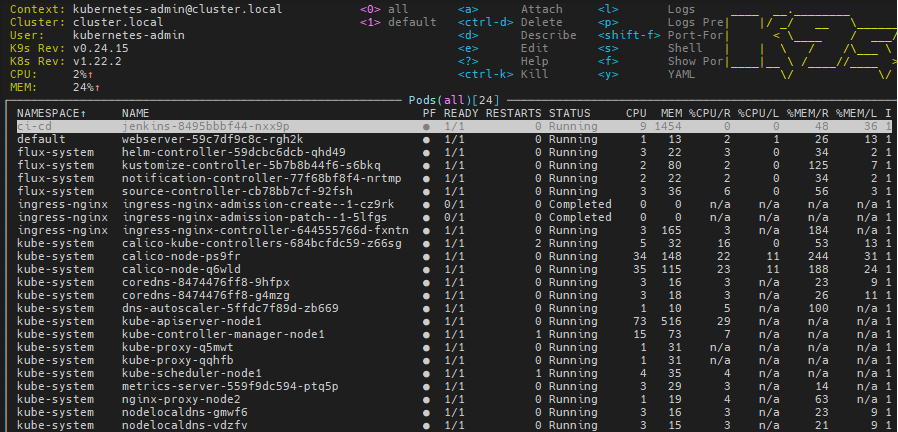

# 14.Kubernetes application deployment

## jenkins
```bash
build -t jfrog.it-academy.by/public/jenkins-ci:linkevich .
docker push jfrog.it-academy.by/public/jenkins-ci:linkevich
mount -t nfs -o rw 192.168.37.105:/mnt/IT-Academy/nfs-data /mnt/test/
```
[jenkins files](jenkins.yaml)





