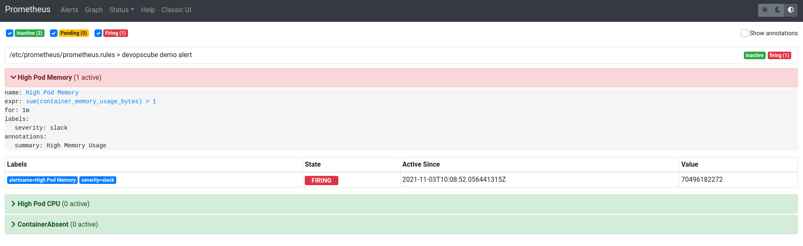
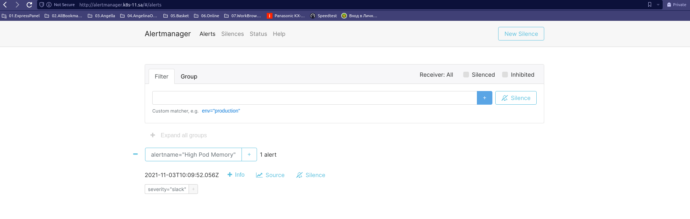
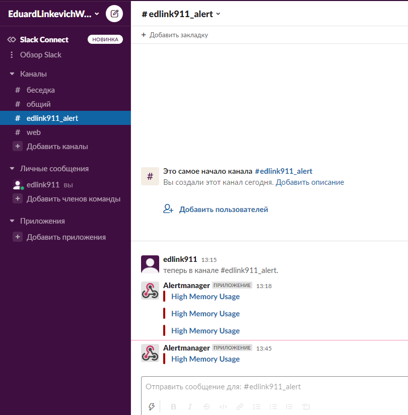

# 15. Technical and service monitoring

[ALERTMANAGER](https://prometheus.io/docs/alerting/latest/alertmanager/)

[НАСТРОЙКА ALERTMANAGER PROMETHEUS](https://losst.ru/nastrojka-alertmanager-prometheus)

[AlertManger+Slack](https://www.devopsage.com/notification-to-slack-using-prometheus-alertmanger/)

[NOTIFICATION TEMPLATE EXAMPLES](https://prometheus.io/docs/alerting/latest/notification_examples/)

[grafana dashboards](https://grafana.com/grafana/dashboards/)

[metrics](https://grafana.com/grafana/dashboards/747)


## commands
```bash
kubectl apply -f ns.yaml
kubectl apply -f prometheus.yaml
kubectl get ingress ingress-prometheus -n monitoring -o yaml
kubectl apply -f alertmanger.yaml
kubectl logs -f alertmanager-55c486dd65-ltgjx -n monitoring
kubectl apply -f grafana.yaml

```

## settings alertmanager
```yaml
    global: {}
    route:
      receiver: slack_prometheus
      group_by: ['alertname', 'datacenter', 'app']
      group_wait: 10s
      repeat_interval: 1m
      routes:
        - receiver: slack_prometheus
          match:
            severity: slack
    receivers:
    - name: slack_prometheus
      slack_configs:
      - api_url: https://hooks.slack.com/services/---webhook---
        channel: '#edlink911'
        title: "{{ range .Alerts }}{{ .Annotations.summary }}\n{{ end }}"
        text: "{{ range .Alerts }}{{ .Annotations.description }}\n{{ end }}"
```







