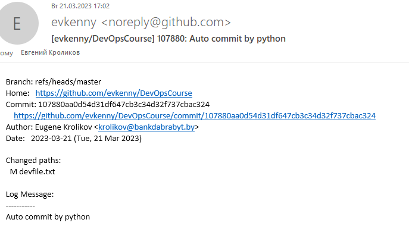

# 03.GIT.Hosting

## URLs repositories

[Github](https://github.com/evkenny/DevOpsCourse)

[Gitlab](https://gitlab.com/dbt8150707/devopscourse)

## Script

```Python
#!/usr/bin/env python
import os

os.system('git add --all')
os.system('git commit -m "Auto commit by python"')
os.system('git remote show')
listRepos = os.popen('git remote show').read().split()
for repo in listRepos:
	os.system(f'git push {repo} --all')
```

### Result script

```bush
krolikov@r402-5 MINGW64 /e/office/GIT/02.GIT (master)
$ autopush
[master 107880a] Auto commit by python
 1 file changed, 1 insertion(+), 1 deletion(-)
Hubrep
Labrep
hostfile_replace_entries: link /h/.ssh/known_hosts to /h/.ssh/known_hosts.old: Operation not permitted
update_known_hosts: hostfile_replace_entries failed for /h/.ssh/known_hosts: Operation not permitted
Enumerating objects: 5, done.
Counting objects: 100% (5/5), done.
Delta compression using up to 16 threads
Compressing objects: 100% (3/3), done.
Writing objects: 100% (3/3), 307 bytes | 307.00 KiB/s, done.
Total 3 (delta 1), reused 0 (delta 0), pack-reused 0
remote: Resolving deltas: 100% (1/1), completed with 1 local object.
To github.com:evkenny/DevOpsCourse.git
   691709f..107880a  master -> master
Enumerating objects: 5, done.
Counting objects: 100% (5/5), done.
Delta compression using up to 16 threads
Compressing objects: 100% (3/3), done.
Writing objects: 100% (3/3), 307 bytes | 307.00 KiB/s, done.
Total 3 (delta 1), reused 0 (delta 0), pack-reused 0
To gitlab.com:dbt8150707/devopscourse.git
   691709f..107880a  master -> master

```

## Email

