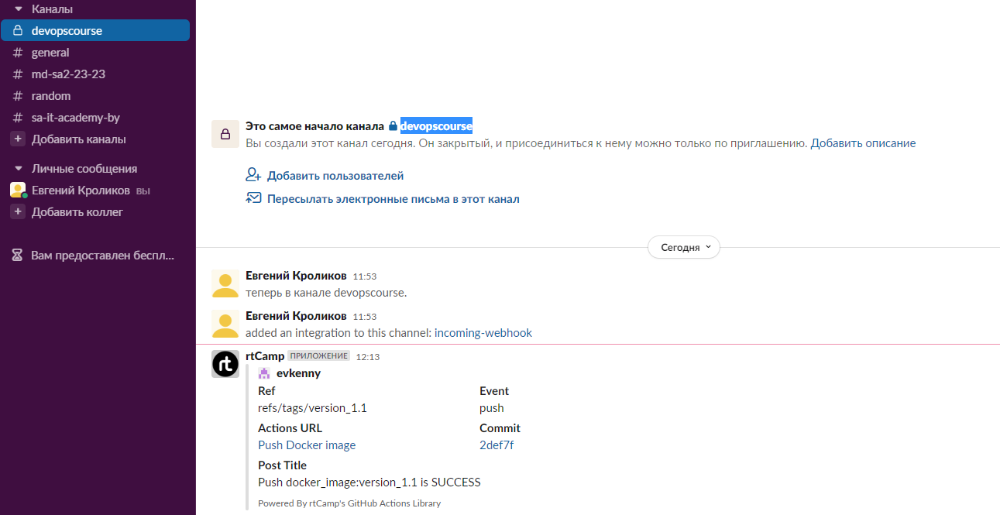
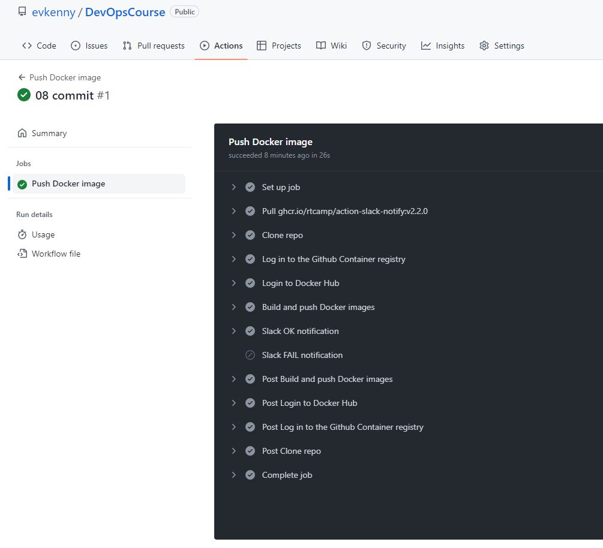

# 08.DockerCompose

## URLs repositories

[DockerHub](https://hub.docker.com/repository/docker/evkenny/docker_image/general)

[Github repo](https://github.com/users/evkenny/packages/container/package/docker_image)

## Action YAML

```yaml
name: Push Docker image

on:
  push:
    tags:
      - "version_*.*"
jobs:
  push_to_registries:
    name: Push Docker image
    runs-on: ubuntu-latest
    permissions:
      packages: write
      contents: read
    steps:
      - name: Clone repo
        uses: actions/checkout@v2

      - name: Log in to the Github Container registry
        uses: docker/login-action@v1
        with:
          registry: ghcr.io
          username: ${{ github.actor }}
          password: ${{ secrets.GIT_TOKEN }}
      - name: Login to Docker Hub
        uses: docker/login-action@v2
        with:
          username: ${{ secrets.DC_USER_NAME }}
          password: ${{ secrets.DC_TOKEN }}
      - name: Build and push Docker images
        uses: docker/build-push-action@v4
        with:
          context: .
          push: true
          tags: |
            ghcr.io/${{ github.actor }}/docker_image:${{ github.ref_name }}
            ${{ secrets.DC_USER_NAME }}/docker_image:${{ github.ref_name }}
      - name: Slack OK notification
        uses: rtCamp/action-slack-notify@v2
        if: success()
        env:
          SLACK_CHANNEL: devopscourse
          SLACK_COLOR: #2EB67D
          SLACK_ICON: https://github.com/rtCamp.png?size=48
          SLACK_MESSAGE: 'Push docker_image:${{ github.ref_name }} is SUCCESS'
          SLACK_TITLE: Post Title
          SLACK_USERNAME: rtCamp
          SLACK_WEBHOOK: ${{ secrets.SLACK_WEBHOOK }}
      - name: Slack FAIL notification
        uses: rtCamp/action-slack-notify@v2
        if: failure()
        env:
          SLACK_CHANNEL: devopscourse
          SLACK_COLOR: #E01E5A
          SLACK_ICON: https://github.com/rtCamp.png?size=48
          SLACK_MESSAGE: 'Push docker_image:${{ github.ref_name }} is FAIL'
          SLACK_TITLE: Post Title
          SLACK_USERNAME: rtCamp
          SLACK_WEBHOOK: ${{ secrets.SLACK_WEBHOOK }}
```

## Slack notification



## Git action

