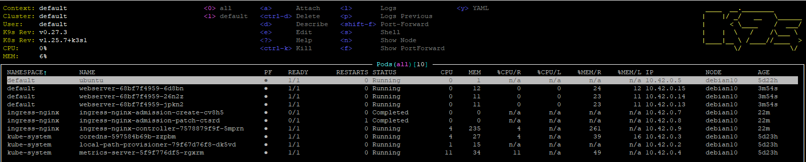

# 11.Kubernetes.Basic objects

## Nginx service




## Nginx deploy yaml

[file nginx deploy](nginx_deploy.yaml)

## add commands

```bash
root@05lesson:/home/devops/11.Kube# kubectl apply -f ingress.yaml
root@05lesson:/home/devops/11.Kube# kubectl create configmap nginx-config --from-file=nginx=nginx.conf --from-file=nginx-site=index.html
root@05lesson:/home/devops/11.Kube# kubectl apply -f nginx_deploy.yaml
```

