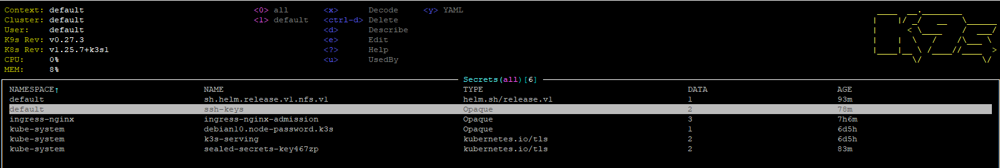
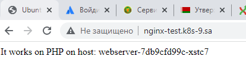
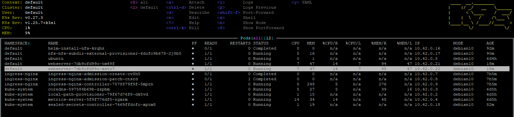

# 12.Kubernetes.Data.Security

## Kubeseal

### Install kubeseal and controller

 ```bash
wget https://github.com/bitnami-labs/sealed-secrets/releases/download/v0.20.2/kubeseal-0.20.2-linux-amd64.tar.gz
history|grep wget
wget --no-check-certificate https://github.com/bitnami-labs/sealed-secrets/releases/download/v0.20.2/kubeseal-0.20.2-linux-amd64.tar.gz
tar -C /usr/local/bin -xzf kubeseal-0.20.2-linux-amd64.tar.gz
kubeseal --version
kubectl apply -f https://github.com/bitnami-labs/sealed-secrets/releases/download/v0.20.2/controller.yaml
kubectl apply -f /home/devops/controller.yaml
 ```

## create seal secret

### yaml files

[my_secret.yaml](my_secret.yaml)

[my_sealed_secret.yaml](my_sealed_secret.yaml)

```bash
cat id_rsa.pub
echo -n "*******" | base64
cat id_rsa
echo -n "*******" | base64
cat my_secret.yaml | kubeseal --format yaml > my_sealed_secret.yaml
kubectl apply -f my_sealed_secret.yaml
```

### Screen secrets




## Nginx + nfs

### yaml files

[nginx_php.yaml](nginx_php.yaml)

[nfs-share.yaml](nfs-share.yaml)

### Screens nginx



