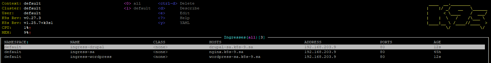
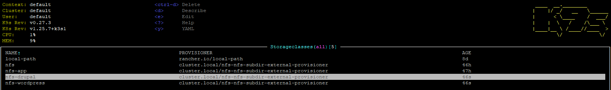
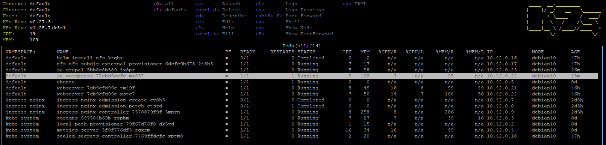
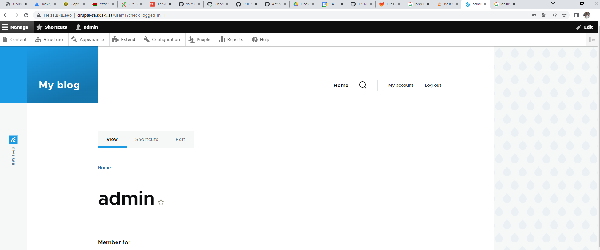
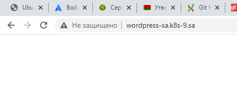

# 13.Kub.Helm

## Install Helm

```bash
root@05lesson:/home/devops/13.Kube# curl -kfsSL -o get_helm.sh https://raw.githubusercontent.com/helm/helm/main/scripts/get-helm-3
root@05lesson:/home/devops/13.Kube# chmod 700 get_helm.sh
root@05lesson:/home/devops/13.Kube# ./get_helm.sh
Downloading https://get.helm.sh/helm--linux-amd64.tar.gz
curl: (60) SSL certificate problem: unable to get local issuer certificate
root@05lesson:/home/devops/13.Kube# vi get_helm.sh
root@05lesson:/home/devops/13.Kube# ./get_helm.sh
Downloading https://get.helm.sh/helm-v3.11.2-linux-amd64.tar.gz
Verifying checksum... Done.
Preparing to install helm into /usr/local/bin
helm installed into /usr/local/bin/helm

root@05lesson:/home/devops/13.Kube# helm repo add my-repo --insecure-skip-tls-verify https://charts.bitnami.com/bitnami
```

## Added ingress

[ingress_sites.yaml](ingress_sites.yaml)



## Added storage classes

[add_storage.yaml](add_storage.yaml)



## create databases with ansible

[inv.yaml](inv.yaml)
[mariadb.yaml](mariadb.yaml)

```bash
root@05lesson:/home/devops/13.Kube# ansible-playbook -i inv.yaml mariadb.yaml -e name_db=bitnami_wordpress -e user_db=bn_wordpress -e pass_db=***
root@05lesson:/home/devops/13.Kube# ansible-playbook -i inv.yaml mariadb.yaml -e name_db=bitnami_drupal -e user_db=bn_drupal -e pass_db=***
```

## Install Wordpress and Drupal with helm

```bash
root@05lesson:/home/devops/13.Kube# helm install sa-drupal --insecure-skip-tls-verify --set mariadb.enabled=false,externalDatabase.host=192.168.201.9,externalDatabase.user=bn_drupal,externalDatabase.password=***,externalDatabase.database=bitnami_drupal,global.storageClass=nfs-drupal,drupalUsername=admin,drupalPassword=***,drupalEmail=**** my-repo/drupal
WARNING: Kubernetes configuration file is group-readable. This is insecure. Location: /root/.kube/config
WARNING: Kubernetes configuration file is world-readable. This is insecure. Location: /root/.kube/config
NAME: sa-drupal
LAST DEPLOYED: Thu Apr  6 12:06:54 2023
NAMESPACE: default
STATUS: deployed
REVISION: 1
TEST SUITE: None
NOTES:
CHART NAME: drupal
CHART VERSION: 13.0.13
APP VERSION: 10.0.7** Please be patient while the chart is being deployed **

1. Get the Drupal URL:

  NOTE: It may take a few minutes for the LoadBalancer IP to be available.
        Watch the status with: 'kubectl get svc --namespace default -w sa-drupal'

  export SERVICE_IP=$(kubectl get svc --namespace default sa-drupal --template "{{ range (index .status.loadBalancer.ingress 0) }}{{ . }}{{ end }}")
  echo "Drupal URL: http://$SERVICE_IP/"

2. Get your Drupal login credentials by running:

  echo Username: admin
  echo Password: $(kubectl get secret --namespace default sa-drupal -o jsonpath="{.data.drupal-password}" | base64 -d)
root@05lesson:/home/devops/13.Kube#
root@05lesson:/home/devops/13.Kube#
root@05lesson:/home/devops/13.Kube# helm install sa-wordpress --insecure-skip-tls-verify --set mariadb.enabled=false,externalDatabase.host=192.168.201.9,externalDatabase.user=bn_wordpress,externalDatabase.password=****,externalDatabase.database=bitnami_wordpress,global.storageClass=nfs-wordpress,wordpressUsername=wp_admin,wordpressPassword=***,wordpressEmail=**** my-repo/wordpress
WARNING: Kubernetes configuration file is group-readable. This is insecure. Location: /root/.kube/config
WARNING: Kubernetes configuration file is world-readable. This is insecure. Location: /root/.kube/config
NAME: sa-wordpress
LAST DEPLOYED: Thu Apr  6 12:07:42 2023
NAMESPACE: default
STATUS: deployed
REVISION: 1
TEST SUITE: None
NOTES:
CHART NAME: wordpress
CHART VERSION: 15.3.0
APP VERSION: 6.2.0

** Please be patient while the chart is being deployed **

Your WordPress site can be accessed through the following DNS name from within your cluster:

    sa-wordpress.default.svc.cluster.local (port 80)

To access your WordPress site from outside the cluster follow the steps below:

1. Get the WordPress URL by running these commands:

  NOTE: It may take a few minutes for the LoadBalancer IP to be available.
        Watch the status with: 'kubectl get svc --namespace default -w sa-wordpress'

   export SERVICE_IP=$(kubectl get svc --namespace default sa-wordpress --template "{{ range (index .status.loadBalancer.ingress 0) }}{{ . }}{{ end }}")
   echo "WordPress URL: http://$SERVICE_IP/"
   echo "WordPress Admin URL: http://$SERVICE_IP/admin"

2. Open a browser and access WordPress using the obtained URL.

3. Login with the following credentials below to see your blog:

  echo Username: wp_admin
  echo Password: $(kubectl get secret --namespace default sa-wordpress -o jsonpath="{.data.wordpress-password}" | base64 -d)
```

## Site pods



## Screen browser



```
wordpress доступен, но пуст
```



```
если по ссылке http://wordpress-sa.k8s-9.sa/wp-json/ то:
```


```cmd
H:\>curl -I http://wordpress-sa.k8s-9.sa/
HTTP/1.1 200 OK
Server: nginx/1.18.0 (Ubuntu)
Date: Thu, 06 Apr 2023 12:30:04 GMT
Content-Type: text/html; charset=UTF-8
Connection: keep-alive
Link: <http://wordpress-sa.k8s-9.sa/wp-json/>; rel="https://api.w.org/"
```
