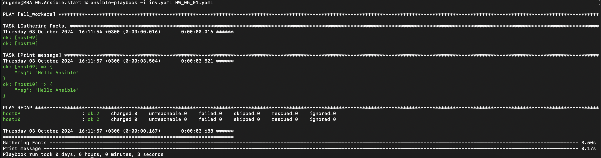
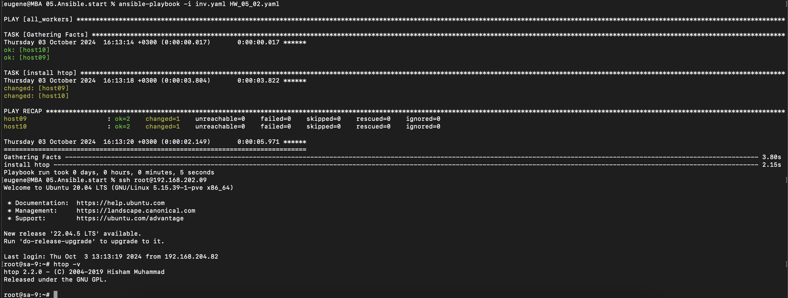

#### 05. Ansible start
### Homework Assignment 1: Setting Up Ansible
```bash
>ssh -p32510 jump_sa@178.124.206.53
>vim ~/.ssh/config      
>ssh root@192.168.202.09
>ssh root@192.168.202.10
>ssh root@192.168.202.10 -o ProxyCommand="ssh -W %h:%p -q jump_sa@178.124.206.53 -p 32510"
```
#### Проброс публичного ключа для рута под рутом на удаленные хосты
```bash
>ansible -i inv.yaml -m authorized_key -a "user=root key=\"{{lookup('file', '~/.ssh/id_rsa.pub') }}\"" -u root all_workers --ask-pass
```

#### Запуск автоматизации
```bash
ansible-playbook -i inv.yaml HW_05_01.yaml
```
 

### Homework Assignment 2: Managing Remote Hosts
#### Запуск автоматизации
```bash
>ansible-playbook -i inv.yaml HW_05_02.yaml
```
 

### Homework Assignment 3: Managing Users and Groups
```bash
>ansible-playbook -i inv.yaml HW_05_03.yaml -e user_name=eugene -e user_group=users -e user_pass=QWEasd_123
```
 
