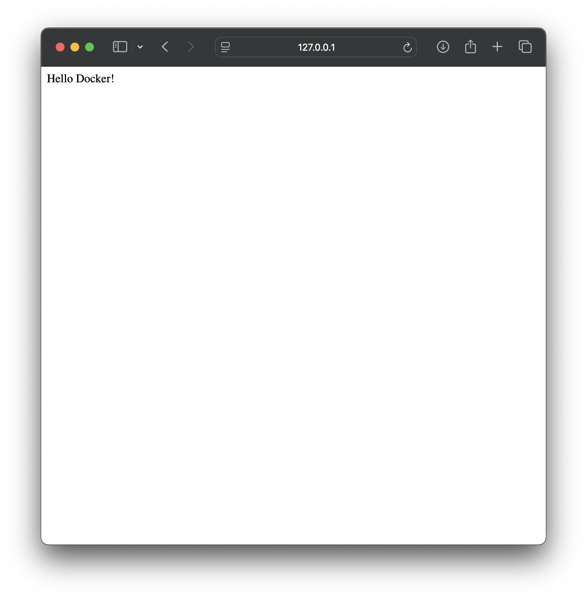

#### 07.Dockerp
### Homework Assignment 1: Docker Installation and Basic Commands
Installed Docker desctop om Macbook
```bash
eugene@MBA 07.Docker % docker --version
Docker version 27.2.0, build 3ab4256

eugene@MBA 07.Docker % docker pull hello-world:latest
latest: Pulling from library/hello-world
478afc919002: Pull complete 
Digest: sha256:d211f485f2dd1dee407a80973c8f129f00d54604d2c90732e8e320e5038a0348
Status: Downloaded newer image for hello-world:latest
docker.io/library/hello-world:latest

eugene@MBA 07.Docker % docker run hello-world

Hello from Docker!
This message shows that your installation appears to be working correctly.

eugene@MBA 07.Docker % docker run -it ubuntu bash
Unable to find image 'ubuntu:latest' locally
latest: Pulling from library/ubuntu
0741829382fa: Pull complete 
Digest: sha256:ab64a8382e935382638764d8719362bb50ee418d944c1f3d26e0c99fae49a345
Status: Downloaded newer image for ubuntu:latest

eugene@MBA 07.Docker % docker ps    
CONTAINER ID   IMAGE     COMMAND   CREATED              STATUS          PORTS     NAMES
c8fdacf4403c   ubuntu    "bash"    About a minute ago   Up 42 seconds             pensive_dubinsky
```

### Homework Assignment 2: Building a Docker Image with Dockerfile
```bash
eugene@MBA docker % docker build -t simplesite .
[+] Building 183.7s (11/11) FINISHED                                                                    docker:desktop-linux
 => [internal] load build definition from Dockerfile                                                                    0.0s
 => => transferring dockerfile: 191B                                                                                    0.0s
 => [internal] load metadata for docker.io/library/python:latest                                                        2.9s
 => [auth] library/python:pull token for registry-1.docker.io                                                           0.0s
 => [internal] load .dockerignore                                                                                       0.0s
 => => transferring context: 2B                                                                                         0.0s
 => [1/5] FROM docker.io/library/python:latest@sha256:45803c375b95ea33f482e53a461eca8f247617667d703660a06ccf5eb3d053  174.2s
 => => resolve docker.io/library/python:latest@sha256:45803c375b95ea33f482e53a461eca8f247617667d703660a06ccf5eb3d05326  0.0s
 => => sha256:95359ab667b3e318c4546caae72cef9a86aa1a434387403f62d28d178cae60d3 2.33kB / 2.33kB                          0.0s
 => => sha256:41b754d079e82fafdf15447cfc188868092eaf1cf4a3f96c9d90ab1b7db91230 64.35MB / 64.35MB                       63.6s
 => => sha256:45803c375b95ea33f482e53a461eca8f247617667d703660a06ccf5eb3d05326 9.72kB / 9.72kB                          0.0s
 => => sha256:64733f0aded8dca64586f1532c8859efc010a8ed4666c19e2f87c197a78a8aa8 5.74kB / 5.74kB                          0.0s
 => => sha256:6d11c181ebb38ef30f2681a42f02030bc6fdcfbe9d5248270ee065eb7302b500 49.58MB / 49.58MB                       27.3s
 => => sha256:2b238499ec52e0d6be479f948c76ba0bc3cc282f612d5a6a4b5ef52ff45f6b2c 23.59MB / 23.59MB                       21.7s
 => => sha256:d71ace0e8bbdcfcf795b836e24a37a6ed0054100e14d6aa6e5a63f7e162ba729 202.65MB / 202.65MB                    166.9s
 => => sha256:07620df085088f7f906414ec6bfa5aaea9e5398d18d8f98036dfcc50dda77192 6.24MB / 6.24MB                         59.2s
 => => extracting sha256:6d11c181ebb38ef30f2681a42f02030bc6fdcfbe9d5248270ee065eb7302b500                               2.3s
 => => extracting sha256:2b238499ec52e0d6be479f948c76ba0bc3cc282f612d5a6a4b5ef52ff45f6b2c                               0.6s
 => => sha256:56cf5ce41fb367e5df76f5c43030450177994aec835de44f077e3b12ce769a64 25.29MB / 25.29MB                       82.7s
 => => extracting sha256:41b754d079e82fafdf15447cfc188868092eaf1cf4a3f96c9d90ab1b7db91230                               2.5s
 => => sha256:a66dd39158c01613bef16b035db7ce51d2d75fcbbadf097aaee8dbf63590588b 249B / 249B                             63.9s
 => => extracting sha256:d71ace0e8bbdcfcf795b836e24a37a6ed0054100e14d6aa6e5a63f7e162ba729                               6.1s
 => => extracting sha256:07620df085088f7f906414ec6bfa5aaea9e5398d18d8f98036dfcc50dda77192                               0.3s
 => => extracting sha256:56cf5ce41fb367e5df76f5c43030450177994aec835de44f077e3b12ce769a64                               0.7s
 => => extracting sha256:a66dd39158c01613bef16b035db7ce51d2d75fcbbadf097aaee8dbf63590588b                               0.0s
 => [internal] load build context                                                                                       0.0s
 => => transferring context: 504B                                                                                       0.0s
 => [2/5] RUN mkdir ./docker                                                                                            0.4s
 => [3/5] WORKDIR ./docker                                                                                              0.0s
 => [4/5] COPY . /docker                                                                                                0.0s
 => [5/5] RUN pip3 install flask                                                                                        5.8s
 => exporting to image                                                                                                  0.2s
 => => exporting layers                                                                                                 0.1s
 => => writing image sha256:5249bec812fe22ba01c765beb01d02e1b654849a714333e608e39a9b481becb6                            0.0s
 => => naming to docker.io/library/simplesite                                                                           0.0s

View build details: docker-desktop://dashboard/build/desktop-linux/desktop-linux/ndphwlo2751jg0ggtey7zbty3

 1 warning found (use docker --debug to expand):
 - WorkdirRelativePath: Relative workdir "./docker" can have unexpected results if the base image changes (line 3)

What's next:
    View a summary of image vulnerabilities and recommendations → docker scout quickview 
eugene@MBA docker % 
eugene@MBA docker % docker run --name simplesite -p 80:80 -d simplesite
657079bdaf7235d19369798744b577365743007ea4fa33af2a3d538a731c275b
```

 
 


