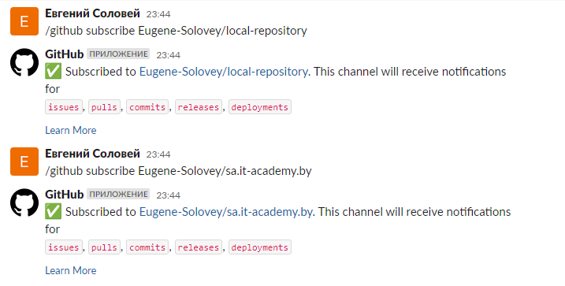

# 03.Git.Hosting

## Repo’s links

[GitHub - https://github.com/Eugene-Solovey/local-repository](https://github.com/Eugene-Solovey/local-repository)

[GitLab - https://gitlab.com/Eugene-Solovey/local-repository](https://gitlab.com/Eugene-Solovey/local-repository)


## Report

### Step 1. Repo's, SSH, git-push

Create repo's in all places in web. Add pub ssh. Get repo's links.

```bash
   ssh-keygen
   cat .ssh/*.pub
   cd git/Git.Local
   git remote add origin git@gitlab.com:Eugene-Solovey/local-repository.git
   git push -u origin --all
   git remote set-url origin git@github.com:Eugene-Solovey/local-repository.git
   git push -u origin --all
  
```

### Step 2. Slack/email integration

Notifications in Slack




### Step 3. Pushing script

Script


```bash
#!/bin/bash
echo "Enter the SCN destination: "
read scn
echo "Enter repository name"
read repoName
git remote set-url origin git@${scn}:Eugene-Solovey/${repoName}.git
git add --all
echo "Enter commit"
read commit
git commit -m "$commit"
git status
for push in $(git remote); do
        git push -u $push --all
done
```

CLI output

```bash
e_solovey@nss:~/test-repository$ git commit -m "add homework_03"
[master e084728] add homework_03
 5 files changed, 69 insertions(+)
 create mode 100644 03.Git.Hosting/README.md
 create mode 100644 03.Git.Hosting/notifications-slack.png
 create mode 100755 03.Git.Hosting/script.sh
 delete mode 100644 1.txt
 delete mode 100644 2.txt
e_solovey@nss:~/test-repository$ git push origin --all
Enumerating objects: 7, done.
Counting objects: 100% (7/7), done.
Delta compression using up to 2 threads
Compressing objects: 100% (6/6), done.
Writing objects: 100% (6/6), 35.94 KiB | 2.76 MiB/s, done.
Total 6 (delta 0), reused 0 (delta 0), pack-reused 0
To github.com:Eugene-Solovey/local-repository.git
   79cfbca..e084728  master -> master
e_solovey@nss:~/test-repository$ vi 03.Git.Hosting/script.sh
e_solovey@nss:~/test-repository$ vi 03.Git.Hosting/
notifications-slack.png  README.md                script.sh
e_solovey@nss:~/test-repository$ vi 03.Git.Hosting/script.sh
e_solovey@nss:~/test-repository$ vi 03.Git.Hosting/README.md
e_solovey@nss:~/test-repository$ . 03.Git.Hosting/script.sh
Enter the SCN destination:
github.com
Enter repository name
local-repository
Enter commit
add homework_03.2
[master c1f5d37] add homework_03.2
 2 files changed, 7 insertions(+), 6 deletions(-)
On branch master
Your branch is ahead of 'origin/master' by 1 commit.
  (use "git push" to publish your local commits)

nothing to commit, working tree clean
Enumerating objects: 9, done.
Counting objects: 100% (9/9), done.
Delta compression using up to 2 threads
Compressing objects: 100% (5/5), done.
Writing objects: 100% (5/5), 545 bytes | 545.00 KiB/s, done.
Total 5 (delta 3), reused 0 (delta 0), pack-reused 0
remote: Resolving deltas: 100% (3/3), completed with 3 local objects.
To github.com:Eugene-Solovey/local-repository.git
   e084728..c1f5d37  master -> master
Unauthorized
fatal: Could not read from remote repository.

Please make sure you have the correct access rights
and the repository exists.
#
e_solovey@nss:~/test-repository$ . 03.Git.Hosting/script.sh
Enter the SCN destination:
gitlab.com
Enter repository name
local-repository
Enter commit
add homework_03
[master 558b65a] add homework_03
 2 files changed, 2 insertions(+), 2 deletions(-)
On branch master
Your branch is ahead of 'origin/master' by 1 commit.
  (use "git push" to publish your local commits)

nothing to commit, working tree clean
Enumerating objects: 17, done.
Counting objects: 100% (17/17), done.
Delta compression using up to 2 threads
Compressing objects: 100% (16/16), done.
Writing objects: 100% (16/16), 36.78 KiB | 2.45 MiB/s, done.
Total 16 (delta 6), reused 0 (delta 0), pack-reused 0
remote:
remote: To create a merge request for master, visit:
remote:   https://gitlab.com/Eugene-Solovey/local-repository/-/merge_requests/new?merge_request%5Bsource_branch%5D=master
remote:
To gitlab.com:Eugene-Solovey/local-repository.git
   79cfbca..558b65a  master -> master
Branch 'dev' set up to track remote branch 'dev' from 'origin'.
Branch 'features/do_one' set up to track remote branch 'features/do_one' from 'origin'.
Branch 'hotfix/we_gonna_die' set up to track remote branch 'hotfix/we_gonna_die' from 'origin'.
Branch 'master' set up to track remote branch 'master' from 'origin'.
Unauthorized
fatal: Could not read from remote repository.

Please make sure you have the correct access rights
and the repository exists.
